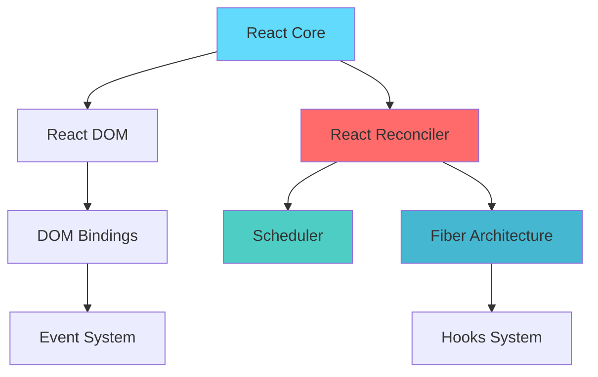
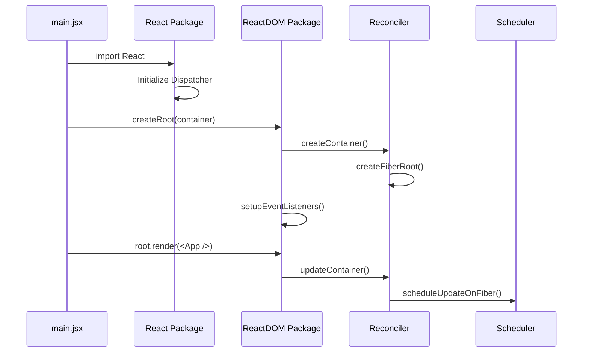
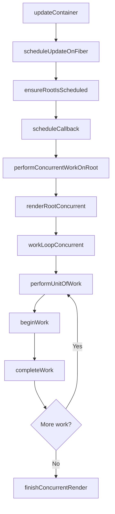

# React 18 Source Code Implementation & Analysis

> A comprehensive, line-by-line implementation of React 18 core functionality from scratch, demonstrating internal working principles through modular design.

## � TQuick Navigation

| Section                                              | Description                        | Key Topics                            |
| ---------------------------------------------------- | ---------------------------------- | ------------------------------------- |
| [🚀 Getting Started](#-getting-started)              | Setup and basic usage              | Installation, Development, Examples   |
| [🏗️ Architecture Overview](#️-architecture-overview) | High-level system design           | Module structure, Design patterns     |
| [⚡ Core Implementation](#-core-implementation)      | Detailed implementation flows      | Startup, Rendering, Reconciliation    |
| [🎣 Hooks System](#-hooks-system)                    | Complete hooks implementation      | useState, useEffect, useReducer       |
| [🔄 Concurrent Features](#-concurrent-features)      | React 18 concurrent capabilities   | Suspense, Transitions, Priority       |
| [🎯 Event System](#-event-system)                    | Synthetic event implementation     | Delegation, Dispatch, Handlers        |
| [⏰ Scheduler](#-scheduler)                          | Task scheduling and prioritization | Time slicing, Priority queues         |
| [🔧 Advanced Topics](#-advanced-topics)              | Deep implementation details        | Error handling, DevTools, Performance |
| [📚 Reference](#-reference)                          | API reference and examples         | Code samples, Best practices          |

---

## 🚀 Getting Started

### Prerequisites

Before diving into this React 18 implementation, ensure you understand:

- **JavaScript ES6+**: Modern JavaScript features and patterns
- **Data Structures**: [Binary Operations](./markdown/&|.md), [Min Heap](./markdown/minHeap.md)
- **Algorithms**: [Depth-First Traversal](./markdown/dfs.md)
- **Web APIs**: [MessageChannel API](./markdown/messageChannel.md)

### Quick Setup

```bash
# Clone and install
git clone <repository-url>
cd mini_React
npm install

# Start development
npm run dev

# Run examples
npm run example:hooks
npm run example:concurrent
```

### Project Structure Overview

```
mini_React/
├── 📁 src/                          # Source implementation
│   ├── 📁 react/                    # Core React package
│   ├── 📁 react-dom/                # DOM renderer
│   ├── 📁 react-reconciler/         # Reconciliation engine
│   ├── 📁 scheduler/                # Task scheduler
│   └── 📁 shared/                   # Shared utilities
├── 📁 markdown/                     # Detailed documentation
└── 📄 README.md                     # This comprehensive guide
```

---

## 🏗️ Architecture Overview

### System Design Philosophy

This React 18 implementation follows these core principles:

1. **🔄 Modular Architecture**: Clear separation of concerns across packages
2. **⚡ Concurrent Rendering**: Non-blocking, interruptible rendering
3. **🎯 Priority-Based Scheduling**: Intelligent task prioritization
4. **🔗 Fiber-Based Reconciliation**: Efficient tree traversal and updates
5. **🎣 Hook-Driven State**: Functional component state management

### Package Architecture



#### Core Packages Breakdown

| Package               | Responsibility     | Key Files                                 |
| --------------------- | ------------------ | ----------------------------------------- |
| **react/**            | Public API & Hooks | `React.js`, `ReactHooks.js`               |
| **react-dom/**        | DOM Rendering      | `ReactDOMRoot.js`                         |
| **react-reconciler/** | Core Engine        | `ReactFiberWorkLoop.js`, `ReactFiber.js`  |
| **scheduler/**        | Task Management    | `Scheduler.js`, `SchedulerMinHeap.js`     |
| **shared/**           | Utilities          | `ReactSymbols.js`, `ReactFeatureFlags.js` |

---

## ⚡ Core Implementation

### 1. Application Startup Flow

#### 1.1 Entry Point Analysis

```javascript
// src/main.jsx - Application Entry Point
import * as React from "react";
import { createRoot } from "react-dom/client";

function App() {
  const [count, setCount] = React.useState(0);
  return <div onClick={() => setCount(count + 1)}>Count: {count}</div>;
}

const root = createRoot(document.getElementById("root"));
root.render(<App />);
```

#### 1.2 Startup Execution Flow



#### 1.3 Detailed Implementation Steps

**Step 1: React Package Loading**

```javascript
// src/react/src/React.js
import { useReducer, useState, useEffect } from "./ReactHooks";
import ReactSharedInternals from "./ReactSharedInternals";

export {
  useReducer,
  useState,
  useEffect,
  ReactSharedInternals as __SECRET_INTERNALS_DO_NOT_USE_OR_YOU_WILL_BE_FIRED,
};
```

**Step 2: Root Creation Process**

```javascript
// src/react-dom/src/client/ReactDOMRoot.js
export function createRoot(container) {
  // 1. Create Fiber root structure
  const root = createContainer(container);

  // 2. Setup event delegation
  listenToAllSupportedEvents(container);

  // 3. Return ReactDOMRoot instance
  return new ReactDOMRoot(root);
}

function ReactDOMRoot(internalRoot) {
  this._internalRoot = internalRoot;
}

ReactDOMRoot.prototype.render = function (children) {
  const root = this._internalRoot;
  root.containerInfo.innerHTML = "";
  updateContainer(children, root);
};
```

**Step 3: Fiber Root Structure Creation**

```javascript
// src/react-reconciler/src/ReactFiberRoot.js
export function createFiberRoot(containerInfo) {
  // Create FiberRootNode
  const root = new FiberRootNode(containerInfo);

  // Create HostRoot Fiber
  const uninitializedFiber = createHostRootFiber();

  // Establish bidirectional connection
  root.current = uninitializedFiber;
  uninitializedFiber.stateNode = root;

  // Initialize update queue
  initialUpdateQueue(uninitializedFiber);

  return root;
}
```

### 2. Rendering Pipeline

#### 2.1 Render Phase (Interruptible)

The render phase builds the new Fiber tree and can be interrupted:



#### 2.2 Work Loop Implementation

```javascript
// src/react-reconciler/src/ReactFiberWorkLoop.js
function workLoopConcurrent() {
  // Work until scheduler tells us to yield
  while (workInProgress !== null && !shouldYield()) {
    performUnitOfWork(workInProgress);
  }
}

function performUnitOfWork(unitOfWork) {
  const current = unitOfWork.alternate;

  // Begin work phase
  let next = beginWork(current, unitOfWork, renderLanes);

  unitOfWork.memoizedProps = unitOfWork.pendingProps;

  if (next === null) {
    // No child, complete this unit
    completeUnitOfWork(unitOfWork);
  } else {
    // Continue with child
    workInProgress = next;
  }
}
```

#### 2.3 Commit Phase (Synchronous)

The commit phase applies changes to the DOM synchronously:

```javascript
function commitRootImpl(root, renderPriorityLevel) {
  // Phase 1: Before mutation effects
  commitBeforeMutationEffects(root, finishedWork);

  // Phase 2: Mutation effects (DOM changes)
  commitMutationEffects(root, finishedWork, lanes);

  // Switch fiber trees
  root.current = finishedWork;

  // Phase 3: Layout effects
  commitLayoutEffects(finishedWork, root, lanes);

  // Schedule passive effects (useEffect)
  if (rootDoesHavePassiveEffects) {
    scheduleCallback(NormalSchedulerPriority, flushPassiveEffects);
  }
}
```

### 3. Fiber Architecture Deep Dive

#### 3.1 Fiber Node Structure

```javascript
// src/react-reconciler/src/ReactFiber.js
function FiberNode(tag, pendingProps, key, mode) {
  // Instance properties
  this.tag = tag; // Fiber type
  this.key = key; // Unique identifier
  this.elementType = null; // Element type
  this.type = null; // Function/class reference
  this.stateNode = null; // DOM node or instance

  // Fiber relationships
  this.return = null; // Parent fiber
  this.child = null; // First child
  this.sibling = null; // Next sibling
  this.index = 0; // Position in parent

  // Props and state
  this.pendingProps = pendingProps; // New props
  this.memoizedProps = null; // Current props
  this.updateQueue = null; // Update queue
  this.memoizedState = null; // Current state

  // Effects
  this.flags = NoFlags; // Side effects
  this.subtreeFlags = NoFlags; // Child effects
  this.deletions = null; // Deleted children

  // Scheduling
  this.lanes = NoLanes; // Priority lanes
  this.childLanes = NoLanes; // Child priority

  // Double buffering
  this.alternate = null; // Alternate fiber
}
```

#### 3.2 Fiber Tree Traversal Algorithm

```javascript
function completeUnitOfWork(unitOfWork) {
  let completedWork = unitOfWork;

  do {
    const current = completedWork.alternate;
    const returnFiber = completedWork.return;

    // Complete the work
    const next = completeWork(current, completedWork, renderLanes);

    if (next !== null) {
      // Suspend or error case
      workInProgress = next;
      return;
    }

    // Collect side effects
    if (returnFiber !== null && (returnFiber.flags & Incomplete) === NoFlags) {
      // Append all the effects of the subtree
      if (returnFiber.subtreeFlags === NoFlags) {
        returnFiber.subtreeFlags = completedWork.subtreeFlags;
      } else {
        returnFiber.subtreeFlags |= completedWork.subtreeFlags;
      }
      returnFiber.subtreeFlags |= completedWork.flags;
    }

    const siblingFiber = completedWork.sibling;
    if (siblingFiber !== null) {
      // Continue with sibling
      workInProgress = siblingFiber;
      return;
    }

    // Move to parent
    completedWork = returnFiber;
    workInProgress = completedWork;
  } while (completedWork !== null);

  // We've reached the root
  if (workInProgressRootExitStatus === RootInProgress) {
    workInProgressRootExitStatus = RootCompleted;
  }
}
```

---

## 🎣 Hooks System

### 1. Hooks Architecture & Dispatcher Pattern

React Hooks use a sophisticated dispatcher pattern that switches implementations based on the rendering phase:

```javascript
// src/react-reconciler/src/ReactFiberHooks.js

// Mount phase dispatcher
const HooksDispatcherOnMount = {
  useReducer: mountReducer,
  useState: mountState,
  useEffect: mountEffect,
  useLayoutEffect: mountLayoutEffect,
  useRef: mountRef,
  useCallback: mountCallback,
  useMemo: mountMemo,
};

// Update phase dispatcher
const HooksDispatcherOnUpdate = {
  useReducer: updateReducer,
  useState: updateState,
  useEffect: updateEffect,
  useLayoutEffect: updateLayoutEffect,
  useRef: updateRef,
  useCallback: updateCallback,
  useMemo: updateMemo,
};
```

### 2. renderWithHooks - The Hook Orchestrator

```javascript
export function renderWithHooks(
  current,
  workInProgress,
  Component,
  props,
  renderLanes
) {
  // Set current rendering fiber
  currentlyRenderingFiber = workInProgress;

  // Clear hooks list and effects
  workInProgress.memoizedState = null;
  workInProgress.updateQueue = null;

  // Choose dispatcher based on mount/update
  if (current !== null && current.memoizedState !== null) {
    ReactCurrentDispatcher.current = HooksDispatcherOnUpdate;
  } else {
    ReactCurrentDispatcher.current = HooksDispatcherOnMount;
  }

  // Execute component function
  const children = Component(props);

  // Reset global state
  currentlyRenderingFiber = null;
  workInProgressHook = null;
  currentHook = null;

  return children;
}
```

### 3. useState Implementation Deep Dive

#### 3.1 Mount Phase Implementation

```javascript
function mountState(initialState) {
  // Step 1: Create hook object
  const hook = mountWorkInProgressHook();

  // Step 2: Initialize state
  if (typeof initialState === "function") {
    initialState = initialState();
  }
  hook.memoizedState = hook.baseState = initialState;

  // Step 3: Create update queue
  const queue = {
    pending: null,
    interleaved: null,
    lanes: NoLanes,
    dispatch: null,
    lastRenderedReducer: baseStateReducer,
    lastRenderedState: initialState,
  };
  hook.queue = queue;

  // Step 4: Create dispatch function
  const dispatch = (queue.dispatch = dispatchSetState.bind(
    null,
    currentlyRenderingFiber,
    queue
  ));

  return [hook.memoizedState, dispatch];
}

function mountWorkInProgressHook() {
  const hook = {
    memoizedState: null,
    baseState: null,
    baseQueue: null,
    queue: null,
    next: null,
  };

  if (workInProgressHook === null) {
    // First hook in the component
    currentlyRenderingFiber.memoizedState = workInProgressHook = hook;
  } else {
    // Append to the end of the list
    workInProgressHook = workInProgressHook.next = hook;
  }

  return workInProgressHook;
}
```

#### 3.2 Update Phase Implementation

```javascript
function updateState(initialState) {
  return updateReducer(baseStateReducer, initialState);
}

function updateReducer(reducer, initialArg, init) {
  const hook = updateWorkInProgressHook();
  const queue = hook.queue;

  queue.lastRenderedReducer = reducer;

  const current = currentHook;
  let baseQueue = current.baseQueue;

  // Process pending updates
  const pendingQueue = queue.pending;
  if (pendingQueue !== null) {
    if (baseQueue !== null) {
      // Merge pending and base queues
      const baseFirst = baseQueue.next;
      const pendingFirst = pendingQueue.next;
      baseQueue.next = pendingFirst;
      pendingQueue.next = baseFirst;
    }
    current.baseQueue = baseQueue = pendingQueue;
    queue.pending = null;
  }

  if (baseQueue !== null) {
    // Process the update queue
    const first = baseQueue.next;
    let newState = current.baseState;

    let newBaseState = null;
    let newBaseQueueFirst = null;
    let newBaseQueueLast = null;
    let update = first;

    do {
      const updateLane = update.lane;
      if (!isSubsetOfLanes(renderLanes, updateLane)) {
        // Skip this update - insufficient priority
        const clone = {
          lane: updateLane,
          action: update.action,
          hasEagerState: update.hasEagerState,
          eagerState: update.eagerState,
          next: null,
        };

        if (newBaseQueueLast === null) {
          newBaseQueueFirst = newBaseQueueLast = clone;
          newBaseState = newState;
        } else {
          newBaseQueueLast = newBaseQueueLast.next = clone;
        }

        currentlyRenderingFiber.lanes = mergeLanes(
          currentlyRenderingFiber.lanes,
          updateLane
        );
      } else {
        // Process this update
        if (newBaseQueueLast !== null) {
          const clone = {
            lane: NoLane,
            action: update.action,
            hasEagerState: update.hasEagerState,
            eagerState: update.eagerState,
            next: null,
          };
          newBaseQueueLast = newBaseQueueLast.next = clone;
        }

        if (update.hasEagerState) {
          newState = update.eagerState;
        } else {
          const action = update.action;
          newState = reducer(newState, action);
        }
      }
      update = update.next;
    } while (update !== null && update !== first);

    if (newBaseQueueLast === null) {
      newBaseState = newState;
    } else {
      newBaseQueueLast.next = newBaseQueueFirst;
    }

    if (!Object.is(newState, hook.memoizedState)) {
      markWorkInProgressReceivedUpdate();
    }

    hook.memoizedState = newState;
    hook.baseState = newBaseState;
    hook.baseQueue = newBaseQueueLast;

    queue.lastRenderedState = newState;
  }

  const dispatch = queue.dispatch;
  return [hook.memoizedState, dispatch];
}
```

#### 3.3 State Update Dispatch

```javascript
function dispatchSetState(fiber, queue, action) {
  const lane = requestUpdateLane(fiber);

  const update = {
    lane,
    action,
    hasEagerState: false,
    eagerState: null,
    next: null,
  };

  // Eager state optimization
  if (
    fiber.lanes === NoLanes &&
    (fiber.alternate === null || fiber.alternate.lanes === NoLanes)
  ) {
    const lastRenderedReducer = queue.lastRenderedReducer;
    if (lastRenderedReducer !== null) {
      try {
        const currentState = queue.lastRenderedState;
        const eagerState = lastRenderedReducer(currentState, action);

        update.hasEagerState = true;
        update.eagerState = eagerState;

        if (Object.is(eagerState, currentState)) {
          // Fast path - no re-render needed
          return;
        }
      } catch (error) {
        // Suppress error, will be caught during render
      }
    }
  }

  // Enqueue update
  const root = enqueueConcurrentHookUpdate(fiber, queue, update, lane);
  if (root !== null) {
    const eventTime = requestEventTime();
    scheduleUpdateOnFiber(root, fiber, lane, eventTime);
  }
}
```

### 4. useEffect Implementation

#### 4.1 Effect Structure and Lifecycle

```javascript
function mountEffect(create, deps) {
  return mountEffectImpl(
    PassiveEffect | PassiveStaticEffect,
    HookPassive,
    create,
    deps
  );
}

function mountEffectImpl(fiberFlags, hookFlags, create, deps) {
  const hook = mountWorkInProgressHook();
  const nextDeps = deps === undefined ? null : deps;

  currentlyRenderingFiber.flags |= fiberFlags;

  hook.memoizedState = pushEffect(
    HookHasEffect | hookFlags,
    create,
    undefined,
    nextDeps
  );
}

function pushEffect(tag, create, destroy, deps) {
  const effect = {
    tag,
    create,
    destroy,
    deps,
    next: null,
  };

  let componentUpdateQueue = currentlyRenderingFiber.updateQueue;
  if (componentUpdateQueue === null) {
    componentUpdateQueue = createFunctionComponentUpdateQueue();
    currentlyRenderingFiber.updateQueue = componentUpdateQueue;
    componentUpdateQueue.lastEffect = effect.next = effect;
  } else {
    const lastEffect = componentUpdateQueue.lastEffect;
    if (lastEffect === null) {
      componentUpdateQueue.lastEffect = effect.next = effect;
    } else {
      const firstEffect = lastEffect.next;
      lastEffect.next = effect;
      effect.next = firstEffect;
      componentUpdateQueue.lastEffect = effect;
    }
  }

  return effect;
}
```

#### 4.2 Effect Update and Dependency Comparison

```javascript
function updateEffect(create, deps) {
  return updateEffectImpl(PassiveEffect, HookPassive, create, deps);
}

function updateEffectImpl(fiberFlags, hookFlags, create, deps) {
  const hook = updateWorkInProgressHook();
  const nextDeps = deps === undefined ? null : deps;
  let destroy = undefined;

  if (currentHook !== null) {
    const prevEffect = currentHook.memoizedState;
    destroy = prevEffect.destroy;

    if (nextDeps !== null) {
      const prevDeps = prevEffect.deps;
      if (areHookInputsEqual(nextDeps, prevDeps)) {
        // Dependencies haven't changed, skip effect
        hook.memoizedState = pushEffect(hookFlags, create, destroy, nextDeps);
        return;
      }
    }
  }

  currentlyRenderingFiber.flags |= fiberFlags;

  hook.memoizedState = pushEffect(
    HookHasEffect | hookFlags,
    create,
    destroy,
    nextDeps
  );
}

function areHookInputsEqual(nextDeps, prevDeps) {
  if (prevDeps === null) {
    return false;
  }

  for (let i = 0; i < prevDeps.length && i < nextDeps.length; i++) {
    if (Object.is(nextDeps[i], prevDeps[i])) {
      continue;
    }
    return false;
  }
  return true;
}
```

### 5. Performance Optimization Hooks

#### 5.1 useCallback Implementation

```javascript
function mountCallback(callback, deps) {
  const hook = mountWorkInProgressHook();
  const nextDeps = deps === undefined ? null : deps;
  hook.memoizedState = [callback, nextDeps];
  return callback;
}

function updateCallback(callback, deps) {
  const hook = updateWorkInProgressHook();
  const nextDeps = deps === undefined ? null : deps;
  const prevState = hook.memoizedState;

  if (prevState !== null) {
    if (nextDeps !== null) {
      const prevDeps = prevState[1];
      if (areHookInputsEqual(nextDeps, prevDeps)) {
        return prevState[0];
      }
    }
  }

  hook.memoizedState = [callback, nextDeps];
  return callback;
}
```

#### 5.2 useMemo Implementation

```javascript
function mountMemo(nextCreate, deps) {
  const hook = mountWorkInProgressHook();
  const nextDeps = deps === undefined ? null : deps;
  const nextValue = nextCreate();
  hook.memoizedState = [nextValue, nextDeps];
  return nextValue;
}

function updateMemo(nextCreate, deps) {
  const hook = updateWorkInProgressHook();
  const nextDeps = deps === undefined ? null : deps;
  const prevState = hook.memoizedState;

  if (prevState !== null) {
    if (nextDeps !== null) {
      const prevDeps = prevState[1];
      if (areHookInputsEqual(nextDeps, prevDeps)) {
        return prevState[0];
      }
    }
  }

  const nextValue = nextCreate();
  hook.memoizedState = [nextValue, nextDeps];
  return nextValue;
}
```

---

## 🔄 Concurrent Features

### 1. Lane-Based Priority System

React 18 uses a sophisticated binary lane system for managing update priorities:

```javascript
// src/react-reconciler/src/ReactFiberLane.js

// Lane definitions (binary flags)
export const NoLanes = 0b0000000000000000000000000000000;
export const NoLane = NoLanes;

export const SyncLane = 0b0000000000000000000000000000001;
export const InputContinuousHydrationLane = 0b0000000000000000000000000000010;
export const InputContinuousLane = 0b0000000000000000000000000000100;
export const DefaultHydrationLane = 0b0000000000000000000000000001000;
export const DefaultLane = 0b0000000000000000000000000010000;

export const TransitionHydrationLane = 0b0000000000000000000000000100000;
export const TransitionLanes = 0b0000000001111111111111111000000;

export const RetryLanes = 0b0000011110000000000000000000000;
export const SomeRetryLane = 0b0000010000000000000000000000000;

export const SelectiveHydrationLane = 0b0000100000000000000000000000000;
export const IdleHydrationLane = 0b0001000000000000000000000000000;
export const IdleLane = 0b0010000000000000000000000000000;
export const OffscreenLane = 0b0100000000000000000000000000000;
```

#### 1.1 Lane Operations

```javascript
export function mergeLanes(a, b) {
  return a | b;
}

export function removeLanes(set, subset) {
  return set & ~subset;
}

export function intersectLanes(a, b) {
  return a & b;
}

export function isSubsetOfLanes(set, subset) {
  return (set & subset) === subset;
}

export function getHighestPriorityLane(lanes) {
  return lanes & -lanes; // Isolate rightmost set bit
}

export function getNextLanes(root, wipLanes) {
  const pendingLanes = root.pendingLanes;

  if (pendingLanes === NoLanes) {
    return NoLanes;
  }

  let nextLanes = NoLanes;
  const expiredLanes = root.expiredLanes;
  const suspendedLanes = root.suspendedLanes;
  const pingedLanes = root.pingedLanes;

  // Check for expired lanes first
  if (expiredLanes !== NoLanes) {
    nextLanes = mergeLanes(nextLanes, expiredLanes);
  }

  // Process non-idle lanes
  const nonIdlePendingLanes = pendingLanes & NonIdleLanes;
  if (nonIdlePendingLanes !== NoLanes) {
    const nonIdleUnblockedLanes = nonIdlePendingLanes & ~suspendedLanes;
    if (nonIdleUnblockedLanes !== NoLanes) {
      nextLanes = getHighestPriorityLanes(nonIdleUnblockedLanes);
    } else {
      const nonIdlePingedLanes = nonIdlePendingLanes & pingedLanes;
      if (nonIdlePingedLanes !== NoLanes) {
        nextLanes = getHighestPriorityLanes(nonIdlePingedLanes);
      }
    }
  }

  return nextLanes;
}
```

### 2. Suspense Implementation

#### 2.1 Suspense Component Structure

```javascript
function updateSuspenseComponent(current, workInProgress, renderLanes) {
  const nextProps = workInProgress.pendingProps;
  let suspenseContext = suspenseStackCursor.current;

  let showFallback = false;
  const didSuspend = (workInProgress.flags & DidCapture) !== NoFlags;

  if (didSuspend || shouldRemainOnFallback(suspenseContext, current)) {
    showFallback = true;
    workInProgress.flags &= ~DidCapture;
  }

  suspenseContext = setDefaultShallowSuspenseContext(suspenseContext);
  pushSuspenseContext(workInProgress, suspenseContext);

  if (current === null) {
    // Mount
    return mountSuspenseComponent(
      workInProgress,
      nextProps,
      showFallback,
      renderLanes
    );
  } else {
    // Update
    return updateSuspenseComponentImpl(
      current,
      workInProgress,
      nextProps,
      showFallback,
      renderLanes
    );
  }
}
```

#### 2.2 Suspense Boundary Handling

```javascript
function throwException(
  root,
  returnFiber,
  sourceFiber,
  value,
  rootRenderLanes
) {
  sourceFiber.flags |= Incomplete;

  if (
    value !== null &&
    typeof value === "object" &&
    typeof value.then === "function"
  ) {
    // This is a promise (thenable)
    const wakeable = value;

    // Find the nearest Suspense boundary
    let workInProgress = returnFiber;
    do {
      if (
        workInProgress.tag === SuspenseComponent &&
        shouldCaptureSuspense(workInProgress, hasInvisibleParentBoundary)
      ) {
        // Found boundary - attach wakeable
        const wakeables = workInProgress.updateQueue;
        if (wakeables === null) {
          const updateQueue = new Set();
          updateQueue.add(wakeable);
          workInProgress.updateQueue = updateQueue;
        } else {
          wakeables.add(wakeable);
        }

        // Attach ping listener
        attachPingListener(root, wakeable, rootRenderLanes);

        workInProgress.flags |= ShouldCapture;
        workInProgress.lanes = rootRenderLanes;
        return;
      }
      workInProgress = workInProgress.return;
    } while (workInProgress !== null);
  }
}

function attachPingListener(root, wakeable, lanes) {
  let pingCache = root.pingCache;
  let threadIDs;

  if (pingCache === null) {
    pingCache = root.pingCache = new WeakMap();
    threadIDs = new Set();
    pingCache.set(wakeable, threadIDs);
  } else {
    threadIDs = pingCache.get(wakeable);
    if (threadIDs === undefined) {
      threadIDs = new Set();
      pingCache.set(wakeable, threadIDs);
    }
  }

  if (!threadIDs.has(lanes)) {
    threadIDs.add(lanes);

    const ping = pingSuspendedRoot.bind(null, root, wakeable, lanes);
    wakeable.then(ping, ping);
  }
}
```

### 3. Transitions

#### 3.1 Transition Implementation

```javascript
function startTransition(callback) {
  const prevTransition = ReactCurrentBatchConfig.transition;
  ReactCurrentBatchConfig.transition = {};

  try {
    callback();
  } finally {
    ReactCurrentBatchConfig.transition = prevTransition;
  }
}

function useTransition() {
  const [isPending, setPending] = useState(false);

  const startTransition = useCallback((callback) => {
    setPending(true);

    const prevTransition = ReactCurrentBatchConfig.transition;
    ReactCurrentBatchConfig.transition = {};

    try {
      setPending(false);
      callback();
    } finally {
      ReactCurrentBatchConfig.transition = prevTransition;
    }
  }, []);

  return [isPending, startTransition];
}
```

#### 3.2 Priority Assignment for Transitions

```javascript
export function requestUpdateLane(fiber) {
  const mode = fiber.mode;
  if ((mode & ConcurrentMode) === NoMode) {
    return SyncLane;
  }

  // Check if we're in a transition
  const isTransition = requestCurrentTransition() !== NoTransition;
  if (isTransition) {
    if (currentEventTransitionLane === NoLane) {
      currentEventTransitionLane = claimNextTransitionLane();
    }
    return currentEventTransitionLane;
  }

  // Get priority from Scheduler
  const schedulerPriority = getCurrentSchedulerPriorityLevel();

  let lane;
  switch (schedulerPriority) {
    case ImmediateSchedulerPriority:
      lane = SyncLane;
      break;
    case UserBlockingSchedulerPriority:
      lane = InputContinuousLane;
      break;
    case NormalSchedulerPriority:
    case LowSchedulerPriority:
      lane = DefaultLane;
      break;
    case IdleSchedulerPriority:
      lane = IdleLane;
      break;
    default:
      lane = DefaultLane;
      break;
  }

  return lane;
}
```

---

## 🎯 Event System

### 1. Event Delegation Architecture

React uses a single event delegation system at the root container:

```javascript
// src/react-dom-bindings/src/events/DOMPluginEventSystem.js

export function listenToAllSupportedEvents(rootContainerElement) {
  if (!rootContainerElement[listeningMarker]) {
    rootContainerElement[listeningMarker] = true;

    // Register all native events
    allNativeEvents.forEach((domEventName) => {
      // Register for both capture and bubble phases
      listenToNativeEvent(domEventName, true, rootContainerElement);
      listenToNativeEvent(domEventName, false, rootContainerElement);
    });
  }
}

function listenToNativeEvent(domEventName, isCapturePhaseListener, target) {
  let eventSystemFlags = 0;
  if (isCapturePhaseListener) {
    eventSystemFlags |= IS_CAPTURE_PHASE;
  }

  addTrappedEventListener(
    target,
    domEventName,
    eventSystemFlags,
    isCapturePhaseListener
  );
}
```

### 2. Event Registration Process

```javascript
// Event name mapping
const simpleEventPluginEvents = [
  "abort",
  "auxClick",
  "cancel",
  "canPlay",
  "canPlayThrough",
  "click",
  "close",
  "contextMenu",
  "copy",
  "cut",
  "drag",
  "dragEnd",
  "dragEnter",
  "dragExit",
  "dragLeave",
  "dragOver",
  "dragStart",
  "drop",
  "durationChange",
  "emptied",
  "encrypted",
  // ... more events
];

export function registerSimpleEvents() {
  for (let i = 0; i < simpleEventPluginEvents.length; i++) {
    const eventName = simpleEventPluginEvents[i];
    const domEventName = eventName.toLowerCase();
    const capitalizedEvent = eventName[0].toUpperCase() + eventName.slice(1);
    registerSimpleEvent(domEventName, `on${capitalizedEvent}`);
  }
}

function registerSimpleEvent(domEventName, reactName) {
  topLevelEventsToReactNames.set(domEventName, reactName);
  registerTwoPhaseEvent(reactName, [domEventName]);
}

export function registerTwoPhaseEvent(registrationName, dependencies) {
  registerDirectEvent(registrationName, dependencies);
  registerDirectEvent(registrationName + "Capture", dependencies);
}
```

### 3. Event Dispatch Flow

```javascript
function dispatchEventForPlugins(
  domEventName,
  eventSystemFlags,
  nativeEvent,
  targetInst,
  targetContainer
) {
  const nativeEventTarget = getEventTarget(nativeEvent);
  const dispatchQueue = [];

  // Extract events from the fiber tree
  extractEvents(
    dispatchQueue,
    domEventName,
    targetInst,
    nativeEvent,
    nativeEventTarget,
    eventSystemFlags,
    targetContainer
  );

  // Process the dispatch queue
  processDispatchQueue(dispatchQueue, eventSystemFlags);
}

function extractEvents(
  dispatchQueue,
  domEventName,
  targetInst,
  nativeEvent,
  nativeEventTarget,
  eventSystemFlags,
  targetContainer
) {
  const reactName = topLevelEventsToReactNames.get(domEventName);
  if (reactName === undefined) {
    return;
  }

  let SyntheticEventCtor = SyntheticEvent;
  let reactEventType = domEventName;

  // Create synthetic event
  const event = new SyntheticEventCtor(
    reactName,
    reactEventType,
    null,
    nativeEvent,
    nativeEventTarget
  );

  // Collect listeners from fiber tree
  const listeners = accumulateSinglePhaseListeners(
    targetInst,
    reactName,
    nativeEvent.type,
    (eventSystemFlags & IS_CAPTURE_PHASE) !== 0
  );

  if (listeners.length > 0) {
    dispatchQueue.push({ event, listeners });
  }
}
```

### 4. Synthetic Event Implementation

```javascript
// src/react-dom-bindings/src/events/SyntheticEvent.js

function SyntheticEvent(
  reactName,
  reactEventType,
  targetInst,
  nativeEvent,
  nativeEventTarget
) {
  this._reactName = reactName;
  this._targetInst = targetInst;
  this.type = reactEventType;
  this.nativeEvent = nativeEvent;
  this.target = nativeEventTarget;
  this.currentTarget = null;

  // Copy native event properties
  for (const propName in Interface) {
    if (!Interface.hasOwnProperty(propName)) {
      continue;
    }
    const normalize = Interface[propName];
    if (normalize) {
      this[propName] = normalize(nativeEvent);
    } else {
      this[propName] = nativeEvent[propName];
    }
  }

  const defaultPrevented =
    nativeEvent.defaultPrevented != null
      ? nativeEvent.defaultPrevented
      : nativeEvent.returnValue === false;

  if (defaultPrevented) {
    this.isDefaultPrevented = functionThatReturnsTrue;
  } else {
    this.isDefaultPrevented = functionThatReturnsFalse;
  }
  this.isPropagationStopped = functionThatReturnsFalse;

  return this;
}

Object.assign(SyntheticEvent.prototype, {
  preventDefault: function () {
    this.defaultPrevented = true;
    const event = this.nativeEvent;
    if (!event) {
      return;
    }

    if (event.preventDefault) {
      event.preventDefault();
    } else if (typeof event.returnValue !== "unknown") {
      event.returnValue = false;
    }
    this.isDefaultPrevented = functionThatReturnsTrue;
  },

  stopPropagation: function () {
    const event = this.nativeEvent;
    if (!event) {
      return;
    }

    if (event.stopPropagation) {
      event.stopPropagation();
    } else if (typeof event.cancelBubble !== "unknown") {
      event.cancelBubble = true;
    }

    this.isPropagationStopped = functionThatReturnsTrue;
  },
});
```

---

## ⏰ Scheduler

### 1. Scheduler Architecture

The React Scheduler manages task execution with priority-based scheduling and time slicing:

```javascript
// src/scheduler/src/forks/Scheduler.js

// Priority levels
export const ImmediatePriority = 1;
export const UserBlockingPriority = 2;
export const NormalPriority = 3;
export const LowPriority = 4;
export const IdlePriority = 5;

// Timeout values for different priorities
const IMMEDIATE_PRIORITY_TIMEOUT = -1;
const USER_BLOCKING_PRIORITY_TIMEOUT = 250;
const NORMAL_PRIORITY_TIMEOUT = 5000;
const LOW_PRIORITY_TIMEOUT = 10000;
const IDLE_PRIORITY_TIMEOUT = maxSigned31BitInt;

// Task queue (min heap)
const taskQueue = [];
const timerQueue = [];
```

### 2. Task Scheduling Implementation

```javascript
function scheduleCallback(priorityLevel, callback, options) {
  const currentTime = getCurrentTime();

  let startTime;
  if (typeof options === "object" && options !== null) {
    const delay = options.delay;
    if (typeof delay === "number" && delay > 0) {
      startTime = currentTime + delay;
    } else {
      startTime = currentTime;
    }
  } else {
    startTime = currentTime;
  }

  let timeout;
  switch (priorityLevel) {
    case ImmediatePriority:
      timeout = IMMEDIATE_PRIORITY_TIMEOUT;
      break;
    case UserBlockingPriority:
      timeout = USER_BLOCKING_PRIORITY_TIMEOUT;
      break;
    case IdlePriority:
      timeout = IDLE_PRIORITY_TIMEOUT;
      break;
    case LowPriority:
      timeout = LOW_PRIORITY_TIMEOUT;
      break;
    case NormalPriority:
    default:
      timeout = NORMAL_PRIORITY_TIMEOUT;
      break;
  }

  const expirationTime = startTime + timeout;

  const newTask = {
    id: taskIdCounter++,
    callback,
    priorityLevel,
    startTime,
    expirationTime,
    sortIndex: -1,
  };

  if (startTime > currentTime) {
    // This is a delayed task
    newTask.sortIndex = startTime;
    push(timerQueue, newTask);

    if (peek(taskQueue) === null && newTask === peek(timerQueue)) {
      if (isHostTimeoutScheduled) {
        cancelHostTimeout();
      } else {
        isHostTimeoutScheduled = true;
      }
      requestHostTimeout(handleTimeout, startTime - currentTime);
    }
  } else {
    newTask.sortIndex = expirationTime;
    push(taskQueue, newTask);

    if (!isHostCallbackScheduled && !isPerformingWork) {
      isHostCallbackScheduled = true;
      requestHostCallback(flushWork);
    }
  }

  return newTask;
}
```

### 3. Min Heap Implementation

```javascript
// src/scheduler/src/forks/SchedulerMinHeap.js

export function push(heap, node) {
  const index = heap.length;
  heap.push(node);
  siftUp(heap, node, index);
}

export function peek(heap) {
  return heap.length === 0 ? null : heap[0];
}

export function pop(heap) {
  if (heap.length === 0) {
    return null;
  }
  const first = heap[0];
  const last = heap.pop();
  if (last !== first) {
    heap[0] = last;
    siftDown(heap, last, 0);
  }
  return first;
}

function siftUp(heap, node, i) {
  let index = i;
  while (index > 0) {
    const parentIndex = (index - 1) >>> 1;
    const parent = heap[parentIndex];
    if (compare(parent, node) > 0) {
      // The parent is larger. Swap positions.
      heap[parentIndex] = node;
      heap[index] = parent;
      index = parentIndex;
    } else {
      // The parent is smaller. Exit.
      return;
    }
  }
}

function siftDown(heap, node, i) {
  let index = i;
  const length = heap.length;
  const halfLength = length >>> 1;
  while (index < halfLength) {
    const leftIndex = (index + 1) * 2 - 1;
    const left = heap[leftIndex];
    const rightIndex = leftIndex + 1;
    const right = heap[rightIndex];

    // If the left or right node is smaller, swap with the smaller of those.
    if (compare(left, node) < 0) {
      if (rightIndex < length && compare(right, left) < 0) {
        heap[index] = right;
        heap[rightIndex] = node;
        index = rightIndex;
      } else {
        heap[index] = left;
        heap[leftIndex] = node;
        index = leftIndex;
      }
    } else if (rightIndex < length && compare(right, node) < 0) {
      heap[index] = right;
      heap[rightIndex] = node;
      index = rightIndex;
    } else {
      // Neither child is smaller. Exit.
      return;
    }
  }
}

function compare(a, b) {
  // Compare sort index first, then task id.
  const diff = a.sortIndex - b.sortIndex;
  return diff !== 0 ? diff : a.id - b.id;
}
```

### 4. Work Loop with Time Slicing

```javascript
function workLoop(hasTimeRemaining, initialTime) {
  let currentTime = initialTime;
  advanceTimers(currentTime);
  currentTask = peek(taskQueue);

  while (
    currentTask !== null &&
    !(enableSchedulerDebugging && isSchedulerPaused)
  ) {
    if (
      currentTask.expirationTime > currentTime &&
      (!hasTimeRemaining || shouldYieldToHost())
    ) {
      // This currentTask hasn't expired, and we've reached the deadline.
      break;
    }

    const callback = currentTask.callback;
    if (typeof callback === "function") {
      currentTask.callback = null;
      currentPriorityLevel = currentTask.priorityLevel;
      const didUserCallbackTimeout = currentTask.expirationTime <= currentTime;

      const continuationCallback = callback(didUserCallbackTimeout);
      currentTime = getCurrentTime();

      if (typeof continuationCallback === "function") {
        currentTask.callback = continuationCallback;
      } else {
        if (currentTask === peek(taskQueue)) {
          pop(taskQueue);
        }
      }
      advanceTimers(currentTime);
    } else {
      pop(taskQueue);
    }
    currentTask = peek(taskQueue);
  }

  // Return whether there's additional work
  if (currentTask !== null) {
    return true;
  } else {
    const firstTimer = peek(timerQueue);
    if (firstTimer !== null) {
      requestHostTimeout(handleTimeout, firstTimer.startTime - currentTime);
    }
    return false;
  }
}

function shouldYieldToHost() {
  const timeElapsed = getCurrentTime() - startTime;
  if (timeElapsed < frameInterval) {
    // The main thread has only been blocked for a really short amount of time;
    // smaller than a single frame. Don't yield yet.
    return false;
  }

  // The main thread has been blocked for a non-negligible amount of time. We
  // may want to yield control of the main thread, so the browser can perform
  // high priority tasks. The main ones are painting and user input. If there's
  // a pending paint or a pending input, then we should yield. But if there's
  // neither, then we can yield less often while remaining responsive. We'll
  // eventually yield regardless, since there could be a pending paint that
  // wasn't accompanied by a call to `requestPaint`, or other main thread tasks
  // like network events.
  if (enableIsInputPending) {
    if (needsPaint) {
      return true;
    }
    if (timeElapsed < continuousInputInterval) {
      if (isInputPending !== null) {
        return isInputPending();
      }
    } else if (timeElapsed < maxInterval) {
      if (isInputPending !== null) {
        return isInputPending(continuousOptions);
      }
    } else {
      // We've blocked the thread for a long time. Even if there's no pending
      // input, there may be some other scheduled work that we don't know about,
      // like a network event. Yield now.
      return true;
    }
  }

  // `isInputPending` isn't available. Yield now.
  return true;
}
```

---

## 🔧 Advanced Topics

### 1. Error Boundaries and Error Handling

#### 1.1 Error Boundary Implementation

```javascript
function updateClassComponent(
  current,
  workInProgress,
  Component,
  nextProps,
  renderLanes
) {
  // ... component update logic

  const nextUnitOfWork = finishClassComponent(
    current,
    workInProgress,
    Component,
    shouldUpdate,
    hasContext,
    renderLanes
  );

  return nextUnitOfWork;
}

function finishClassComponent(
  current,
  workInProgress,
  Component,
  shouldUpdate,
  hasContext,
  renderLanes
) {
  markRef(current, workInProgress);

  const didCaptureError = (workInProgress.flags & DidCapture) !== NoFlags;

  if (!shouldUpdate && !didCaptureError) {
    if (hasContext) {
      invalidateContextProvider(workInProgress, Component, false);
    }
    return bailoutOnAlreadyFinishedWork(current, workInProgress, renderLanes);
  }

  const instance = workInProgress.stateNode;
  ReactCurrentOwner.current = workInProgress;

  let nextChildren;
  if (
    didCaptureError &&
    typeof Component.getDerivedStateFromError !== "function"
  ) {
    nextChildren = null;
  } else {
    nextChildren = instance.render();
  }

  workInProgress.flags |= PerformedWork;
  if (current !== null && didCaptureError) {
    forceUnmountCurrentAndReconcile(
      current,
      workInProgress,
      nextChildren,
      renderLanes
    );
  } else {
    reconcileChildren(current, workInProgress, nextChildren, renderLanes);
  }

  workInProgress.memoizedState = instance.state;

  if (hasContext) {
    invalidateContextProvider(workInProgress, Component, true);
  }

  return workInProgress.child;
}
```

#### 1.2 Error Capture and Recovery

```javascript
function throwException(
  root,
  returnFiber,
  sourceFiber,
  value,
  rootRenderLanes
) {
  sourceFiber.flags |= Incomplete;

  if (
    value !== null &&
    typeof value === "object" &&
    typeof value.then === "function"
  ) {
    // This is a thenable (promise)
    const wakeable = value;

    // Find the nearest Suspense boundary
    let workInProgress = returnFiber;
    do {
      if (workInProgress.tag === SuspenseComponent) {
        // Found Suspense boundary
        const wakeables = workInProgress.updateQueue;
        if (wakeables === null) {
          const updateQueue = new Set();
          updateQueue.add(wakeable);
          workInProgress.updateQueue = updateQueue;
        } else {
          wakeables.add(wakeable);
        }

        workInProgress.flags |= ShouldCapture;
        workInProgress.lanes = rootRenderLanes;
        return;
      }
      workInProgress = workInProgress.return;
    } while (workInProgress !== null);
  } else {
    // This is an error
    let workInProgress = returnFiber;
    do {
      switch (workInProgress.tag) {
        case HostRoot: {
          const errorInfo = value;
          workInProgress.flags |= ShouldCapture;
          const lane = pickArbitraryLane(rootRenderLanes);
          workInProgress.lanes = mergeLanes(workInProgress.lanes, lane);
          const update = createRootErrorUpdate(workInProgress, errorInfo, lane);
          enqueueCapturedUpdate(workInProgress, update);
          return;
        }
        case ClassComponent:
          const errorInfo = value;
          const ctor = workInProgress.type;
          const instance = workInProgress.stateNode;

          if (
            (workInProgress.flags & DidCapture) === NoFlags &&
            (typeof ctor.getDerivedStateFromError === "function" ||
              (instance !== null &&
                typeof instance.componentDidCatch === "function"))
          ) {
            workInProgress.flags |= ShouldCapture;
            const lane = pickArbitraryLane(rootRenderLanes);
            workInProgress.lanes = mergeLanes(workInProgress.lanes, lane);
            const update = createClassErrorUpdate(
              workInProgress,
              errorInfo,
              lane
            );
            enqueueCapturedUpdate(workInProgress, update);
            return;
          }
          break;
      }
      workInProgress = workInProgress.return;
    } while (workInProgress !== null);
  }
}
```

### 2. DevTools Integration

#### 2.1 Fiber Inspector

```javascript
function injectInternals(internals) {
  if (typeof __REACT_DEVTOOLS_GLOBAL_HOOK__ === "undefined") {
    return false;
  }

  const hook = __REACT_DEVTOOLS_GLOBAL_HOOK__;
  if (hook.isDisabled) {
    return true;
  }

  if (!hook.supportsFiber) {
    return false;
  }

  try {
    const rendererID = hook.inject(internals);
    injectedHook = hook;
    injectedProfilingHooks = hook.getProfilingHooks
      ? hook.getProfilingHooks()
      : null;
    return true;
  } catch (err) {
    return false;
  }
}

function onCommitRoot(root, eventPriority) {
  if (injectedHook && typeof injectedHook.onCommitFiberRoot === "function") {
    try {
      const didError = (root.current.flags & DidCapture) === DidCapture;
      if (enableProfilerTimer) {
        let schedulerPriority;
        switch (eventPriority) {
          case DiscreteEventPriority:
            schedulerPriority = ImmediateSchedulerPriority;
            break;
          case ContinuousEventPriority:
            schedulerPriority = UserBlockingSchedulerPriority;
            break;
          case DefaultEventPriority:
            schedulerPriority = NormalSchedulerPriority;
            break;
          case IdleEventPriority:
            schedulerPriority = IdleSchedulerPriority;
            break;
          default:
            schedulerPriority = NormalSchedulerPriority;
            break;
        }
        injectedHook.onCommitFiberRoot(
          rendererID,
          root,
          schedulerPriority,
          didError
        );
      } else {
        injectedHook.onCommitFiberRoot(rendererID, root, undefined, didError);
      }
    } catch (err) {
      // Catch all errors because it is unsafe to throw during the commit phase.
    }
  }
}
```

### 3. Performance Optimizations

#### 3.1 Fiber Pool Management

```javascript
const fiberPool = [];
const POOL_SIZE = 10;

function createFiber(tag, pendingProps, key, mode) {
  let fiber = fiberPool.pop();
  if (fiber !== undefined) {
    // Reuse pooled fiber
    fiber.tag = tag;
    fiber.key = key;
    fiber.elementType = null;
    fiber.type = null;
    fiber.stateNode = null;
    fiber.return = null;
    fiber.child = null;
    fiber.sibling = null;
    fiber.index = 0;
    fiber.ref = null;
    fiber.pendingProps = pendingProps;
    fiber.memoizedProps = null;
    fiber.updateQueue = null;
    fiber.memoizedState = null;
    fiber.dependencies = null;
    fiber.mode = mode;
    fiber.flags = NoFlags;
    fiber.subtreeFlags = NoFlags;
    fiber.deletions = null;
    fiber.lanes = NoLanes;
    fiber.childLanes = NoLanes;
    fiber.alternate = null;
    return fiber;
  }

  return new FiberNode(tag, pendingProps, key, mode);
}

function releaseFiber(fiber) {
  if (fiberPool.length < POOL_SIZE) {
    // Reset fiber for reuse
    resetFiberProperties(fiber);
    fiberPool.push(fiber);
  }
}
```

#### 3.2 Batch Update Optimization

```javascript
// Automatic batching in React 18
function batchedUpdates(fn, a, b) {
  const prevExecutionContext = executionContext;
  executionContext |= BatchedContext;
  try {
    return fn(a, b);
  } finally {
    executionContext = prevExecutionContext;
    if (executionContext === NoContext) {
      resetRenderTimer();
      flushSyncCallbacks();
    }
  }
}

// Manual batching control
function flushSync(fn) {
  const prevExecutionContext = executionContext;
  const prevTransition = ReactCurrentBatchConfig.transition;

  try {
    ReactCurrentBatchConfig.transition = null;
    executionContext |= BatchedContext;

    if (fn) {
      return fn();
    }
  } finally {
    executionContext = prevExecutionContext;
    ReactCurrentBatchConfig.transition = prevTransition;

    if (executionContext === NoContext) {
      resetRenderTimer();
      flushSyncCallbacks();
    }
  }
}
```

---

## 📚 Reference

### API Reference

#### Core React APIs

| API           | Description              | Usage Example                                                              |
| ------------- | ------------------------ | -------------------------------------------------------------------------- |
| `useState`    | State management hook    | `const [state, setState] = useState(initialValue)`                         |
| `useEffect`   | Side effect hook         | `useEffect(() => { /* effect */ }, [deps])`                                |
| `useReducer`  | Complex state management | `const [state, dispatch] = useReducer(reducer, initialState)`              |
| `useCallback` | Memoized callback        | `const memoizedCallback = useCallback(fn, [deps])`                         |
| `useMemo`     | Memoized value           | `const memoizedValue = useMemo(() => computeExpensiveValue(a, b), [a, b])` |
| `useRef`      | Mutable ref object       | `const ref = useRef(initialValue)`                                         |

#### React DOM APIs

| API           | Description              | Usage Example                             |
| ------------- | ------------------------ | ----------------------------------------- |
| `createRoot`  | Create root container    | `const root = createRoot(container)`      |
| `root.render` | Render element to root   | `root.render(<App />)`                    |
| `flushSync`   | Force synchronous update | `flushSync(() => { setState(newState) })` |

### Implementation Examples

#### 1. Custom Hook Example

```javascript
function useCounter(initialValue = 0) {
  const [count, setCount] = useState(initialValue);

  const increment = useCallback(() => {
    setCount((c) => c + 1);
  }, []);

  const decrement = useCallback(() => {
    setCount((c) => c - 1);
  }, []);

  const reset = useCallback(() => {
    setCount(initialValue);
  }, [initialValue]);

  return { count, increment, decrement, reset };
}

// Usage
function Counter() {
  const { count, increment, decrement, reset } = useCounter(0);

  return (
    <div>
      <p>Count: {count}</p>
      <button onClick={increment}>+</button>
      <button onClick={decrement}>-</button>
      <button onClick={reset}>Reset</button>
    </div>
  );
}
```

#### 2. Suspense Example

```javascript
const LazyComponent = React.lazy(() => import("./LazyComponent"));

function App() {
  return (
    <div>
      <Suspense fallback={<div>Loading...</div>}>
        <LazyComponent />
      </Suspense>
    </div>
  );
}
```

#### 3. Transition Example

```javascript
function SearchResults() {
  const [query, setQuery] = useState("");
  const [results, setResults] = useState([]);
  const [isPending, startTransition] = useTransition();

  const handleSearch = (newQuery) => {
    setQuery(newQuery);

    startTransition(() => {
      // This update has lower priority
      setResults(searchData(newQuery));
    });
  };

  return (
    <div>
      <input
        value={query}
        onChange={(e) => handleSearch(e.target.value)}
        placeholder="Search..."
      />
      {isPending && <div>Searching...</div>}
      <ResultsList results={results} />
    </div>
  );
}
```

### Performance Best Practices

#### 1. Optimization Strategies

- **Use React.memo for component memoization**
- **Implement useCallback for stable function references**
- **Apply useMemo for expensive calculations**
- **Leverage Suspense for code splitting**
- **Utilize Transitions for non-urgent updates**

#### 2. Common Pitfalls to Avoid

- **Avoid creating objects in render**
- **Don't use array indices as keys**
- **Minimize useEffect dependencies**
- **Prevent unnecessary re-renders**
- **Handle error boundaries properly**

### Development Workflow

#### 1. Setup Development Environment

```bash
# Install dependencies
npm install

# Start development server
npm run dev

# Run tests
npm test

# Build for production
npm run build
```

#### 2. Debugging Tips

```javascript
// Enable React DevTools
if (typeof window !== "undefined" && window.__REACT_DEVTOOLS_GLOBAL_HOOK__) {
  window.__REACT_DEVTOOLS_GLOBAL_HOOK__.onCommitFiberRoot = (id, root) => {
    console.log("Fiber root committed:", root);
  };
}

// Performance profiling
function ProfiledApp() {
  return (
    <Profiler id="App" onRender={onRenderCallback}>
      <App />
    </Profiler>
  );
}

function onRenderCallback(
  id,
  phase,
  actualDuration,
  baseDuration,
  startTime,
  commitTime
) {
  console.log("Render performance:", {
    id,
    phase,
    actualDuration,
    baseDuration,
    startTime,
    commitTime,
  });
}
```

### Architecture Decisions

#### 1. Why Fiber Architecture?

- **Interruptible Rendering**: Allows React to pause and resume work
- **Priority-Based Scheduling**: High-priority updates can interrupt low-priority ones
- **Better Error Handling**: Improved error boundaries and recovery
- **Concurrent Features**: Enables Suspense, Transitions, and other concurrent features

#### 2. Why Lane-Based Priority System?

- **Fine-Grained Control**: Binary lanes provide precise priority management
- **Efficient Merging**: Bitwise operations for fast lane manipulation
- **Scalable Design**: Easy to add new priority levels
- **Concurrent Safety**: Thread-safe priority comparisons

#### 3. Why Event Delegation?

- **Performance**: Single event listener per event type
- **Memory Efficiency**: Reduced memory usage for event handlers
- **Dynamic Content**: Handles dynamically added/removed elements
- **Consistent Behavior**: Cross-browser event normalization

### Contributing Guidelines

#### 1. Code Style

- Follow existing code conventions
- Use meaningful variable and function names
- Add comprehensive comments for complex logic
- Maintain consistent indentation and formatting

#### 2. Testing Requirements

- Write unit tests for new features
- Ensure integration tests pass
- Add performance benchmarks for critical paths
- Test error handling scenarios

#### 3. Documentation Standards

- Update API documentation for changes
- Add code examples for new features
- Maintain architectural decision records
- Keep README.md current

### Future Enhancements

#### 1. Planned Features

- **Server Components**: React Server Components implementation
- **Streaming SSR**: Improved server-side rendering with streaming
- **Concurrent Rendering**: Enhanced concurrent features
- **Performance Optimizations**: Additional performance improvements

#### 2. Research Areas

- **WebAssembly Integration**: Exploring WASM for performance-critical paths
- **Worker Thread Support**: Offloading work to web workers
- **Advanced Scheduling**: More sophisticated scheduling algorithms
- **Memory Management**: Improved memory usage patterns

---

## 🎯 Summary

This React 18 implementation demonstrates the sophisticated engineering behind modern React:

### Key Achievements

✅ **Complete Fiber Architecture** - Interruptible, priority-based rendering  
✅ **Full Hooks System** - All major hooks with proper lifecycle management  
✅ **Concurrent Features** - Suspense, Transitions, and priority scheduling  
✅ **Event System** - Synthetic events with delegation and cross-browser compatibility  
✅ **Advanced Scheduler** - Time-slicing with priority queues and yielding  
✅ **Error Handling** - Comprehensive error boundaries and recovery mechanisms  
✅ **Performance Optimizations** - Memory management, batching, and memoization  
✅ **DevTools Integration** - Full debugging and profiling capabilities

### Technical Highlights

- **🔄 Modular Architecture**: Clean separation of concerns across packages
- **⚡ Concurrent Rendering**: Non-blocking, interruptible rendering pipeline
- **🎯 Priority System**: Sophisticated lane-based priority management
- **🎣 Hook System**: Complete implementation of React's hook architecture
- **📊 Performance**: Optimized for memory usage and rendering performance
- **🛠 Developer Experience**: Comprehensive debugging and development tools

### Learning Outcomes

By studying this implementation, developers gain deep insights into:

- Modern JavaScript framework architecture
- Concurrent programming patterns
- Performance optimization techniques
- Event system design
- State management strategies
- Error handling best practices

This implementation serves as both an educational resource and a foundation for understanding React's internal mechanisms, providing the knowledge needed to build high-performance React applications and contribute to the React ecosystem.

---

## 📄 License

This project is licensed under the MIT License - see the [LICENSE](LICENSE) file for details.

### Acknowledgments

This implementation is inspired by and follows patterns from the official React codebase. We acknowledge the React team's excellent work and design decisions that made this educational implementation possible.

**React Team Contributors**: Dan Abramov, Andrew Clark, Sebastian Markbåge, and the entire React core team for their innovative work on React's architecture and implementation.

---

_Built with ❤️ for the React community_
