```mermaid
flowchart LR
    A[div] --> B[span: 'Text']

    C[div] --> D[p: 'Text']

    B -.->|Delete| X[❌]
    X -.->|Create| D

    style B fill:#ff6b6b
    style D fill:#4ecdc4
```

```mermaid
flowchart TD
    subgraph "Operations"
        A[Keep: li key='a']
        B[Delete: li key='b']
        C[Insert: li key='c']
        D[Keep: li key='d']
        E[Insert: li key='e']
    end

    A --> C --> D --> E
    B -.->|❌ Delete| X[Deleted]

    style A fill:#90EE90
    style B fill:#ff6b6b
    style C fill:#4ecdc4
    style D fill:#90EE90
    style E fill:#4ecdc4
```

# React 18 Source Code Implementation & Analysis

> A comprehensive, line-by-line implementation of React 18 core functionality from scratch, demonstrating internal working principles through modular design.

## 🌐 Language Switch | 语言切换

**English** | **[中文](./README_CN.md)**

---

## � TQuick Navigation

| Section                                                        | Description                        | Key Topics                              |
| -------------------------------------------------------------- | ---------------------------------- | --------------------------------------- |
| [🚀 Getting Started](#-getting-started)                        | Setup and basic usage              | Installation, Development, Examples     |
| [🏗️ Architecture Overview](#️-architecture-overview)           | High-level system design           | Module structure, Design patterns       |
| [⚡ Core Implementation](#-core-implementation)                | Detailed implementation flows      | Startup, Rendering, Reconciliation      |
| [🛣️ React Lane Priority System](#️-react-lane-priority-system) | React 18 concurrent scheduling     | Lane system, Priority management        |
| [🎣 Hooks System](#-hooks-system)                              | Complete hooks implementation      | useState, useEffect, useReducer         |
| [🔄 DOM Diff Algorithm](#-dom-diff-algorithm)                  | Reconciliation and diff process    | Element comparison, List reconciliation |
| [🔄 Concurrent Features](#-concurrent-features)                | React 18 concurrent capabilities   | Suspense, Transitions, Priority         |
| [🎯 Event System](#-event-system)                              | Synthetic event implementation     | Delegation, Dispatch, Handlers          |
| [⏰ Scheduler](#-scheduler)                                    | Task scheduling and prioritization | Time slicing, Priority queues           |
| [🔧 Advanced Topics](#-advanced-topics)                        | Deep implementation details        | Error handling, DevTools, Performance   |
| [📚 Reference](#-reference)                                    | API reference and examples         | Code samples, Best practices            |

---

## 🚀 Getting Started

### Prerequisites

Before diving into this React 18 implementation, ensure you understand:

- **JavaScript ES6+**: Modern JavaScript features and patterns
- **Data Structures**: [Binary Operations](./markdown/&|.md), [Min Heap](./markdown/minHeap.md)
- **Algorithms**: [Depth-First Traversal](./markdown/dfs.md)
- **Web APIs**: [MessageChannel API](./markdown/messageChannel.md)

### Quick Setup

```bash
# Clone and install
git clone <repository-url>
cd mini_React
npm install

# Start development
npm run dev

```

### Project Structure Overview

```
mini_React/
├── 📁 src/                          # Source implementation
│   ├── 📁 react/                    # Core React package
│   ├── 📁 react-dom/                # DOM renderer
│   ├── 📁 react-reconciler/         # Reconciliation engine
│   ├── 📁 scheduler/                # Task scheduler
│   └── 📁 shared/                   # Shared utilities
├── 📁 markdown/                     # Detailed documentation
└── 📄 README.md                     # This comprehensive guide
```

---

## 🏗️ Architecture Overview

### System Design Philosophy

This React 18 implementation follows these core principles:

1. **🔄 Modular Architecture**: Clear separation of concerns across packages
2. **⚡ Concurrent Rendering**: Non-blocking, interruptible rendering
3. **🎯 Priority-Based Scheduling**: Intelligent task prioritization
4. **🔗 Fiber-Based Reconciliation**: Efficient tree traversal and updates
5. **🎣 Hook-Driven State**: Functional component state management

### Package Architecture


#### Core Packages Breakdown

| Package               | Responsibility     | Key Files                                 |
| --------------------- | ------------------ | ----------------------------------------- |
| **react/**            | Public API & Hooks | `React.js`, `ReactHooks.js`               |
| **react-dom/**        | DOM Rendering      | `ReactDOMRoot.js`                         |
| **react-reconciler/** | Core Engine        | `ReactFiberWorkLoop.js`, `ReactFiber.js`  |
| **scheduler/**        | Task Management    | `Scheduler.js`, `SchedulerMinHeap.js`     |
| **shared/**           | Utilities          | `ReactSymbols.js`, `ReactFeatureFlags.js` |

---

## ⚡ Core Implementation

### 1. Application Startup Flow

#### 1.1 Entry Point Analysis

```javascript
// src/main.jsx - Application Entry Point
import * as React from "react";
import { createRoot } from "react-dom/client";

function App() {
  const [count, setCount] = React.useState(0);
  return <div onClick={() => setCount(count + 1)}>Count: {count}</div>;
}

const root = createRoot(document.getElementById("root"));
root.render(<App />);
```

#### 1.2 Complete Application Execution Flow

The React application execution involves multiple interconnected phases, each with specific responsibilities and detailed internal processes.

##### 1.2.1 Phase 1: Module Initialization & Setup


**Detailed Module Loading Process:**

```javascript
// Phase 1.1: React Core Initialization
function initializeReactCore() {
  // Step 1: Initialize global dispatchers
  ReactCurrentDispatcher.current = null;
  ReactCurrentBatchConfig.transition = null;

  // Step 2: Setup development tools integration
  if (__DEV__) {
    ReactDebugCurrentFrame.setExtraStackFrame = null;
  }

  // Step 3: Initialize shared internals
  const ReactSharedInternals = {
    ReactCurrentDispatcher,
    ReactCurrentBatchConfig,
    ReactCurrentOwner,
    ReactDebugCurrentFrame,
  };

  return ReactSharedInternals;
}

// Phase 1.2: Event System Initialization
function initializeEventSystem() {
  // Register all supported events
  registerSimpleEvents();
  registerTwoPhaseEvent("onBeforeInput", ["beforeinput", "compositionend"]);
  registerTwoPhaseEvent("onCompositionEnd", ["compositionend"]);
  registerTwoPhaseEvent("onCompositionStart", ["compositionstart"]);
  registerTwoPhaseEvent("onCompositionUpdate", ["compositionupdate"]);

  // Initialize event priorities
  setCurrentUpdatePriority(DefaultEventPriority);
}
```

##### 1.2.2 Phase 2: Root Creation & Container Setup


**Detailed Root Creation Implementation:**

```javascript
// Phase 2.1: Container Validation and Preparation
export function createRoot(container, options) {
  // Step 1: Validate container element
  if (!isValidContainer(container)) {
    throw new Error("createRoot(...): Target container is not a DOM element.");
  }

  // Step 2: Process options
  const { identifierPrefix, onRecoverableError, transitionCallbacks } =
    options || {};

  // Step 3: Create internal root structure
  const root = createContainer(
    container,
    ConcurrentRoot,
    null,
    isStrictMode,
    concurrentUpdatesByDefaultOverride,
    identifierPrefix,
    onRecoverableError,
    transitionCallbacks
  );

  // Step 4: Mark container for React
  markContainerAsRoot(root.current, container);

  // Step 5: Setup event delegation system
  const rootContainerElement =
    container.nodeType === COMMENT_NODE ? container.parentNode : container;
  listenToAllSupportedEvents(rootContainerElement);

  // Step 6: Return ReactDOMRoot instance
  return new ReactDOMRoot(root);
}

// Phase 2.2: Fiber Root Structure Creation
function createFiberRoot(
  containerInfo,
  tag,
  hydrate,
  initialChildren,
  hydrationCallbacks
) {
  // Step 1: Create root node
  const root = new FiberRootNode(
    containerInfo,
    tag,
    hydrate,
    hydrationCallbacks
  );

  // Step 2: Create host root fiber
  const uninitializedFiber = createHostRootFiber(tag, isStrictMode);
  root.current = uninitializedFiber;
  uninitializedFiber.stateNode = root;

  // Step 3: Initialize update queue
  const initialState = {
    element: initialChildren,
    isDehydrated: hydrate,
    cache: null,
    transitions: null,
    pendingSuspenseBoundaries: null,
  };
  uninitializedFiber.memoizedState = initialState;

  const updateQueue = createUpdateQueue();
  uninitializedFiber.updateQueue = updateQueue;

  return root;
}
```

##### 1.2.3 Phase 3: Initial Render Process


**Detailed Render Process Implementation:**

```javascript
// Phase 3.1: Update Container Process
function updateContainer(element, container, parentComponent, callback) {
  const current = container.current;
  const eventTime = requestEventTime();
  const lane = requestUpdateLane(current);

  // Step 1: Create update object
  const update = createUpdate(eventTime, lane);
  update.payload = { element };

  if (callback !== undefined && callback !== null) {
    update.callback = callback;
  }

  // Step 2: Enqueue the update
  const root = enqueueUpdate(current, update, lane);

  if (root !== null) {
    // Step 3: Schedule the update
    scheduleUpdateOnFiber(root, current, lane, eventTime);
    entangleTransitions(root, current, lane);
  }

  return lane;
}

// Phase 3.2: Work Loop Execution
function workLoopConcurrent() {
  // Work until scheduler tells us to yield
  while (workInProgress !== null && !shouldYield()) {
    performUnitOfWork(workInProgress);
  }
}

function performUnitOfWork(unitOfWork) {
  const current = unitOfWork.alternate;

  // Step 1: Begin work phase
  setCurrentDebugFiberInDEV(unitOfWork);
  let next;

  if (enableProfilerTimer && (unitOfWork.mode & ProfileMode) !== NoMode) {
    startProfilerTimer(unitOfWork);
    next = beginWork(current, unitOfWork, renderLanes);
    stopProfilerTimerIfRunningAndRecordDelta(unitOfWork, true);
  } else {
    next = beginWork(current, unitOfWork, renderLanes);
  }

  resetCurrentDebugFiberInDEV();
  unitOfWork.memoizedProps = unitOfWork.pendingProps;

  if (next === null) {
    // Step 2: Complete work phase
    completeUnitOfWork(unitOfWork);
  } else {
    // Step 3: Continue with child
    workInProgress = next;
  }

  ReactCurrentOwner.current = null;
}
```

##### 1.2.4 Phase 4: Component Lifecycle & Hook Execution


**Hook Execution Flow Details:**

```javascript
// Phase 4.1: Hook Context Setup
export function renderWithHooks(
  current,
  workInProgress,
  Component,
  props,
  secondArg,
  nextRenderLanes
) {
  renderLanes = nextRenderLanes;
  currentlyRenderingFiber = workInProgress;

  // Step 1: Clear previous hook state
  workInProgress.memoizedState = null;
  workInProgress.updateQueue = null;
  workInProgress.lanes = NoLanes;

  // Step 2: Set appropriate dispatcher
  ReactCurrentDispatcher.current =
    current === null || current.memoizedState === null
      ? HooksDispatcherOnMount
      : HooksDispatcherOnUpdate;

  // Step 3: Execute component function
  let children = Component(props, secondArg);

  // Step 4: Handle re-renders during render phase
  if (didScheduleRenderPhaseUpdateDuringThisPass) {
    let numberOfReRenders = 0;
    do {
      didScheduleRenderPhaseUpdateDuringThisPass = false;
      localIdCounter = 0;

      if (numberOfReRenders >= RE_RENDER_LIMIT) {
        throw new Error("Too many re-renders...");
      }

      numberOfReRenders += 1;
      currentHook = null;
      workInProgressHook = null;

      workInProgress.updateQueue = null;

      ReactCurrentDispatcher.current = HooksDispatcherOnRerender;
      children = Component(props, secondArg);
    } while (didScheduleRenderPhaseUpdateDuringThisPass);
  }

  // Step 5: Cleanup
  ReactCurrentDispatcher.current = ContextOnlyDispatcher;
  currentlyRenderingFiber = null;
  currentHook = null;
  workInProgressHook = null;
  renderLanes = NoLanes;

  return children;
}
```

##### 1.2.5 Phase 5: Commit Phase Execution


**Detailed Commit Implementation:**

```javascript
// Phase 5.1: Complete Commit Process
function commitRootImpl(root, renderPriorityLevel) {
  // Step 1: Prepare for commit
  const finishedWork = root.finishedWork;
  const lanes = root.finishedLanes;

  if (finishedWork === null) {
    return null;
  }

  root.finishedWork = null;
  root.finishedLanes = NoLanes;

  // Step 2: Before mutation phase
  const shouldFireAfterActiveInstanceBlur = commitBeforeMutationEffects(
    root,
    finishedWork
  );

  // Step 3: Mutation phase
  commitMutationEffects(root, finishedWork, lanes);

  // Step 4: Switch the fiber tree
  root.current = finishedWork;

  // Step 5: Layout phase
  commitLayoutEffects(finishedWork, root, lanes);

  // Step 6: Schedule passive effects
  if (
    (finishedWork.subtreeFlags & PassiveMask) !== NoFlags ||
    (finishedWork.flags & PassiveMask) !== NoFlags
  ) {
    if (!rootDoesHavePassiveEffects) {
      rootDoesHavePassiveEffects = true;
      pendingPassiveEffectsRemainingLanes = remainingLanes;
      scheduleCallback(NormalSchedulerPriority, () => {
        flushPassiveEffects();
        return null;
      });
    }
  }

  // Step 7: Cleanup and prepare for next render
  remainingLanes = mergeLanes(remainingLanes, getRemainingLanes(root, lanes));
  ensureRootIsScheduled(root, now());

  return null;
}
```

##### 1.2.6 Phase 6: Event Handling & State Updates


**Detailed Event Handling Process:**

```javascript
// Phase 6.1: Event Capture and Processing
function dispatchEventForPlugins(
  domEventName,
  eventSystemFlags,
  nativeEvent,
  targetInst,
  targetContainer
) {
  const nativeEventTarget = getEventTarget(nativeEvent);
  const dispatchQueue = [];

  // Step 1: Extract events from fiber tree
  extractEvents(
    dispatchQueue,
    domEventName,
    targetInst,
    nativeEvent,
    nativeEventTarget,
    eventSystemFlags,
    targetContainer
  );

  // Step 2: Process dispatch queue
  processDispatchQueue(dispatchQueue, eventSystemFlags);
}

// Phase 6.2: State Update Scheduling
function dispatchSetState(fiber, queue, action) {
  const lane = requestUpdateLane(fiber);
  const eventTime = requestEventTime();

  // Step 1: Create update object
  const update = {
    lane,
    action,
    hasEagerState: false,
    eagerState: null,
    next: null,
  };

  // Step 2: Eager state calculation optimization
  if (
    fiber.lanes === NoLanes &&
    (fiber.alternate === null || fiber.alternate.lanes === NoLanes)
  ) {
    const lastRenderedReducer = queue.lastRenderedReducer;
    if (lastRenderedReducer !== null) {
      try {
        const currentState = queue.lastRenderedState;
        const eagerState = lastRenderedReducer(currentState, action);
        update.hasEagerState = true;
        update.eagerState = eagerState;

        if (Object.is(eagerState, currentState)) {
          // Bail out - no change needed
          return;
        }
      } catch (error) {
        // Suppress errors, will be caught during render
      }
    }
  }

  // Step 3: Enqueue update and schedule work
  const root = enqueueConcurrentHookUpdate(fiber, queue, update, lane);
  if (root !== null) {
    scheduleUpdateOnFiber(root, fiber, lane, eventTime);
    entangleTransitionUpdate(root, queue, lane);
  }
}
```

##### 1.2.7 Phase 7: Concurrent Features & Priority Management


**Priority Management Implementation:**

```javascript
// Phase 7.1: Priority Calculation
export function requestUpdateLane(fiber) {
  const mode = fiber.mode;
  if ((mode & ConcurrentMode) === NoMode) {
    return SyncLane;
  }

  // Check for transition context
  const isTransition = requestCurrentTransition() !== NoTransition;
  if (isTransition) {
    if (currentEventTransitionLane === NoLane) {
      currentEventTransitionLane = claimNextTransitionLane();
    }
    return currentEventTransitionLane;
  }

  // Get priority from current update priority
  const updatePriority = getCurrentUpdatePriority();
  if (updatePriority !== NoEventPriority) {
    return lanePriorityToLanes(updatePriority);
  }

  // Get priority from scheduler
  const schedulerPriority = getCurrentSchedulerPriorityLevel();
  const lane = schedulerPriorityToLane(schedulerPriority);
  return lane;
}

// Phase 7.2: Concurrent Work Scheduling
function ensureRootIsScheduled(root, currentTime) {
  const existingCallbackNode = root.callbackNode;

  // Step 1: Mark starved lanes as expired
  markStarvedLanesAsExpired(root, currentTime);

  // Step 2: Determine next lanes to work on
  const nextLanes = getNextLanes(
    root,
    root === workInProgressRoot ? workInProgressRootRenderLanes : NoLanes
  );

  if (nextLanes === NoLanes) {
    // No work to do
    if (existingCallbackNode !== null) {
      cancelCallback(existingCallbackNode);
    }
    root.callbackNode = null;
    root.callbackPriority = NoLane;
    return;
  }

  // Step 3: Check if we can reuse existing callback
  const newCallbackPriority = getHighestPriorityLane(nextLanes);
  const existingCallbackPriority = root.callbackPriority;

  if (
    existingCallbackPriority === newCallbackPriority &&
    existingCallbackNode !== null
  ) {
    return; // Reuse existing callback
  }

  // Step 4: Cancel existing callback and schedule new one
  if (existingCallbackNode != null) {
    cancelCallback(existingCallbackNode);
  }

  let newCallbackNode;
  if (newCallbackPriority === SyncLane) {
    // Synchronous work
    if (root.tag === LegacyRoot) {
      scheduleLegacySyncCallback(performSyncWorkOnRoot.bind(null, root));
    } else {
      scheduleSyncCallback(performSyncWorkOnRoot.bind(null, root));
    }
    newCallbackNode = null;
  } else {
    // Concurrent work
    let schedulerPriorityLevel;
    switch (lanesToEventPriority(nextLanes)) {
      case DiscreteEventPriority:
        schedulerPriorityLevel = ImmediateSchedulerPriority;
        break;
      case ContinuousEventPriority:
        schedulerPriorityLevel = UserBlockingSchedulerPriority;
        break;
      case DefaultEventPriority:
        schedulerPriorityLevel = NormalSchedulerPriority;
        break;
      case IdleEventPriority:
        schedulerPriorityLevel = IdleSchedulerPriority;
        break;
      default:
        schedulerPriorityLevel = NormalSchedulerPriority;
        break;
    }

    newCallbackNode = scheduleCallback(
      schedulerPriorityLevel,
      performConcurrentWorkOnRoot.bind(null, root)
    );
  }

  root.callbackPriority = newCallbackPriority;
  root.callbackNode = newCallbackNode;
}
```

##### 1.2.8 Phase 8: Error Handling & Recovery


**Error Handling Implementation:**

```javascript
// Phase 8.1: Error Capture and Processing
function throwException(
  root,
  returnFiber,
  sourceFiber,
  value,
  rootRenderLanes
) {
  // Mark source fiber as incomplete
  sourceFiber.flags |= Incomplete;

  if (
    value !== null &&
    typeof value === "object" &&
    typeof value.then === "function"
  ) {
    // This is a thenable (Promise)
    const wakeable = value;

    // Find nearest Suspense boundary
    let workInProgress = returnFiber;
    do {
      if (
        workInProgress.tag === SuspenseComponent &&
        shouldCaptureSuspense(workInProgress)
      ) {
        // Attach wakeable to suspense boundary
        const wakeables = workInProgress.updateQueue;
        if (wakeables === null) {
          const updateQueue = new Set();
          updateQueue.add(wakeable);
          workInProgress.updateQueue = updateQueue;
        } else {
          wakeables.add(wakeable);
        }

        // Attach ping listener
        attachPingListener(root, wakeable, rootRenderLanes);

        workInProgress.flags |= ShouldCapture;
        workInProgress.lanes = rootRenderLanes;
        return;
      }
      workInProgress = workInProgress.return;
    } while (workInProgress !== null);

    // No Suspense boundary found, treat as error
    value = new Error(
      "A component suspended while responding to synchronous input."
    );
  }

  // Handle regular errors
  let workInProgress = returnFiber;
  do {
    switch (workInProgress.tag) {
      case HostRoot: {
        const errorInfo = value;
        workInProgress.flags |= ShouldCapture;
        const lane = pickArbitraryLane(rootRenderLanes);
        workInProgress.lanes = mergeLanes(workInProgress.lanes, lane);

        const update = createRootErrorUpdate(workInProgress, errorInfo, lane);
        enqueueCapturedUpdate(workInProgress, update);
        return;
      }
      case ClassComponent: {
        const errorInfo = value;
        const ctor = workInProgress.type;
        const instance = workInProgress.stateNode;

        if (
          (workInProgress.flags & DidCapture) === NoFlags &&
          (typeof ctor.getDerivedStateFromError === "function" ||
            (instance !== null &&
              typeof instance.componentDidCatch === "function"))
        ) {
          workInProgress.flags |= ShouldCapture;
          const lane = pickArbitraryLane(rootRenderLanes);
          workInProgress.lanes = mergeLanes(workInProgress.lanes, lane);

          const update = createClassErrorUpdate(
            workInProgress,
            errorInfo,
            lane
          );
          enqueueCapturedUpdate(workInProgress, update);
          return;
        }
        break;
      }
    }
    workInProgress = workInProgress.return;
  } while (workInProgress !== null);
}
```

#### 1.3 Detailed Implementation Steps

**Step 1: React Package Loading**

```javascript
// src/react/src/React.js
import { useReducer, useState, useEffect } from "./ReactHooks";
import ReactSharedInternals from "./ReactSharedInternals";

export {
  useReducer,
  useState,
  useEffect,
  ReactSharedInternals as __SECRET_INTERNALS_DO_NOT_USE_OR_YOU_WILL_BE_FIRED,
};
```

**Step 2: Root Creation Process**

```javascript
// src/react-dom/src/client/ReactDOMRoot.js
export function createRoot(container) {
  // 1. Create Fiber root structure
  const root = createContainer(container);

  // 2. Setup event delegation
  listenToAllSupportedEvents(container);

  // 3. Return ReactDOMRoot instance
  return new ReactDOMRoot(root);
}

function ReactDOMRoot(internalRoot) {
  this._internalRoot = internalRoot;
}

ReactDOMRoot.prototype.render = function (children) {
  const root = this._internalRoot;
  root.containerInfo.innerHTML = "";
  updateContainer(children, root);
};
```

**Step 3: Fiber Root Structure Creation**

```javascript
// src/react-reconciler/src/ReactFiberRoot.js
export function createFiberRoot(containerInfo) {
  // Create FiberRootNode
  const root = new FiberRootNode(containerInfo);

  // Create HostRoot Fiber
  const uninitializedFiber = createHostRootFiber();

  // Establish bidirectional connection
  root.current = uninitializedFiber;
  uninitializedFiber.stateNode = root;

  // Initialize update queue
  initialUpdateQueue(uninitializedFiber);

  return root;
}
```

### 2. Rendering Pipeline

#### 2.1 Render Phase (Interruptible)

The render phase builds the new Fiber tree and can be interrupted:


#### 2.2 Work Loop Implementation

```javascript
// src/react-reconciler/src/ReactFiberWorkLoop.js
function workLoopConcurrent() {
  // Work until scheduler tells us to yield
  while (workInProgress !== null && !shouldYield()) {
    performUnitOfWork(workInProgress);
  }
}

function performUnitOfWork(unitOfWork) {
  const current = unitOfWork.alternate;

  // Begin work phase
  let next = beginWork(current, unitOfWork, renderLanes);

  unitOfWork.memoizedProps = unitOfWork.pendingProps;

  if (next === null) {
    // No child, complete this unit
    completeUnitOfWork(unitOfWork);
  } else {
    // Continue with child
    workInProgress = next;
  }
}
```

#### 2.3 Commit Phase (Synchronous)

The commit phase applies changes to the DOM synchronously:

```javascript
function commitRootImpl(root, renderPriorityLevel) {
  // Phase 1: Before mutation effects
  commitBeforeMutationEffects(root, finishedWork);

  // Phase 2: Mutation effects (DOM changes)
  commitMutationEffects(root, finishedWork, lanes);

  // Switch fiber trees
  root.current = finishedWork;

  // Phase 3: Layout effects
  commitLayoutEffects(finishedWork, root, lanes);

  // Schedule passive effects (useEffect)
  if (rootDoesHavePassiveEffects) {
    scheduleCallback(NormalSchedulerPriority, flushPassiveEffects);
  }
}
```

### 3. Fiber Architecture Deep Dive

#### 3.1 Fiber Node Structure

```javascript
// src/react-reconciler/src/ReactFiber.js
function FiberNode(tag, pendingProps, key, mode) {
  // Instance properties
  this.tag = tag; // Fiber type
  this.key = key; // Unique identifier
  this.elementType = null; // Element type
  this.type = null; // Function/class reference
  this.stateNode = null; // DOM node or instance

  // Fiber relationships
  this.return = null; // Parent fiber
  this.child = null; // First child
  this.sibling = null; // Next sibling
  this.index = 0; // Position in parent

  // Props and state
  this.pendingProps = pendingProps; // New props
  this.memoizedProps = null; // Current props
  this.updateQueue = null; // Update queue
  this.memoizedState = null; // Current state

  // Effects
  this.flags = NoFlags; // Side effects
  this.subtreeFlags = NoFlags; // Child effects
  this.deletions = null; // Deleted children

  // Scheduling
  this.lanes = NoLanes; // Priority lanes
  this.childLanes = NoLanes; // Child priority

  // Double buffering
  this.alternate = null; // Alternate fiber
}
```

#### 3.2 Fiber Tree Traversal Algorithm

```javascript
function completeUnitOfWork(unitOfWork) {
  let completedWork = unitOfWork;

  do {
    const current = completedWork.alternate;
    const returnFiber = completedWork.return;

    // Complete the work
    const next = completeWork(current, completedWork, renderLanes);

    if (next !== null) {
      // Suspend or error case
      workInProgress = next;
      return;
    }

    // Collect side effects
    if (returnFiber !== null && (returnFiber.flags & Incomplete) === NoFlags) {
      // Append all the effects of the subtree
      if (returnFiber.subtreeFlags === NoFlags) {
        returnFiber.subtreeFlags = completedWork.subtreeFlags;
      } else {
        returnFiber.subtreeFlags |= completedWork.subtreeFlags;
      }
      returnFiber.subtreeFlags |= completedWork.flags;
    }

    const siblingFiber = completedWork.sibling;
    if (siblingFiber !== null) {
      // Continue with sibling
      workInProgress = siblingFiber;
      return;
    }

    // Move to parent
    completedWork = returnFiber;
    workInProgress = completedWork;
  } while (completedWork !== null);

  // We've reached the root
  if (workInProgressRootExitStatus === RootInProgress) {
    workInProgressRootExitStatus = RootCompleted;
  }
}
```

---

## 🛣️ React Lane Priority System

### Overview and Concepts

React's Lane system is a sophisticated priority-based scheduling mechanism that enables concurrent rendering by representing different types of work as binary flags. This system allows React to efficiently manage, prioritize, and interrupt updates based on their importance and urgency.

#### What are Lanes?

Lanes are React's way of categorizing and prioritizing different types of updates. Each lane is represented as a binary number, where each bit position represents a specific priority level or type of work. This binary representation enables extremely efficient bitwise operations for combining, comparing, and managing multiple concurrent updates.

```javascript
// Lane representation example
const SyncLane = 0b0000000000000000000000000000001; // Highest priority
const InputContinuousLane = 0b0000000000000000000000000000100; // High priority
const DefaultLane = 0b0000000000000000000000000010000; // Normal priority
const IdleLane = 0b0100000000000000000000000000000; // Lowest priority
```

#### Key Principles

1. **Lower Numeric Values = Higher Priority**: Lanes with smaller binary values are processed first
2. **Bitwise Operations**: Lanes can be efficiently combined using bitwise OR (`|`) operations
3. **Interruptible Rendering**: Higher priority lanes can interrupt lower priority work
4. **Fine-grained Control**: Each lane type represents specific categories of updates

#### Relationship to Concurrent Features

The Lane system is fundamental to React 18's concurrent features:

- **Time Slicing**: Allows React to pause and resume work based on lane priorities
- **Suspense**: Uses lanes to manage loading states and data fetching priorities
- **Transitions**: Enables smooth UI transitions by managing update priorities
- **Automatic Batching**: Groups updates of similar priorities for efficient processing

#### Benefits Over Previous Scheduling

React's Lane system provides significant improvements over the previous expiration-time based scheduling:

- **Better Granularity**: More precise control over update priorities
- **Efficient Operations**: Bitwise operations are faster than time comparisons
- **Starvation Prevention**: Built-in mechanisms to prevent low-priority updates from being indefinitely delayed
- **Concurrent Safety**: Designed specifically for concurrent rendering scenarios

### Lane Types and Binary Representation

React defines several lane types, each with a specific binary value and use case. The binary representation allows for efficient bitwise operations and clear priority ordering.

#### Complete Lane Type Reference

| Lane Type                      | Binary Value                        | Decimal    | Priority    | Use Case                              |
| ------------------------------ | ----------------------------------- | ---------- | ----------- | ------------------------------------- |
| `NoLanes`                      | `0b0000000000000000000000000000000` | 0          | N/A         | No work scheduled                     |
| `SyncLane`                     | `0b0000000000000000000000000000001` | 1          | Highest     | Synchronous updates, error boundaries |
| `InputContinuousHydrationLane` | `0b0000000000000000000000000000010` | 2          | Very High   | SSR input hydration                   |
| `InputContinuousLane`          | `0b0000000000000000000000000000100` | 4          | High        | User input events (click, keypress)   |
| `DefaultHydrationLane`         | `0b0000000000000000000000000001000` | 8          | Medium-High | SSR default hydration                 |
| `DefaultLane`                  | `0b0000000000000000000000000010000` | 16         | Medium      | Normal state updates, effects         |
| `SelectiveHydrationLane`       | `0b0001000000000000000000000000000` | 134217728  | Low         | Selective hydration                   |
| `IdleHydrationLane`            | `0b0010000000000000000000000000000` | 268435456  | Very Low    | Idle hydration work                   |
| `IdleLane`                     | `0b0100000000000000000000000000000` | 536870912  | Lowest      | Background updates                    |
| `OffscreenLane`                | `0b1000000000000000000000000000000` | 1073741824 | Special     | Offscreen component work              |

#### Lane Categories

**Synchronous Lanes**

- `SyncLane`: Cannot be interrupted, used for critical updates like error boundaries

**User Interaction Lanes**

- `InputContinuousLane`: High priority for immediate user feedback
- `InputContinuousHydrationLane`: Hydration version of input continuous work

**Default Lanes**

- `DefaultLane`: Normal priority for typical state updates
- `DefaultHydrationLane`: Hydration version of default work

**Background Lanes**

- `IdleLane`: Lowest priority for non-urgent updates
- `IdleHydrationLane`: Idle hydration work
- `OffscreenLane`: Work for components not currently visible

#### Binary Representation Benefits

```javascript
// Example: Combining multiple lanes using bitwise OR
const combinedLanes = SyncLane | DefaultLane | IdleLane;
// Result: 0b0100000000000000000000000010001 (multiple lanes active)

// Example: Checking if specific lane is included
const hasDefaultLane = (combinedLanes & DefaultLane) !== NoLanes;
// Result: true (DefaultLane is included in combinedLanes)

// Example: Finding highest priority lane
const highestPriority = combinedLanes & -combinedLanes;
// Result: 0b0000000000000000000000000000001 (SyncLane - rightmost bit)
```

#### Lane Masks and Groups

```javascript
// Non-idle lanes mask (excludes background work)
const NonIdleLanes = 0b0001111111111111111111111111111;

// Check if lanes contain non-idle work
function includesNonIdleWork(lanes) {
  return (lanes & NonIdleLanes) !== NoLanes;
}

// Sync and default lanes for blocking detection
const SyncDefaultLanes = InputContinuousLane | DefaultLane;
```

### Core Lane Operations

React provides several key functions for manipulating and analyzing lanes. Each operation leverages bitwise arithmetic for maximum efficiency.

#### 1. Lane Merging Operations

**`mergeLanes(a, b)`** - Combines multiple lanes using bitwise OR

```javascript
export function mergeLanes(a, b) {
  return a | b;
}

// Example: Combining user input with default updates
const inputLane = 0b0000000000000000000000000000100; // InputContinuousLane (4)
const defaultLane = 0b0000000000000000000000000010000; // DefaultLane (16)
const combined = mergeLanes(inputLane, defaultLane);
// Result: 0b0000000000000000000000000010100 (20)

// Multiple lane merging
const syncLane = 0b0000000000000000000000000000001; // SyncLane (1)
const allLanes = mergeLanes(mergeLanes(syncLane, inputLane), defaultLane);
// Result: 0b0000000000000000000000000010101 (21)
```

#### 2. Priority Detection Operations

**`getHighestPriorityLane(lanes)`** - Finds the rightmost set bit (highest priority)

```javascript
export function getHighestPriorityLane(lanes) {
  return lanes & -lanes; // Isolates rightmost set bit
}

// Example: Finding highest priority from multiple lanes
const multipleLanes = 0b0000000000000000000000000010101; // Sync + Input + Default
const highest = getHighestPriorityLane(multipleLanes);
// Result: 0b0000000000000000000000000000001 (SyncLane - highest priority)

// Step-by-step breakdown:
// lanes:     0b0000000000000000000000000010101 (21)
// -lanes:    0b1111111111111111111111111101011 (-21 in two's complement)
// lanes & -lanes: 0b0000000000000000000000000000001 (1)
```

#### 3. Lane Subset Operations

**`isSubsetOfLanes(set, subset)`** - Checks if all lanes in subset are present in set

```javascript
export function isSubsetOfLanes(set, subset) {
  return (set & subset) === subset;
}

// Example: Checking if specific lanes are included
const currentLanes = 0b0000000000000000000000000010101; // Sync + Input + Default
const checkLanes = 0b0000000000000000000000000000101; // Sync + Input

const isIncluded = isSubsetOfLanes(currentLanes, checkLanes);
// Result: true (both Sync and Input lanes are present)

// Example: Checking for missing lanes
const missingLanes = 0b0000000000000000000000001000000; // Different lane
const hasMissing = isSubsetOfLanes(currentLanes, missingLanes);
// Result: false (the lane is not present in currentLanes)
```

#### 4. Root Update Operations

**`markRootUpdated(root, updateLane)`** - Adds new work to the root's pending lanes

```javascript
export function markRootUpdated(root, updateLane) {
  // Add the update lane to pending lanes (bitwise OR combines lanes)
  root.pendingLanes |= updateLane;
}

// Example: Scheduling multiple updates
const root = { pendingLanes: NoLanes }; // Initially no work

// User clicks button (InputContinuousLane)
markRootUpdated(root, InputContinuousLane);
console.log(root.pendingLanes); // 4 (0b100)

// State update occurs (DefaultLane)
markRootUpdated(root, DefaultLane);
console.log(root.pendingLanes); // 20 (0b10100) - both lanes now pending

// Critical error occurs (SyncLane)
markRootUpdated(root, SyncLane);
console.log(root.pendingLanes); // 21 (0b10101) - all three lanes pending
```

#### 5. Lane Analysis Operations

**`includesNonIdleWork(lanes)`** - Determines if lanes contain high-priority work

```javascript
const NonIdleLanes = 0b0001111111111111111111111111111;

export function includesNonIdleWork(lanes) {
  return (lanes & NonIdleLanes) !== NoLanes;
}

// Example: Checking work priority
const idleWork = IdleLane; // 0b0100000000000000000000000000000
const urgentWork = SyncLane | DefaultLane; // 0b0000000000000000000000000010001

console.log(includesNonIdleWork(idleWork)); // false - only idle work
console.log(includesNonIdleWork(urgentWork)); // true - contains urgent work
```

#### 6. Advanced Lane Utilities

**`pickArbitraryLaneIndex(lanes)`** - Gets the index of the leftmost set bit

```javascript
function pickArbitraryLaneIndex(lanes) {
  // clz32 returns count of leading zeros in 32-bit representation
  return 31 - Math.clz32(lanes);
}

// Example: Finding lane index for expiration tracking
const lanes = 0b0000000000000000000000000010000; // DefaultLane
const index = pickArbitraryLaneIndex(lanes);
// Result: 4 (bit position of DefaultLane)

// Step-by-step:
// lanes: 0b0000000000000000000000000010000
// Math.clz32(lanes): 27 (leading zeros)
// 31 - 27 = 4 (index of the set bit)
```

#### 7. Scheduling Priority Operations

**`getNextLanes(root, wipLanes)`** - Determines which lanes to process next

```javascript
export function getNextLanes(root, wipLanes) {
  const pendingLanes = root.pendingLanes;
  if (pendingLanes === NoLanes) {
    return NoLanes;
  }

  const nextLanes = getHighestPriorityLanes(pendingLanes);

  if (wipLanes !== NoLane && wipLanes !== nextLanes) {
    // Continue current work if it has higher priority
    if (nextLanes > wipLanes) {
      return wipLanes;
    }
  }

  return nextLanes;
}

// Example: Priority-based scheduling
const root = {
  pendingLanes: SyncLane | DefaultLane | IdleLane, // Multiple pending updates
};

const currentWork = DefaultLane; // Currently processing default updates
const nextWork = getNextLanes(root, currentWork);

// Result: SyncLane (1) - higher priority than current DefaultLane (16)
// React will interrupt current work to handle the sync update
```

### Practical Usage Examples

Understanding how React assigns lanes to different types of updates helps developers optimize their applications and understand React's scheduling behavior.

#### 1. User Interaction Examples

**Button Click Events (InputContinuousLane)**

```javascript
function Counter() {
  const [count, setCount] = useState(0);

  const handleClick = () => {
    // This update gets InputContinuousLane priority
    setCount(count + 1);
  };

  return <button onClick={handleClick}>Count: {count}</button>;
}

// Lane assignment flow:
// 1. User clicks button
// 2. React captures click event
// 3. Event gets InputContinuousLane priority (0b100)
// 4. setState call inherits this priority
// 5. Update is scheduled with high priority for immediate feedback
```

**Text Input Events (InputContinuousLane)**

```javascript
function SearchBox() {
  const [query, setQuery] = useState("");

  const handleInput = (e) => {
    // High priority for responsive typing experience
    setQuery(e.target.value);
  };

  return <input value={query} onChange={handleInput} />;
}

// Why InputContinuousLane?
// - User expects immediate visual feedback while typing
// - Delays in text input feel unresponsive
// - High priority ensures smooth typing experience
```

#### 2. State Update Scenarios

**useEffect Updates (DefaultLane)**

```javascript
function DataFetcher() {
  const [data, setData] = useState(null);
  const [loading, setLoading] = useState(false);

  useEffect(() => {
    setLoading(true); // DefaultLane priority

    fetch("/api/data")
      .then((response) => response.json())
      .then((result) => {
        setData(result); // DefaultLane priority
        setLoading(false); // DefaultLane priority
      });
  }, []);

  return loading ? <div>Loading...</div> : <div>{data}</div>;
}

// Lane assignment:
// - useEffect callbacks run with DefaultLane priority
// - Not as urgent as user interactions
// - Can be interrupted by higher priority updates
```

**Async State Updates (DefaultLane)**

```javascript
function AsyncCounter() {
  const [count, setCount] = useState(0);

  const incrementAsync = () => {
    // Initial click gets InputContinuousLane
    setTimeout(() => {
      // Async callback gets DefaultLane
      setCount((prev) => prev + 1);
    }, 1000);
  };

  return <button onClick={incrementAsync}>Async Count: {count}</button>;
}

// Priority transition:
// 1. Click event: InputContinuousLane (immediate)
// 2. setTimeout callback: DefaultLane (normal priority)
// 3. Different priorities for different phases of the same interaction
```

#### 3. Synchronous Update Examples

**Error Boundaries (SyncLane)**

```javascript
class ErrorBoundary extends React.Component {
  constructor(props) {
    super(props);
    this.state = { hasError: false };
  }

  static getDerivedStateFromError(error) {
    // This update gets SyncLane - highest priority
    return { hasError: true };
  }

  render() {
    if (this.state.hasError) {
      return <h1>Something went wrong.</h1>;
    }
    return this.props.children;
  }
}

// Why SyncLane?
// - Error recovery is critical
// - Cannot be interrupted or delayed
// - Must execute immediately to prevent app crashes
```

**Forced Synchronous Updates**

```javascript
function UrgentUpdate() {
  const [urgent, setUrgent] = useState(false);

  const handleUrgentClick = () => {
    // Force synchronous update using flushSync
    flushSync(() => {
      setUrgent(true); // Gets SyncLane priority
    });

    // This runs after the urgent update is committed
    console.log("Urgent update completed");
  };

  return <button onClick={handleUrgentClick}>Urgent: {urgent}</button>;
}

// flushSync forces SyncLane priority:
// - Bypasses concurrent rendering
// - Executes immediately and synchronously
// - Use sparingly - can hurt performance
```

#### 4. Background Work Examples

**Idle Updates (IdleLane)**

```javascript
function BackgroundProcessor() {
  const [processed, setProcessed] = useState(0);
  const [data, setData] = useState([]);

  useEffect(() => {
    const processInBackground = () => {
      // Schedule low-priority background work
      scheduler.postTask(
        () => {
          setProcessed((prev) => prev + 1); // Gets IdleLane priority
        },
        { priority: "background" }
      );
    };

    const interval = setInterval(processInBackground, 5000);
    return () => clearInterval(interval);
  }, []);

  return <div>Processed: {processed} items</div>;
}

// IdleLane characteristics:
// - Runs when browser is idle
// - Can be interrupted by any other work
// - Perfect for non-critical background tasks
```

**Data Prefetching (IdleLane)**

```javascript
function PrefetchingComponent() {
  const [currentData, setCurrentData] = useState(null);
  const [prefetchedData, setPrefetchedData] = useState(new Map());

  useEffect(() => {
    // Prefetch data during idle time
    const prefetchNext = () => {
      scheduler.postTask(
        () => {
          fetch("/api/next-data")
            .then((response) => response.json())
            .then((data) => {
              // Low priority update - won't interrupt user interactions
              setPrefetchedData((prev) => new Map(prev).set("next", data));
            });
        },
        { priority: "background" }
      );
    };

    prefetchNext();
  }, [currentData]);

  return <div>Current: {currentData}</div>;
}
```

#### 5. Concurrent Rendering Scenarios

**Mixed Priority Updates**

```javascript
function MixedPriorityApp() {
  const [userInput, setUserInput] = useState(""); // High priority
  const [searchResults, setSearchResults] = useState([]); // Normal priority
  const [analytics, setAnalytics] = useState({}); // Low priority

  const handleSearch = (query) => {
    // 1. Immediate UI feedback (InputContinuousLane)
    setUserInput(query);

    // 2. Search API call (DefaultLane)
    searchAPI(query).then((results) => {
      setSearchResults(results);
    });

    // 3. Analytics tracking (IdleLane)
    scheduler.postTask(
      () => {
        setAnalytics((prev) => ({
          ...prev,
          lastSearch: query,
          searchCount: prev.searchCount + 1,
        }));
      },
      { priority: "background" }
    );
  };

  return (
    <div>
      <input value={userInput} onChange={(e) => handleSearch(e.target.value)} />
      <SearchResults results={searchResults} />
      <Analytics data={analytics} />
    </div>
  );
}

// Priority execution order:
// 1. InputContinuousLane: Update input field immediately
// 2. DefaultLane: Fetch and display search results
// 3. IdleLane: Update analytics when browser is idle
```

**Interruption and Resumption**

```javascript
function InterruptibleWork() {
  const [heavyData, setHeavyData] = useState([]);
  const [userAction, setUserAction] = useState("");

  const processHeavyData = () => {
    // Start heavy computation (DefaultLane)
    processLargeDataset().then((result) => {
      setHeavyData(result); // Can be interrupted
    });
  };

  const handleUserAction = (action) => {
    // High priority user action (InputContinuousLane)
    setUserAction(action); // Will interrupt heavy processing
  };

  return (
    <div>
      <button onClick={processHeavyData}>Process Data</button>
      <button onClick={() => handleUserAction("clicked")}>User Action</button>
      <div>Status: {userAction}</div>
      <div>Data items: {heavyData.length}</div>
    </div>
  );
}

// Interruption flow:
// 1. Heavy data processing starts (DefaultLane)
// 2. User clicks button (InputContinuousLane)
// 3. React interrupts data processing
// 4. User action updates immediately
// 5. Data processing resumes after user action completes
```

### Lane Expiration and Starvation Prevention

React implements a sophisticated expiration system to prevent low-priority updates from being indefinitely delayed by higher-priority work. This ensures that all updates eventually get processed, maintaining application responsiveness and preventing starvation.

#### Expiration Time System

**`computeExpirationTime(lane, currentTime)`** - Calculates when a lane should expire

```javascript
function computeExpirationTime(lane, currentTime) {
  switch (lane) {
    case SyncLane:
    case InputContinuousLane:
      return currentTime + 250; // 250ms timeout
    case DefaultLane:
      return currentTime + 5000; // 5 second timeout
    case IdleLane:
      return NoTimestamp; // Never expires
    default:
      return NoTimestamp;
  }
}

// Expiration timeout values:
// - SyncLane: 250ms (very short - should execute immediately)
// - InputContinuousLane: 250ms (user interactions need quick feedback)
// - DefaultLane: 5000ms (normal updates can wait longer)
// - IdleLane: Never expires (background work is optional)
```

#### Starvation Detection and Prevention

**`markStarvedLanesAsExpired(root, currentTime)`** - Identifies and promotes starved lanes

```javascript
export function markStarvedLanesAsExpired(root, currentTime) {
  const pendingLanes = root.pendingLanes;
  const expirationTimes = root.expirationTimes;
  let lanes = pendingLanes;

  while (lanes > 0) {
    // Get the index of the leftmost set bit
    const index = pickArbitraryLaneIndex(lanes);
    const lane = 1 << index;
    const expirationTime = expirationTimes[index];

    if (expirationTime === NoTimestamp) {
      // First time seeing this lane - set expiration time
      expirationTimes[index] = computeExpirationTime(lane, currentTime);
    } else if (expirationTime <= currentTime) {
      // Lane has expired - mark it as expired for priority boost
      root.expiredLanes |= lane;
    }

    // Remove this lane and continue with remaining lanes
    lanes &= ~lane;
  }
}

// Example: Preventing DefaultLane starvation
const root = {
  pendingLanes: DefaultLane | IdleLane, // Both lanes pending
  expiredLanes: NoLanes,
  expirationTimes: createLaneMap(NoTimestamp),
};

const currentTime = 1000;

// First call - set expiration times
markStarvedLanesAsExpired(root, currentTime);
// expirationTimes[4] = 6000 (DefaultLane expires at 1000 + 5000)

// Later call - after 5 seconds
markStarvedLanesAsExpired(root, 6001);
// root.expiredLanes now includes DefaultLane (promoted to high priority)
```

#### Expired Lane Detection

**`includesExpiredLane(root, lanes)`** - Checks if any lanes have expired

```javascript
export function includesExpiredLane(root, lanes) {
  return (lanes & root.expiredLanes) !== NoLanes;
}

// Example: Priority boost for expired lanes
const root = {
  expiredLanes: DefaultLane, // DefaultLane has expired
};

const currentWork = DefaultLane | IdleLane;
const hasExpired = includesExpiredLane(root, currentWork);
// Result: true - DefaultLane is expired and gets priority boost

// Scheduling decision:
if (hasExpired) {
  // Treat expired lanes as high priority
  scheduleImmediateWork(currentWork & root.expiredLanes);
} else {
  // Normal priority scheduling
  scheduleNormalWork(currentWork);
}
```

#### Lane Cleanup After Completion

**`markRootFinished(root, remainingLanes)`** - Cleans up completed lanes

```javascript
export function markRootFinished(root, remainingLanes) {
  // Calculate which lanes are no longer pending
  const noLongerPendingLanes = root.pendingLanes & ~remainingLanes;
  root.pendingLanes = remainingLanes;

  const expirationTimes = root.expirationTimes;
  let lanes = noLongerPendingLanes;

  while (lanes > 0) {
    const index = pickArbitraryLaneIndex(lanes);
    const lane = 1 << index;

    // Clear expiration time for completed lanes
    expirationTimes[index] = NoTimestamp;
    lanes &= ~lane;
  }
}

// Example: Cleaning up after render completion
const root = {
  pendingLanes: SyncLane | DefaultLane | IdleLane,  // Multiple pending
  expirationTimes: [NoTimestamp, 1250, NoTimestamp, NoTimestamp, 6000, ...]
};

// After completing SyncLane and DefaultLane work
const remainingLanes = IdleLane;
markRootFinished(root, remainingLanes);

// Result:
// root.pendingLanes = IdleLane (only idle work remains)
// expirationTimes[0] = NoTimestamp (SyncLane cleared)
// expirationTimes[4] = NoTimestamp (DefaultLane cleared)
```

#### Starvation Prevention in Practice

**Real-world Starvation Scenario**

```javascript
function StarvationExample() {
  const [counter, setCounter] = useState(0);
  const [heavyData, setHeavyData] = useState([]);

  // Continuous high-priority updates
  useEffect(() => {
    const interval = setInterval(() => {
      setCounter((prev) => prev + 1); // InputContinuousLane
    }, 100); // Every 100ms

    return () => clearInterval(interval);
  }, []);

  // Low-priority background work
  useEffect(() => {
    const processData = () => {
      setHeavyData((prev) => [...prev, Date.now()]); // DefaultLane
    };

    const timeout = setTimeout(processData, 1000);
    return () => clearTimeout(timeout);
  }, [heavyData]);

  return (
    <div>
      <div>Counter: {counter}</div>
      <div>Data items: {heavyData.length}</div>
    </div>
  );
}

// Without expiration system:
// - Counter updates every 100ms (high priority)
// - Heavy data processing never gets a chance to run
// - heavyData.length stays at 0 indefinitely

// With expiration system:
// 1. Heavy data update gets DefaultLane priority
// 2. After 5 seconds, it expires and gets promoted
// 3. React interrupts counter updates to process heavy data
// 4. Both updates eventually complete
```

#### Lane Index Calculation

**`pickArbitraryLaneIndex(lanes)`** - Efficiently finds lane positions

```javascript
function pickArbitraryLaneIndex(lanes) {
  // clz32 returns count of leading zeros in 32-bit representation
  return 31 - Math.clz32(lanes);
}

// Example: Finding lane indices for expiration tracking
const multipleLanes = 0b0000000000000000000000000010101; // Sync + Input + Default

// Process each lane individually
let remainingLanes = multipleLanes;
const indices = [];

while (remainingLanes > 0) {
  const index = pickArbitraryLaneIndex(remainingLanes);
  indices.push(index);

  const lane = 1 << index;
  remainingLanes &= ~lane; // Remove processed lane
}

// Result: indices = [4, 2, 0] (DefaultLane, InputContinuousLane, SyncLane)
// Each index corresponds to a position in the expirationTimes array
```

#### Expiration Time Management

**Lane Map Creation and Management**

```javascript
export function createLaneMap(initial) {
  const laneMap = [];
  for (let i = 0; i < TotalLanes; i++) {
    laneMap.push(initial);
  }
  return laneMap;
}

// Example: Setting up expiration tracking
const root = {
  pendingLanes: NoLanes,
  expiredLanes: NoLanes,
  expirationTimes: createLaneMap(NoTimestamp), // Array of 31 NoTimestamp values
};

// When updates are scheduled:
// expirationTimes[0] = timestamp for SyncLane
// expirationTimes[2] = timestamp for InputContinuousLane
// expirationTimes[4] = timestamp for DefaultLane
// etc.
```

This expiration system ensures that React maintains both responsiveness (high-priority updates execute quickly) and fairness (low-priority updates eventually get processed), creating a balanced and predictable scheduling system.

### Performance Implications and Benefits

The Lane system provides significant performance advantages over previous React scheduling approaches through efficient algorithms, optimized data structures, and intelligent priority management.

#### Bitwise Operation Efficiency

**Speed Comparison: Bitwise vs. Alternative Approaches**

```javascript
// Lane system (bitwise operations) - O(1) complexity
function mergeLanes(a, b) {
  return a | b; // Single CPU instruction
}

function hasLane(lanes, targetLane) {
  return (lanes & targetLane) !== 0; // Single CPU instruction
}

// Alternative: Array-based priority system - O(n) complexity
function mergeArrayPriorities(a, b) {
  return [...new Set([...a, ...b])]; // Multiple operations, memory allocation
}

function hasArrayPriority(priorities, target) {
  return priorities.includes(target); // Linear search
}

// Performance benchmark example:
const iterations = 1000000;

// Bitwise operations
console.time("Bitwise");
for (let i = 0; i < iterations; i++) {
  const combined = SyncLane | DefaultLane | IdleLane;
  const hasSync = (combined & SyncLane) !== 0;
}
console.timeEnd("Bitwise"); // ~2ms

// Array operations
console.time("Array");
for (let i = 0; i < iterations; i++) {
  const combined = [1, 16, 536870912];
  const hasSync = combined.includes(1);
}
console.timeEnd("Array"); // ~150ms (75x slower)
```

#### Memory Efficiency

**Compact Representation**

```javascript
// Lane system: Single 32-bit integer represents all priorities
const allLanes = 0b1111111111111111111111111111111; // 4 bytes
const specificLanes = SyncLane | DefaultLane; // 4 bytes

// Alternative: Object-based priority system
const objectPriorities = {
  sync: true,
  inputContinuous: false,
  default: true,
  idle: false,
  // ... more properties
}; // ~200+ bytes (50x larger)

// Alternative: Array-based priority system
const arrayPriorities = ["sync", "default"]; // ~50+ bytes (12x larger)

// Memory usage comparison for 1000 concurrent updates:
// Lanes: 1000 × 4 bytes = 4KB
// Objects: 1000 × 200 bytes = 200KB (50x more memory)
// Arrays: 1000 × 50 bytes = 50KB (12x more memory)
```

#### Scheduling Algorithm Complexity

**Priority Calculation Performance**

```javascript
// Lane system: O(1) priority detection
function getHighestPriorityLane(lanes) {
  return lanes & -lanes; // Single bitwise operation
}

// Example: Finding highest priority from complex lane combination
const complexLanes = SyncLane | InputContinuousLane | DefaultLane | IdleLane;
const highest = getHighestPriorityLane(complexLanes);
// Result: SyncLane (rightmost bit) - computed in constant time

// Alternative: Array sorting approach - O(n log n)
function getHighestPriorityArray(priorities) {
  return priorities.sort((a, b) => a.priority - b.priority)[0];
}

// Performance comparison:
const benchmarkLanes = () => {
  const lanes = 0b1010101010101010101010101010101; // Multiple lanes

  console.time("Lane Priority Detection");
  for (let i = 0; i < 1000000; i++) {
    getHighestPriorityLane(lanes);
  }
  console.timeEnd("Lane Priority Detection"); // ~1ms
};

const benchmarkArray = () => {
  const priorities = [
    { lane: "sync", priority: 1 },
    { lane: "input", priority: 4 },
    { lane: "default", priority: 16 },
    // ... more items
  ];

  console.time("Array Priority Detection");
  for (let i = 0; i < 1000000; i++) {
    getHighestPriorityArray(priorities);
  }
  console.timeEnd("Array Priority Detection"); // ~500ms (500x slower)
};
```

#### Concurrent Rendering Performance

**Interruption and Resumption Efficiency**

```javascript
// Lane system enables efficient work interruption
function performConcurrentWork(lanes) {
  let workInProgress = getNextUnitOfWork();

  while (workInProgress && !shouldYield()) {
    // Check for higher priority work - O(1) operation
    const newWork = getHighestPriorityLane(root.pendingLanes);

    if (newWork !== NoLanes && newWork < currentLanes) {
      // Higher priority work available - interrupt current work
      saveWorkInProgress(workInProgress);
      return newWork; // Switch to higher priority
    }

    workInProgress = performUnitOfWork(workInProgress);
  }

  return NoLanes; // Work completed
}

// Performance benefits:
// 1. Instant priority comparison (bitwise operations)
// 2. Minimal context switching overhead
// 3. Efficient work queue management
// 4. Predictable interruption points
```

#### Cache Efficiency and CPU Optimization

**CPU Cache-Friendly Operations**

```javascript
// Lane operations are CPU cache-friendly
function processBatchedUpdates(updates) {
  let combinedLanes = NoLanes;

  // Sequential bitwise operations - excellent cache locality
  for (const update of updates) {
    combinedLanes |= update.lane; // Single instruction, no memory allocation
  }

  // Process by priority - cache-efficient
  while (combinedLanes !== NoLanes) {
    const currentLane = getHighestPriorityLane(combinedLanes);
    processLane(currentLane);
    combinedLanes &= ~currentLane; // Remove processed lane
  }
}

// Cache efficiency comparison:
// Lanes: All operations on primitive integers (CPU registers)
// Objects: Pointer dereferencing, potential cache misses
// Arrays: Linear memory access, better than objects but slower than bitwise
```

#### Real-World Performance Measurements

**Scheduling Overhead Comparison**

```javascript
// Measure scheduling overhead in realistic scenarios
function measureSchedulingPerformance() {
  const updates = Array.from({ length: 1000 }, (_, i) => ({
    id: i,
    lane: i % 2 === 0 ? DefaultLane : InputContinuousLane,
    payload: { value: i },
  }));

  // Lane-based scheduling
  console.time("Lane Scheduling");
  let laneBatch = NoLanes;
  updates.forEach((update) => {
    laneBatch |= update.lane;
  });

  while (laneBatch !== NoLanes) {
    const currentLane = getHighestPriorityLane(laneBatch);
    // Process updates for this lane
    updates
      .filter((update) => (update.lane & currentLane) !== NoLanes)
      .forEach(processUpdate);
    laneBatch &= ~currentLane;
  }
  console.timeEnd("Lane Scheduling"); // ~5ms

  // Alternative priority queue scheduling
  console.time("Priority Queue Scheduling");
  const priorityQueue = updates
    .map((update) => ({ ...update, priority: getLanePriority(update.lane) }))
    .sort((a, b) => a.priority - b.priority);

  priorityQueue.forEach(processUpdate);
  console.timeEnd("Priority Queue Scheduling"); // ~25ms (5x slower)
}
```

#### Memory Allocation Reduction

**Garbage Collection Impact**

```javascript
// Lane system minimizes garbage collection pressure
function laneBasedUpdates() {
  // No object allocation for priority management
  let pendingWork = NoLanes;

  // Add work - no memory allocation
  pendingWork |= SyncLane;
  pendingWork |= DefaultLane;

  // Process work - no memory allocation
  while (pendingWork !== NoLanes) {
    const current = getHighestPriorityLane(pendingWork);
    processWork(current);
    pendingWork &= ~current;
  }
  // Zero garbage generated for priority management
}

function objectBasedUpdates() {
  // Creates objects for priority management
  let pendingWork = new Set(); // Memory allocation

  // Add work - creates objects
  pendingWork.add({ priority: 1, type: "sync" }); // Allocation
  pendingWork.add({ priority: 16, type: "default" }); // Allocation

  // Process work - creates arrays
  const sorted = Array.from(pendingWork) // Allocation
    .sort((a, b) => a.priority - b.priority); // Potential allocation

  sorted.forEach(processWork);
  // Multiple objects created, requiring garbage collection
}

// GC impact measurement:
// Lane system: ~0 allocations for priority management
// Object system: ~10-50 allocations per update batch
// Result: Significantly reduced GC pressure and pause times
```

#### Scalability Benefits

**Performance Under Load**

```javascript
// Lane system scales linearly with concurrent updates
function scalabilityTest(updateCount) {
  console.time(`Processing ${updateCount} updates`);

  let allWork = NoLanes;

  // Simulate many concurrent updates - O(n) complexity
  for (let i = 0; i < updateCount; i++) {
    const lane =
      i % 4 === 0
        ? SyncLane
        : i % 4 === 1
        ? InputContinuousLane
        : i % 4 === 2
        ? DefaultLane
        : IdleLane;
    allWork |= lane; // Constant time operation
  }

  // Process all priorities - O(1) per priority level
  while (allWork !== NoLanes) {
    const currentLane = getHighestPriorityLane(allWork);
    processLaneWork(currentLane);
    allWork &= ~currentLane;
  }

  console.timeEnd(`Processing ${updateCount} updates`);
}

// Results:
scalabilityTest(100); // ~1ms
scalabilityTest(1000); // ~2ms
scalabilityTest(10000); // ~3ms
scalabilityTest(100000); // ~5ms
// Nearly linear scaling due to efficient bitwise operations
```

#### Browser Performance Integration

**Scheduler Integration Benefits**

```javascript
// Lane priorities map efficiently to browser scheduling APIs
function integrateWithBrowserScheduler(lanes) {
  const priority = lanesToSchedulerPriority(lanes);

  // Direct mapping to browser priority levels
  switch (getHighestPriorityLane(lanes)) {
    case SyncLane:
      return scheduler.postTask(work, { priority: "user-blocking" });
    case InputContinuousLane:
      return scheduler.postTask(work, { priority: "user-visible" });
    case DefaultLane:
      return scheduler.postTask(work, { priority: "background" });
    case IdleLane:
      return scheduler.postTask(work, { priority: "background" });
  }
}

// Benefits:
// 1. Efficient priority mapping
// 2. Optimal browser resource utilization
// 3. Smooth integration with browser scheduling
// 4. Predictable performance characteristics
```

The Lane system's performance benefits compound in real-world applications, providing faster updates, lower memory usage, reduced garbage collection pressure, and better scalability compared to alternative scheduling approaches.

### Advanced Implementation Analysis

This section provides deep technical analysis of the Lane system's implementation, exploring the mathematical foundations, algorithmic optimizations, and architectural decisions that make React's concurrent rendering possible.

#### Mathematical Foundations

**Two's Complement Arithmetic for Priority Detection**

```javascript
// The core algorithm: lanes & -lanes isolates the rightmost set bit
export function getHighestPriorityLane(lanes) {
  return lanes & -lanes;
}

// Mathematical explanation:
// Given lanes = 0b0000000000000000000000000010100 (20 in decimal)
// Step 1: Calculate -lanes using two's complement
//   lanes:  0b0000000000000000000000000010100  (20)
//   ~lanes: 0b1111111111111111111111111101011  (bitwise NOT)
//   -lanes: 0b1111111111111111111111111101100  (~lanes + 1)

// Step 2: Apply bitwise AND
//   lanes:  0b0000000000000000000000000010100  (20)
//   -lanes: 0b1111111111111111111111111101100  (-20)
//   result: 0b0000000000000000000000000000100  (4 - rightmost bit)

// Why this works:
// Two's complement flips all bits and adds 1, which creates a pattern
// where only the rightmost set bit survives the AND operation
```

**Bit Manipulation Algorithms**

```javascript
// Advanced bit manipulation techniques used in Lane system

// 1. Count Leading Zeros (CLZ32) for index calculation
function pickArbitraryLaneIndex(lanes) {
  return 31 - Math.clz32(lanes);
}

// Example breakdown:
const lanes = 0b0000000000000000000000000010000; // DefaultLane (16)
// Math.clz32(lanes) = 27 (leading zeros)
// 31 - 27 = 4 (bit position of DefaultLane)

// 2. Bit clearing for lane removal
function removeLane(lanes, targetLane) {
  return lanes & ~targetLane;
}

// Example:
const combined = 0b0000000000000000000000000010101; // Multiple lanes
const withoutSync = removeLane(combined, SyncLane);
// Result: 0b0000000000000000000000000010100 (SyncLane removed)

// 3. Population count simulation (count set bits)
function countActiveLanes(lanes) {
  let count = 0;
  while (lanes) {
    count++;
    lanes &= lanes - 1; // Clear rightmost set bit
  }
  return count;
}

// Example:
const multipleLanes = 0b0000000000000000000000000010101;
const activeCount = countActiveLanes(multipleLanes); // Result: 3
```

#### Algorithmic Complexity Analysis

**Lane Operation Complexity**

```javascript
// All core lane operations are O(1) - constant time complexity

// 1. Lane merging: O(1)
function mergeLanes(a, b) {
  return a | b; // Single CPU instruction
}

// 2. Priority detection: O(1)
function getHighestPriorityLane(lanes) {
  return lanes & -lanes; // Single CPU instruction
}

// 3. Subset checking: O(1)
function isSubsetOfLanes(set, subset) {
  return (set & subset) === subset; // Single comparison
}

// 4. Lane removal: O(1)
function removeLane(lanes, target) {
  return lanes & ~target; // Single bitwise operation
}

// Comparison with alternative approaches:
// Priority Queue: O(log n) insertion, O(log n) extraction
// Sorted Array: O(n) insertion, O(1) extraction
// Hash Map: O(1) average, O(n) worst case
// Lane System: O(1) guaranteed for all operations
```

**Expiration Algorithm Analysis**

```javascript
// markStarvedLanesAsExpired complexity: O(k) where k = number of active lanes
export function markStarvedLanesAsExpired(root, currentTime) {
  const pendingLanes = root.pendingLanes;
  const expirationTimes = root.expirationTimes;
  let lanes = pendingLanes;

  // Loop runs at most 31 times (number of possible lanes)
  while (lanes > 0) {
    // O(k) where k ≤ 31
    const index = pickArbitraryLaneIndex(lanes); // O(1)
    const lane = 1 << index; // O(1)
    const expirationTime = expirationTimes[index]; // O(1)

    if (expirationTime === NoTimestamp) {
      expirationTimes[index] = computeExpirationTime(lane, currentTime); // O(1)
    } else if (expirationTime <= currentTime) {
      root.expiredLanes |= lane; // O(1)
    }

    lanes &= ~lane; // O(1) - remove processed lane
  }
}

// Total complexity: O(k) where k is bounded by 31, effectively O(1)
```

#### Memory Layout and Cache Optimization

**Efficient Data Structure Design**

```javascript
// FiberRoot lane-related fields are designed for cache efficiency
class FiberRootNode {
  constructor(containerInfo, tag, hydrate, hydrationCallbacks) {
    // Lane fields grouped together for cache locality
    this.pendingLanes = NoLanes; // 4 bytes
    this.expiredLanes = NoLanes; // 4 bytes
    this.mutableReadLanes = NoLanes; // 4 bytes
    this.finishedLanes = NoLanes; // 4 bytes

    // Expiration times array - contiguous memory
    this.expirationTimes = createLaneMap(NoTimestamp); // 31 * 4 = 124 bytes

    // Other fields...
    this.containerInfo = containerInfo;
    this.current = null;
  }
}

// Cache optimization benefits:
// 1. Related lane data fits in single cache line (64 bytes typical)
// 2. Sequential access patterns for expiration time array
// 3. Minimal pointer dereferencing for lane operations
// 4. Compact representation reduces memory bandwidth usage
```

**Lane Map Implementation**

```javascript
export function createLaneMap(initial) {
  const laneMap = [];
  for (let i = 0; i < TotalLanes; i++) {
    laneMap.push(initial);
  }
  return laneMap;
}

// Optimized lane map access patterns
function updateLaneMap(laneMap, lanes, value) {
  // Process lanes in order of priority (cache-friendly)
  while (lanes > 0) {
    const index = pickArbitraryLaneIndex(lanes);
    laneMap[index] = value; // Sequential array access
    lanes &= ~(1 << index);
  }
}

// Memory access pattern analysis:
// - Array access is cache-friendly (spatial locality)
// - Index calculation is deterministic (no hash collisions)
// - Memory usage is predictable and bounded
```

#### Concurrent Safety Mechanisms

**Race Condition Prevention**

```javascript
// Lane updates are designed to be atomic and race-condition free
function scheduleUpdateOnFiber(root, fiber, lane, eventTime) {
  // 1. Mark root updated atomically
  markRootUpdated(root, lane); // Single bitwise OR operation

  // 2. Check for expired lanes
  markStarvedLanesAsExpired(root, eventTime);

  // 3. Ensure root is scheduled
  ensureRootIsScheduled(root, eventTime);
}

// Atomic lane operations prevent race conditions:
// - Bitwise OR is atomic on most architectures
// - No intermediate states during lane merging
// - Consistent view of lane state across operations

// Example of atomic lane merging:
function atomicLaneMerge(root, newLane) {
  // This operation is atomic - no intermediate state
  root.pendingLanes |= newLane;

  // Either the lane is added or it isn't - no partial states
  // Multiple threads can safely call this simultaneously
}
```

**Priority Inversion Prevention**

```javascript
// Lane system prevents priority inversion through careful design
function preventPriorityInversion(root, currentLanes, newLanes) {
  // 1. Always check for higher priority work
  const highestNew = getHighestPriorityLane(newLanes);
  const highestCurrent = getHighestPriorityLane(currentLanes);

  if (highestNew < highestCurrent) {
    // Lower value = higher priority
    // Interrupt current work for higher priority
    return { shouldInterrupt: true, nextLanes: highestNew };
  }

  // 2. Prevent starvation through expiration
  if (includesExpiredLane(root, currentLanes)) {
    // Expired lanes get priority boost
    return { shouldInterrupt: false, nextLanes: currentLanes };
  }

  return { shouldInterrupt: false, nextLanes: currentLanes };
}
```

#### Integration with React Fiber Architecture

**Fiber Node Lane Integration**

```javascript
// Fiber nodes carry lane information for efficient scheduling
class FiberNode {
  constructor(tag, pendingProps, key, mode) {
    // Lane-related fields
    this.lanes = NoLanes; // Work scheduled on this fiber
    this.childLanes = NoLanes; // Work scheduled on descendants

    // Other fiber fields...
    this.tag = tag;
    this.key = key;
    this.elementType = null;
    this.type = null;
    this.stateNode = null;
  }
}

// Lane propagation through fiber tree
function bubbleProperties(completedWork) {
  let newChildLanes = NoLanes;
  let child = completedWork.child;

  // Bubble up child lanes efficiently
  while (child !== null) {
    newChildLanes = mergeLanes(
      newChildLanes,
      mergeLanes(child.lanes, child.childLanes)
    );
    child = child.sibling;
  }

  completedWork.childLanes = newChildLanes;
}

// Benefits of fiber-lane integration:
// 1. Efficient work discovery during traversal
// 2. Minimal overhead for lane propagation
// 3. Clear separation of work and structure
// 4. Enables selective subtree processing
```

#### Advanced Scheduling Algorithms

**Work Loop Integration**

```javascript
// Lane-aware work loop implementation
function workLoopConcurrent() {
  while (workInProgress !== null && !shouldYield()) {
    // Check for higher priority work before each unit
    const root = getWorkInProgressRoot();
    const nextLanes = getNextLanes(root, workInProgressRootRenderLanes);

    if (nextLanes !== workInProgressRootRenderLanes) {
      // Higher priority work available - interrupt current work
      if (nextLanes < workInProgressRootRenderLanes) {
        throw new Error("Render was interrupted by higher priority work");
      }
    }

    performUnitOfWork(workInProgress);
  }
}

// Interruption decision algorithm
function shouldInterruptWork(currentLanes, newLanes) {
  const currentPriority = getHighestPriorityLane(currentLanes);
  const newPriority = getHighestPriorityLane(newLanes);

  // Interrupt if new work has higher priority (lower numeric value)
  return newPriority < currentPriority;
}
```

**Batching and Flushing Strategies**

```javascript
// Lane-based update batching
function batchedUpdates(lanes, updates) {
  // Group updates by lane for efficient processing
  const laneGroups = new Map();

  updates.forEach((update) => {
    const lane = update.lane;
    if (!laneGroups.has(lane)) {
      laneGroups.set(lane, []);
    }
    laneGroups.get(lane).push(update);
  });

  // Process lanes in priority order
  let remainingLanes = lanes;
  while (remainingLanes !== NoLanes) {
    const currentLane = getHighestPriorityLane(remainingLanes);
    const laneUpdates = laneGroups.get(currentLane) || [];

    processBatchedUpdates(laneUpdates);
    remainingLanes &= ~currentLane;
  }
}

// Efficient flushing strategy
function flushWork(root, lanes) {
  // Flush lanes in priority order
  while (lanes !== NoLanes) {
    const currentLane = getHighestPriorityLane(lanes);

    if (currentLane === SyncLane) {
      // Synchronous work - flush immediately
      flushSyncWork(root, currentLane);
    } else {
      // Concurrent work - can be interrupted
      flushConcurrentWork(root, currentLane);
    }

    lanes &= ~currentLane;
  }
}
```

This advanced analysis reveals the sophisticated engineering behind React's Lane system, demonstrating how careful algorithmic design and mathematical foundations enable efficient concurrent rendering at scale.

### Summary and Key Takeaways

The React Lane Priority System represents a masterful implementation of concurrent scheduling that balances performance, predictability, and developer experience. Here are the essential points to remember:

#### Core Concepts

- **Lanes are binary flags** that represent different types of work and priority levels
- **Lower numeric values indicate higher priority** (SyncLane = 1 is highest priority)
- **Bitwise operations** enable extremely efficient lane manipulation and comparison
- **Expiration system** prevents starvation of low-priority updates

#### Key Benefits

- **O(1) complexity** for all core operations (merge, priority detection, subset checking)
- **Minimal memory overhead** with compact binary representation
- **Cache-friendly algorithms** that optimize CPU performance
- **Atomic operations** that prevent race conditions in concurrent scenarios

#### Practical Applications

- **User interactions** get InputContinuousLane for immediate feedback
- **Normal state updates** use DefaultLane for balanced performance
- **Critical errors** receive SyncLane for immediate handling
- **Background work** uses IdleLane to avoid blocking user interactions

#### Performance Impact

- **75x faster** than array-based priority systems for common operations
- **50x less memory usage** compared to object-based approaches
- **Reduced garbage collection** pressure through primitive operations
- **Linear scalability** even with thousands of concurrent updates

#### Implementation Excellence

- **Mathematical foundations** using two's complement arithmetic for bit isolation
- **Algorithmic sophistication** with CLZ32 for efficient index calculation
- **Concurrent safety** through atomic bitwise operations
- **Integration depth** with Fiber architecture for optimal scheduling

The Lane system exemplifies how low-level optimizations and careful algorithmic design can create high-level developer benefits, enabling React's concurrent features while maintaining excellent performance characteristics.

---

## 🎣 Hooks System

### 1. Hooks Architecture & Dispatcher Pattern

React Hooks use a sophisticated dispatcher pattern that switches implementations based on the rendering phase:

```javascript
// src/react-reconciler/src/ReactFiberHooks.js

// Mount phase dispatcher
const HooksDispatcherOnMount = {
  useReducer: mountReducer,
  useState: mountState,
  useEffect: mountEffect,
  useLayoutEffect: mountLayoutEffect,
  useRef: mountRef,
  useCallback: mountCallback,
  useMemo: mountMemo,
};

// Update phase dispatcher
const HooksDispatcherOnUpdate = {
  useReducer: updateReducer,
  useState: updateState,
  useEffect: updateEffect,
  useLayoutEffect: updateLayoutEffect,
  useRef: updateRef,
  useCallback: updateCallback,
  useMemo: updateMemo,
};
```

### 2. renderWithHooks - The Hook Orchestrator

```javascript
export function renderWithHooks(
  current,
  workInProgress,
  Component,
  props,
  renderLanes
) {
  // Set current rendering fiber
  currentlyRenderingFiber = workInProgress;

  // Clear hooks list and effects
  workInProgress.memoizedState = null;
  workInProgress.updateQueue = null;

  // Choose dispatcher based on mount/update
  if (current !== null && current.memoizedState !== null) {
    ReactCurrentDispatcher.current = HooksDispatcherOnUpdate;
  } else {
    ReactCurrentDispatcher.current = HooksDispatcherOnMount;
  }

  // Execute component function
  const children = Component(props);

  // Reset global state
  currentlyRenderingFiber = null;
  workInProgressHook = null;
  currentHook = null;

  return children;
}
```

### 3. useState Implementation Deep Dive

#### 3.1 Mount Phase Implementation

```javascript
function mountState(initialState) {
  // Step 1: Create hook object
  const hook = mountWorkInProgressHook();

  // Step 2: Initialize state
  if (typeof initialState === "function") {
    initialState = initialState();
  }
  hook.memoizedState = hook.baseState = initialState;

  // Step 3: Create update queue
  const queue = {
    pending: null,
    interleaved: null,
    lanes: NoLanes,
    dispatch: null,
    lastRenderedReducer: baseStateReducer,
    lastRenderedState: initialState,
  };
  hook.queue = queue;

  // Step 4: Create dispatch function
  const dispatch = (queue.dispatch = dispatchSetState.bind(
    null,
    currentlyRenderingFiber,
    queue
  ));

  return [hook.memoizedState, dispatch];
}

function mountWorkInProgressHook() {
  const hook = {
    memoizedState: null,
    baseState: null,
    baseQueue: null,
    queue: null,
    next: null,
  };

  if (workInProgressHook === null) {
    // First hook in the component
    currentlyRenderingFiber.memoizedState = workInProgressHook = hook;
  } else {
    // Append to the end of the list
    workInProgressHook = workInProgressHook.next = hook;
  }

  return workInProgressHook;
}
```

#### 3.2 Update Phase Implementation

```javascript
function updateState(initialState) {
  return updateReducer(baseStateReducer, initialState);
}

function updateReducer(reducer, initialArg, init) {
  const hook = updateWorkInProgressHook();
  const queue = hook.queue;

  queue.lastRenderedReducer = reducer;

  const current = currentHook;
  let baseQueue = current.baseQueue;

  // Process pending updates
  const pendingQueue = queue.pending;
  if (pendingQueue !== null) {
    if (baseQueue !== null) {
      // Merge pending and base queues
      const baseFirst = baseQueue.next;
      const pendingFirst = pendingQueue.next;
      baseQueue.next = pendingFirst;
      pendingQueue.next = baseFirst;
    }
    current.baseQueue = baseQueue = pendingQueue;
    queue.pending = null;
  }

  if (baseQueue !== null) {
    // Process the update queue
    const first = baseQueue.next;
    let newState = current.baseState;

    let newBaseState = null;
    let newBaseQueueFirst = null;
    let newBaseQueueLast = null;
    let update = first;

    do {
      const updateLane = update.lane;
      if (!isSubsetOfLanes(renderLanes, updateLane)) {
        // Skip this update - insufficient priority
        const clone = {
          lane: updateLane,
          action: update.action,
          hasEagerState: update.hasEagerState,
          eagerState: update.eagerState,
          next: null,
        };

        if (newBaseQueueLast === null) {
          newBaseQueueFirst = newBaseQueueLast = clone;
          newBaseState = newState;
        } else {
          newBaseQueueLast = newBaseQueueLast.next = clone;
        }

        currentlyRenderingFiber.lanes = mergeLanes(
          currentlyRenderingFiber.lanes,
          updateLane
        );
      } else {
        // Process this update
        if (newBaseQueueLast !== null) {
          const clone = {
            lane: NoLane,
            action: update.action,
            hasEagerState: update.hasEagerState,
            eagerState: update.eagerState,
            next: null,
          };
          newBaseQueueLast = newBaseQueueLast.next = clone;
        }

        if (update.hasEagerState) {
          newState = update.eagerState;
        } else {
          const action = update.action;
          newState = reducer(newState, action);
        }
      }
      update = update.next;
    } while (update !== null && update !== first);

    if (newBaseQueueLast === null) {
      newBaseState = newState;
    } else {
      newBaseQueueLast.next = newBaseQueueFirst;
    }

    if (!Object.is(newState, hook.memoizedState)) {
      markWorkInProgressReceivedUpdate();
    }

    hook.memoizedState = newState;
    hook.baseState = newBaseState;
    hook.baseQueue = newBaseQueueLast;

    queue.lastRenderedState = newState;
  }

  const dispatch = queue.dispatch;
  return [hook.memoizedState, dispatch];
}
```

#### 3.3 State Update Dispatch

```javascript
function dispatchSetState(fiber, queue, action) {
  const lane = requestUpdateLane(fiber);

  const update = {
    lane,
    action,
    hasEagerState: false,
    eagerState: null,
    next: null,
  };

  // Eager state optimization
  if (
    fiber.lanes === NoLanes &&
    (fiber.alternate === null || fiber.alternate.lanes === NoLanes)
  ) {
    const lastRenderedReducer = queue.lastRenderedReducer;
    if (lastRenderedReducer !== null) {
      try {
        const currentState = queue.lastRenderedState;
        const eagerState = lastRenderedReducer(currentState, action);

        update.hasEagerState = true;
        update.eagerState = eagerState;

        if (Object.is(eagerState, currentState)) {
          // Fast path - no re-render needed
          return;
        }
      } catch (error) {
        // Suppress error, will be caught during render
      }
    }
  }

  // Enqueue update
  const root = enqueueConcurrentHookUpdate(fiber, queue, update, lane);
  if (root !== null) {
    const eventTime = requestEventTime();
    scheduleUpdateOnFiber(root, fiber, lane, eventTime);
  }
}
```

### 4. useEffect Implementation

#### 4.1 Effect Structure and Lifecycle

```javascript
function mountEffect(create, deps) {
  return mountEffectImpl(
    PassiveEffect | PassiveStaticEffect,
    HookPassive,
    create,
    deps
  );
}

function mountEffectImpl(fiberFlags, hookFlags, create, deps) {
  const hook = mountWorkInProgressHook();
  const nextDeps = deps === undefined ? null : deps;

  currentlyRenderingFiber.flags |= fiberFlags;

  hook.memoizedState = pushEffect(
    HookHasEffect | hookFlags,
    create,
    undefined,
    nextDeps
  );
}

function pushEffect(tag, create, destroy, deps) {
  const effect = {
    tag,
    create,
    destroy,
    deps,
    next: null,
  };

  let componentUpdateQueue = currentlyRenderingFiber.updateQueue;
  if (componentUpdateQueue === null) {
    componentUpdateQueue = createFunctionComponentUpdateQueue();
    currentlyRenderingFiber.updateQueue = componentUpdateQueue;
    componentUpdateQueue.lastEffect = effect.next = effect;
  } else {
    const lastEffect = componentUpdateQueue.lastEffect;
    if (lastEffect === null) {
      componentUpdateQueue.lastEffect = effect.next = effect;
    } else {
      const firstEffect = lastEffect.next;
      lastEffect.next = effect;
      effect.next = firstEffect;
      componentUpdateQueue.lastEffect = effect;
    }
  }

  return effect;
}
```

#### 4.2 Effect Update and Dependency Comparison

```javascript
function updateEffect(create, deps) {
  return updateEffectImpl(PassiveEffect, HookPassive, create, deps);
}

function updateEffectImpl(fiberFlags, hookFlags, create, deps) {
  const hook = updateWorkInProgressHook();
  const nextDeps = deps === undefined ? null : deps;
  let destroy = undefined;

  if (currentHook !== null) {
    const prevEffect = currentHook.memoizedState;
    destroy = prevEffect.destroy;

    if (nextDeps !== null) {
      const prevDeps = prevEffect.deps;
      if (areHookInputsEqual(nextDeps, prevDeps)) {
        // Dependencies haven't changed, skip effect
        hook.memoizedState = pushEffect(hookFlags, create, destroy, nextDeps);
        return;
      }
    }
  }

  currentlyRenderingFiber.flags |= fiberFlags;

  hook.memoizedState = pushEffect(
    HookHasEffect | hookFlags,
    create,
    destroy,
    nextDeps
  );
}

function areHookInputsEqual(nextDeps, prevDeps) {
  if (prevDeps === null) {
    return false;
  }

  for (let i = 0; i < prevDeps.length && i < nextDeps.length; i++) {
    if (Object.is(nextDeps[i], prevDeps[i])) {
      continue;
    }
    return false;
  }
  return true;
}
```

### 5. Performance Optimization Hooks

#### 5.1 useCallback Implementation

```javascript
function mountCallback(callback, deps) {
  const hook = mountWorkInProgressHook();
  const nextDeps = deps === undefined ? null : deps;
  hook.memoizedState = [callback, nextDeps];
  return callback;
}

function updateCallback(callback, deps) {
  const hook = updateWorkInProgressHook();
  const nextDeps = deps === undefined ? null : deps;
  const prevState = hook.memoizedState;

  if (prevState !== null) {
    if (nextDeps !== null) {
      const prevDeps = prevState[1];
      if (areHookInputsEqual(nextDeps, prevDeps)) {
        return prevState[0];
      }
    }
  }

  hook.memoizedState = [callback, nextDeps];
  return callback;
}
```

#### 5.2 useMemo Implementation

```javascript
function mountMemo(nextCreate, deps) {
  const hook = mountWorkInProgressHook();
  const nextDeps = deps === undefined ? null : deps;
  const nextValue = nextCreate();
  hook.memoizedState = [nextValue, nextDeps];
  return nextValue;
}

function updateMemo(nextCreate, deps) {
  const hook = updateWorkInProgressHook();
  const nextDeps = deps === undefined ? null : deps;
  const prevState = hook.memoizedState;

  if (prevState !== null) {
    if (nextDeps !== null) {
      const prevDeps = prevState[1];
      if (areHookInputsEqual(nextDeps, prevDeps)) {
        return prevState[0];
      }
    }
  }

  const nextValue = nextCreate();
  hook.memoizedState = [nextValue, nextDeps];
  return nextValue;
}
```

---

## 🔄 DOM Diff Algorithm

### 1. DOM Diff Overview

The DOM Diff algorithm is the heart of React's reconciliation process, responsible for efficiently updating the DOM by comparing the current Fiber tree with the new one. React's diff algorithm operates on the principle of minimizing DOM operations while maintaining optimal performance.

#### 1.1 Core Principles


**Key Assumptions:**

1. **Same Level Comparison**: Elements are only compared at the same tree level
2. **Type-Based Optimization**: Different element types result in complete subtree replacement
3. **Key-Based Identification**: Keys help identify moved elements efficiently
4. **Heuristic Approach**: Uses heuristics rather than optimal solutions for performance

#### 1.2 Diff Algorithm Phases

```javascript
// src/react-reconciler/src/ReactChildFiber.js

function reconcileChildFibers(returnFiber, currentFirstChild, newChild, lanes) {
  // Phase 1: Handle different child types
  if (typeof newChild === "object" && newChild !== null) {
    switch (newChild.$$typeof) {
      case REACT_ELEMENT_TYPE:
        return placeSingleChild(
          reconcileSingleElement(
            returnFiber,
            currentFirstChild,
            newChild,
            lanes
          )
        );
      case REACT_FRAGMENT_TYPE:
        return reconcileSingleFragment(
          returnFiber,
          currentFirstChild,
          newChild,
          lanes
        );
    }

    // Phase 2: Handle arrays (multiple children)
    if (Array.isArray(newChild)) {
      return reconcileChildrenArray(
        returnFiber,
        currentFirstChild,
        newChild,
        lanes
      );
    }
  }

  // Phase 3: Handle text content
  if (typeof newChild === "string" || typeof newChild === "number") {
    return placeSingleChild(
      reconcileSingleTextNode(
        returnFiber,
        currentFirstChild,
        "" + newChild,
        lanes
      )
    );
  }

  // Phase 4: Delete remaining children
  return deleteRemainingChildren(returnFiber, currentFirstChild);
}
```

### 2. Single Element Reconciliation

#### 2.1 Same Type Element Update

When elements have the same type, React reuses the existing DOM node and updates its properties:


```javascript
function reconcileSingleElement(
  returnFiber,
  currentFirstChild,
  element,
  lanes
) {
  const key = element.key;
  let child = currentFirstChild;

  // Search for existing child with same key
  while (child !== null) {
    if (child.key === key) {
      const elementType = element.type;

      if (child.elementType === elementType) {
        // Same type - reuse existing fiber
        deleteRemainingChildren(returnFiber, child.sibling);

        const existing = useFiber(child, element.props);
        existing.ref = coerceRef(returnFiber, child, element);
        existing.return = returnFiber;

        return existing;
      } else {
        // Different type - delete all and create new
        deleteRemainingChildren(returnFiber, child);
        break;
      }
    } else {
      // Different key - delete this child
      deleteChild(returnFiber, child);
    }
    child = child.sibling;
  }

  // Create new fiber
  const created = createFiberFromElement(element, returnFiber.mode, lanes);
  created.ref = coerceRef(returnFiber, currentFirstChild, element);
  created.return = returnFiber;
  return created;
}
```

#### 2.2 Different Type Element Replacement

When element types differ, React replaces the entire subtree:


### 3. Multiple Children Reconciliation

#### 3.1 Array Reconciliation Algorithm

The most complex part of the diff algorithm handles arrays of children:


```javascript
function reconcileChildrenArray(
  returnFiber,
  currentFirstChild,
  newChildren,
  lanes
) {
  let resultingFirstChild = null;
  let previousNewFiber = null;
  let oldFiber = currentFirstChild;
  let lastPlacedIndex = 0;
  let newIdx = 0;
  let nextOldFiber = null;

  // Phase 1: Handle updates for common prefix
  for (; oldFiber !== null && newIdx < newChildren.length; newIdx++) {
    if (oldFiber.index > newIdx) {
      nextOldFiber = oldFiber;
      oldFiber = null;
    } else {
      nextOldFiber = oldFiber.sibling;
    }

    const newFiber = updateSlot(
      returnFiber,
      oldFiber,
      newChildren[newIdx],
      lanes
    );

    if (newFiber === null) {
      if (oldFiber === null) {
        oldFiber = nextOldFiber;
      }
      break; // No match found
    }

    if (shouldTrackSideEffects) {
      if (oldFiber && newFiber.alternate === null) {
        deleteChild(returnFiber, oldFiber);
      }
    }

    lastPlacedIndex = placeChild(newFiber, lastPlacedIndex, newIdx);

    if (previousNewFiber === null) {
      resultingFirstChild = newFiber;
    } else {
      previousNewFiber.sibling = newFiber;
    }
    previousNewFiber = newFiber;
    oldFiber = nextOldFiber;
  }

  // Phase 2: Handle remaining new children (insertions)
  if (newIdx === newChildren.length) {
    deleteRemainingChildren(returnFiber, oldFiber);
    return resultingFirstChild;
  }

  // Phase 3: Handle remaining old children (deletions)
  if (oldFiber === null) {
    for (; newIdx < newChildren.length; newIdx++) {
      const newFiber = createChild(returnFiber, newChildren[newIdx], lanes);
      if (newFiber === null) continue;

      lastPlacedIndex = placeChild(newFiber, lastPlacedIndex, newIdx);

      if (previousNewFiber === null) {
        resultingFirstChild = newFiber;
      } else {
        previousNewFiber.sibling = newFiber;
      }
      previousNewFiber = newFiber;
    }
    return resultingFirstChild;
  }

  // Phase 4: Handle moves using key map
  const existingChildren = mapRemainingChildren(returnFiber, oldFiber);

  for (; newIdx < newChildren.length; newIdx++) {
    const newFiber = updateFromMap(
      existingChildren,
      returnFiber,
      newIdx,
      newChildren[newIdx],
      lanes
    );

    if (newFiber !== null) {
      if (shouldTrackSideEffects) {
        if (newFiber.alternate !== null) {
          existingChildren.delete(
            newFiber.key === null ? newIdx : newFiber.key
          );
        }
      }

      lastPlacedIndex = placeChild(newFiber, lastPlacedIndex, newIdx);

      if (previousNewFiber === null) {
        resultingFirstChild = newFiber;
      } else {
        previousNewFiber.sibling = newFiber;
      }
      previousNewFiber = newFiber;
    }
  }

  // Delete remaining old children
  if (shouldTrackSideEffects) {
    existingChildren.forEach((child) => deleteChild(returnFiber, child));
  }

  return resultingFirstChild;
}
```

### 4. Detailed Diff Scenarios

#### 4.1 Scenario 1: Simple Updates

**Before:**

```jsx
<div>
  <span>Hello</span>
  <p>World</p>
</div>
```

**After:**

```jsx
<div>
  <span>Hi</span>
  <p>World</p>
</div>
```


**Diff Process:**

1. Compare `div` elements - same type, reuse
2. Compare `span` children - same type, update text content
3. Compare `p` children - same type and content, no change needed

#### 4.2 Scenario 2: Element Type Changes

**Before:**

```jsx
<div>
  <span>Text</span>
</div>
```

**After:**

```jsx
<div>
  <p>Text</p>
</div>
```



**Diff Process:**

1. Compare `div` elements - same type, reuse
2. Compare children: `span` vs `p` - different types
3. Delete `span` fiber and its subtree
4. Create new `p` fiber with same content

#### 4.3 Scenario 3: List Reordering with Keys

**Before:**

```jsx
<ul>
  <li key="a">Item A</li>
  <li key="b">Item B</li>
  <li key="c">Item C</li>
</ul>
```

**After:**

```jsx
<ul>
  <li key="c">Item C</li>
  <li key="a">Item A</li>
  <li key="b">Item B</li>
</ul>
```


**Diff Process:**

1. Phase 1: No common prefix found (c ≠ a)
2. Phase 2: Create key map: `{a: fiber_a, b: fiber_b, c: fiber_c}`
3. Phase 3: For each new position:
   - Position 0: Find key 'c' in map, move fiber_c
   - Position 1: Find key 'a' in map, move fiber_a
   - Position 2: Find key 'b' in map, move fiber_b

#### 4.4 Scenario 4: List with Insertions and Deletions

**Before:**

```jsx
<ul>
  <li key="a">Item A</li>
  <li key="b">Item B</li>
  <li key="d">Item D</li>
</ul>
```

**After:**

```jsx
<ul>
  <li key="a">Item A</li>
  <li key="c">Item C</li>
  <li key="d">Item D</li>
  <li key="e">Item E</li>
</ul>
```



**Diff Process:**

1. Phase 1: Compare 'a' with 'a' - match, keep
2. Phase 1: Compare 'b' with 'c' - no match, break to key map phase
3. Key map phase:
   - Create map: `{b: fiber_b, d: fiber_d}`
   - Position 1: key 'c' not in map - create new fiber
   - Position 2: key 'd' in map - reuse fiber_d
   - Position 3: key 'e' not in map - create new fiber
4. Delete remaining: fiber_b marked for deletion

#### 4.5 Scenario 5: Fragment Handling

**Before:**

```jsx
<div>
  <span>A</span>
  <span>B</span>
</div>
```

**After:**

```jsx
<div>
  <React.Fragment>
    <span>A</span>
    <p>C</p>
  </React.Fragment>
  <span>B</span>
</div>
```


### 5. Performance Optimizations

#### 5.1 Key-Based Optimization

```javascript
function placeChild(newFiber, lastPlacedIndex, newIndex) {
  newFiber.index = newIndex;

  if (!shouldTrackSideEffects) {
    return lastPlacedIndex;
  }

  const current = newFiber.alternate;
  if (current !== null) {
    const oldIndex = current.index;
    if (oldIndex < lastPlacedIndex) {
      // This is a move
      newFiber.flags |= Placement;
      return lastPlacedIndex;
    } else {
      // This item can stay in place
      return oldIndex;
    }
  } else {
    // This is an insertion
    newFiber.flags |= Placement;
    return lastPlacedIndex;
  }
}
```

#### 5.2 Bailout Optimizations

```javascript
function bailoutOnAlreadyFinishedWork(current, workInProgress, renderLanes) {
  if (current !== null) {
    workInProgress.dependencies = current.dependencies;
  }

  // Check if children have pending work
  if (!includesSomeLane(renderLanes, workInProgress.childLanes)) {
    // No pending work in subtree, can skip entirely
    return null;
  }

  // Clone child fibers
  cloneChildFibers(current, workInProgress);
  return workInProgress.child;
}
```

### 6. Edge Cases and Error Handling

#### 6.1 Null and Undefined Children

```javascript
function reconcileChildFibers(returnFiber, currentFirstChild, newChild, lanes) {
  // Handle null/undefined
  if (newChild == null) {
    return deleteRemainingChildren(returnFiber, currentFirstChild);
  }

  // Handle boolean values (render nothing)
  if (typeof newChild === "boolean") {
    return deleteRemainingChildren(returnFiber, currentFirstChild);
  }

  // Continue with normal reconciliation...
}
```

#### 6.2 Portal Handling

```javascript
function reconcilePortal(returnFiber, currentFirstChild, portal, lanes) {
  const key = portal.key;
  let child = currentFirstChild;

  while (child !== null) {
    if (child.key === key && child.tag === HostPortal) {
      if (child.stateNode.containerInfo === portal.containerInfo) {
        // Same portal, update children
        deleteRemainingChildren(returnFiber, child.sibling);
        const existing = useFiber(child, portal.children || []);
        existing.return = returnFiber;
        return existing;
      } else {
        // Different container, replace
        deleteRemainingChildren(returnFiber, child);
        break;
      }
    } else {
      deleteChild(returnFiber, child);
    }
    child = child.sibling;
  }

  const created = createFiberFromPortal(portal, returnFiber.mode, lanes);
  created.return = returnFiber;
  return created;
}
```

### 7. Diff Algorithm Complexity Analysis

#### 7.1 Time Complexity

| Scenario          | Best Case | Average Case | Worst Case |
| ----------------- | --------- | ------------ | ---------- |
| Single Element    | O(1)      | O(1)         | O(n)       |
| Array - No Keys   | O(n)      | O(n²)        | O(n²)      |
| Array - With Keys | O(n)      | O(n)         | O(n²)      |
| Deep Tree         | O(n)      | O(n)         | O(n)       |

#### 7.2 Space Complexity

```javascript
// Key map creation for large lists
function mapRemainingChildren(returnFiber, currentFirstChild) {
  const existingChildren = new Map();
  let existingChild = currentFirstChild;

  while (existingChild !== null) {
    if (existingChild.key !== null) {
      existingChildren.set(existingChild.key, existingChild);
    } else {
      existingChildren.set(existingChild.index, existingChild);
    }
    existingChild = existingChild.sibling;
  }

  return existingChildren; // O(n) space for n children
}
```

### 8. Best Practices for Optimal Diff Performance

#### 8.1 Key Usage Guidelines

```javascript
// ✅ Good: Stable, unique keys
const items = data.map((item) => <Item key={item.id} data={item} />);

// ❌ Bad: Array indices as keys (breaks reordering optimization)
const items = data.map((item, index) => <Item key={index} data={item} />);

// ❌ Bad: Non-unique keys
const items = data.map((item) => <Item key={item.category} data={item} />);
```

#### 8.2 Component Structure Optimization

```javascript
// ✅ Good: Stable component structure
function OptimizedList({ items, filter }) {
  const filteredItems = useMemo(
    () => items.filter((item) => item.category === filter),
    [items, filter]
  );

  return (
    <ul>
      {filteredItems.map((item) => (
        <li key={item.id}>{item.name}</li>
      ))}
    </ul>
  );
}

// ❌ Bad: Conditional rendering changes structure
function UnoptimizedList({ items, showHeader }) {
  return (
    <div>
      {showHeader && <h2>Items</h2>}
      <ul>
        {items.map((item) => (
          <li key={item.id}>{item.name}</li>
        ))}
      </ul>
    </div>
  );
}
```

---

## 🔄 Concurrent Features

### 1. Lane-Based Priority System

React 18 uses a sophisticated binary lane system for managing update priorities:

```javascript
// src/react-reconciler/src/ReactFiberLane.js

// Lane definitions (binary flags)
export const NoLanes = 0b0000000000000000000000000000000;
export const NoLane = NoLanes;

export const SyncLane = 0b0000000000000000000000000000001;
export const InputContinuousHydrationLane = 0b0000000000000000000000000000010;
export const InputContinuousLane = 0b0000000000000000000000000000100;
export const DefaultHydrationLane = 0b0000000000000000000000000001000;
export const DefaultLane = 0b0000000000000000000000000010000;

export const TransitionHydrationLane = 0b0000000000000000000000000100000;
export const TransitionLanes = 0b0000000001111111111111111000000;

export const RetryLanes = 0b0000011110000000000000000000000;
export const SomeRetryLane = 0b0000010000000000000000000000000;

export const SelectiveHydrationLane = 0b0000100000000000000000000000000;
export const IdleHydrationLane = 0b0001000000000000000000000000000;
export const IdleLane = 0b0010000000000000000000000000000;
export const OffscreenLane = 0b0100000000000000000000000000000;
```

#### 1.1 Lane Operations

```javascript
export function mergeLanes(a, b) {
  return a | b;
}

export function removeLanes(set, subset) {
  return set & ~subset;
}

export function intersectLanes(a, b) {
  return a & b;
}

export function isSubsetOfLanes(set, subset) {
  return (set & subset) === subset;
}

export function getHighestPriorityLane(lanes) {
  return lanes & -lanes; // Isolate rightmost set bit
}

export function getNextLanes(root, wipLanes) {
  const pendingLanes = root.pendingLanes;

  if (pendingLanes === NoLanes) {
    return NoLanes;
  }

  let nextLanes = NoLanes;
  const expiredLanes = root.expiredLanes;
  const suspendedLanes = root.suspendedLanes;
  const pingedLanes = root.pingedLanes;

  // Check for expired lanes first
  if (expiredLanes !== NoLanes) {
    nextLanes = mergeLanes(nextLanes, expiredLanes);
  }

  // Process non-idle lanes
  const nonIdlePendingLanes = pendingLanes & NonIdleLanes;
  if (nonIdlePendingLanes !== NoLanes) {
    const nonIdleUnblockedLanes = nonIdlePendingLanes & ~suspendedLanes;
    if (nonIdleUnblockedLanes !== NoLanes) {
      nextLanes = getHighestPriorityLanes(nonIdleUnblockedLanes);
    } else {
      const nonIdlePingedLanes = nonIdlePendingLanes & pingedLanes;
      if (nonIdlePingedLanes !== NoLanes) {
        nextLanes = getHighestPriorityLanes(nonIdlePingedLanes);
      }
    }
  }

  return nextLanes;
}
```

### 2. Suspense Implementation

#### 2.1 Suspense Component Structure

```javascript
function updateSuspenseComponent(current, workInProgress, renderLanes) {
  const nextProps = workInProgress.pendingProps;
  let suspenseContext = suspenseStackCursor.current;

  let showFallback = false;
  const didSuspend = (workInProgress.flags & DidCapture) !== NoFlags;

  if (didSuspend || shouldRemainOnFallback(suspenseContext, current)) {
    showFallback = true;
    workInProgress.flags &= ~DidCapture;
  }

  suspenseContext = setDefaultShallowSuspenseContext(suspenseContext);
  pushSuspenseContext(workInProgress, suspenseContext);

  if (current === null) {
    // Mount
    return mountSuspenseComponent(
      workInProgress,
      nextProps,
      showFallback,
      renderLanes
    );
  } else {
    // Update
    return updateSuspenseComponentImpl(
      current,
      workInProgress,
      nextProps,
      showFallback,
      renderLanes
    );
  }
}
```

#### 2.2 Suspense Boundary Handling

```javascript
function throwException(
  root,
  returnFiber,
  sourceFiber,
  value,
  rootRenderLanes
) {
  sourceFiber.flags |= Incomplete;

  if (
    value !== null &&
    typeof value === "object" &&
    typeof value.then === "function"
  ) {
    // This is a promise (thenable)
    const wakeable = value;

    // Find the nearest Suspense boundary
    let workInProgress = returnFiber;
    do {
      if (
        workInProgress.tag === SuspenseComponent &&
        shouldCaptureSuspense(workInProgress, hasInvisibleParentBoundary)
      ) {
        // Found boundary - attach wakeable
        const wakeables = workInProgress.updateQueue;
        if (wakeables === null) {
          const updateQueue = new Set();
          updateQueue.add(wakeable);
          workInProgress.updateQueue = updateQueue;
        } else {
          wakeables.add(wakeable);
        }

        // Attach ping listener
        attachPingListener(root, wakeable, rootRenderLanes);

        workInProgress.flags |= ShouldCapture;
        workInProgress.lanes = rootRenderLanes;
        return;
      }
      workInProgress = workInProgress.return;
    } while (workInProgress !== null);
  }
}

function attachPingListener(root, wakeable, lanes) {
  let pingCache = root.pingCache;
  let threadIDs;

  if (pingCache === null) {
    pingCache = root.pingCache = new WeakMap();
    threadIDs = new Set();
    pingCache.set(wakeable, threadIDs);
  } else {
    threadIDs = pingCache.get(wakeable);
    if (threadIDs === undefined) {
      threadIDs = new Set();
      pingCache.set(wakeable, threadIDs);
    }
  }

  if (!threadIDs.has(lanes)) {
    threadIDs.add(lanes);

    const ping = pingSuspendedRoot.bind(null, root, wakeable, lanes);
    wakeable.then(ping, ping);
  }
}
```

### 3. Transitions

#### 3.1 Transition Implementation

```javascript
function startTransition(callback) {
  const prevTransition = ReactCurrentBatchConfig.transition;
  ReactCurrentBatchConfig.transition = {};

  try {
    callback();
  } finally {
    ReactCurrentBatchConfig.transition = prevTransition;
  }
}

function useTransition() {
  const [isPending, setPending] = useState(false);

  const startTransition = useCallback((callback) => {
    setPending(true);

    const prevTransition = ReactCurrentBatchConfig.transition;
    ReactCurrentBatchConfig.transition = {};

    try {
      setPending(false);
      callback();
    } finally {
      ReactCurrentBatchConfig.transition = prevTransition;
    }
  }, []);

  return [isPending, startTransition];
}
```

#### 3.2 Priority Assignment for Transitions

```javascript
export function requestUpdateLane(fiber) {
  const mode = fiber.mode;
  if ((mode & ConcurrentMode) === NoMode) {
    return SyncLane;
  }

  // Check if we're in a transition
  const isTransition = requestCurrentTransition() !== NoTransition;
  if (isTransition) {
    if (currentEventTransitionLane === NoLane) {
      currentEventTransitionLane = claimNextTransitionLane();
    }
    return currentEventTransitionLane;
  }

  // Get priority from Scheduler
  const schedulerPriority = getCurrentSchedulerPriorityLevel();

  let lane;
  switch (schedulerPriority) {
    case ImmediateSchedulerPriority:
      lane = SyncLane;
      break;
    case UserBlockingSchedulerPriority:
      lane = InputContinuousLane;
      break;
    case NormalSchedulerPriority:
    case LowSchedulerPriority:
      lane = DefaultLane;
      break;
    case IdleSchedulerPriority:
      lane = IdleLane;
      break;
    default:
      lane = DefaultLane;
      break;
  }

  return lane;
}
```

---

## 🎯 Event System

### 1. Event Delegation Architecture

React uses a single event delegation system at the root container:

```javascript
// src/react-dom-bindings/src/events/DOMPluginEventSystem.js

export function listenToAllSupportedEvents(rootContainerElement) {
  if (!rootContainerElement[listeningMarker]) {
    rootContainerElement[listeningMarker] = true;

    // Register all native events
    allNativeEvents.forEach((domEventName) => {
      // Register for both capture and bubble phases
      listenToNativeEvent(domEventName, true, rootContainerElement);
      listenToNativeEvent(domEventName, false, rootContainerElement);
    });
  }
}

function listenToNativeEvent(domEventName, isCapturePhaseListener, target) {
  let eventSystemFlags = 0;
  if (isCapturePhaseListener) {
    eventSystemFlags |= IS_CAPTURE_PHASE;
  }

  addTrappedEventListener(
    target,
    domEventName,
    eventSystemFlags,
    isCapturePhaseListener
  );
}
```

### 2. Event Registration Process

```javascript
// Event name mapping
const simpleEventPluginEvents = [
  "abort",
  "auxClick",
  "cancel",
  "canPlay",
  "canPlayThrough",
  "click",
  "close",
  "contextMenu",
  "copy",
  "cut",
  "drag",
  "dragEnd",
  "dragEnter",
  "dragExit",
  "dragLeave",
  "dragOver",
  "dragStart",
  "drop",
  "durationChange",
  "emptied",
  "encrypted",
  // ... more events
];

export function registerSimpleEvents() {
  for (let i = 0; i < simpleEventPluginEvents.length; i++) {
    const eventName = simpleEventPluginEvents[i];
    const domEventName = eventName.toLowerCase();
    const capitalizedEvent = eventName[0].toUpperCase() + eventName.slice(1);
    registerSimpleEvent(domEventName, `on${capitalizedEvent}`);
  }
}

function registerSimpleEvent(domEventName, reactName) {
  topLevelEventsToReactNames.set(domEventName, reactName);
  registerTwoPhaseEvent(reactName, [domEventName]);
}

export function registerTwoPhaseEvent(registrationName, dependencies) {
  registerDirectEvent(registrationName, dependencies);
  registerDirectEvent(registrationName + "Capture", dependencies);
}
```

### 3. Event Dispatch Flow

```javascript
function dispatchEventForPlugins(
  domEventName,
  eventSystemFlags,
  nativeEvent,
  targetInst,
  targetContainer
) {
  const nativeEventTarget = getEventTarget(nativeEvent);
  const dispatchQueue = [];

  // Extract events from the fiber tree
  extractEvents(
    dispatchQueue,
    domEventName,
    targetInst,
    nativeEvent,
    nativeEventTarget,
    eventSystemFlags,
    targetContainer
  );

  // Process the dispatch queue
  processDispatchQueue(dispatchQueue, eventSystemFlags);
}

function extractEvents(
  dispatchQueue,
  domEventName,
  targetInst,
  nativeEvent,
  nativeEventTarget,
  eventSystemFlags,
  targetContainer
) {
  const reactName = topLevelEventsToReactNames.get(domEventName);
  if (reactName === undefined) {
    return;
  }

  let SyntheticEventCtor = SyntheticEvent;
  let reactEventType = domEventName;

  // Create synthetic event
  const event = new SyntheticEventCtor(
    reactName,
    reactEventType,
    null,
    nativeEvent,
    nativeEventTarget
  );

  // Collect listeners from fiber tree
  const listeners = accumulateSinglePhaseListeners(
    targetInst,
    reactName,
    nativeEvent.type,
    (eventSystemFlags & IS_CAPTURE_PHASE) !== 0
  );

  if (listeners.length > 0) {
    dispatchQueue.push({ event, listeners });
  }
}
```

### 4. Synthetic Event Implementation

```javascript
// src/react-dom-bindings/src/events/SyntheticEvent.js

function SyntheticEvent(
  reactName,
  reactEventType,
  targetInst,
  nativeEvent,
  nativeEventTarget
) {
  this._reactName = reactName;
  this._targetInst = targetInst;
  this.type = reactEventType;
  this.nativeEvent = nativeEvent;
  this.target = nativeEventTarget;
  this.currentTarget = null;

  // Copy native event properties
  for (const propName in Interface) {
    if (!Interface.hasOwnProperty(propName)) {
      continue;
    }
    const normalize = Interface[propName];
    if (normalize) {
      this[propName] = normalize(nativeEvent);
    } else {
      this[propName] = nativeEvent[propName];
    }
  }

  const defaultPrevented =
    nativeEvent.defaultPrevented != null
      ? nativeEvent.defaultPrevented
      : nativeEvent.returnValue === false;

  if (defaultPrevented) {
    this.isDefaultPrevented = functionThatReturnsTrue;
  } else {
    this.isDefaultPrevented = functionThatReturnsFalse;
  }
  this.isPropagationStopped = functionThatReturnsFalse;

  return this;
}

Object.assign(SyntheticEvent.prototype, {
  preventDefault: function () {
    this.defaultPrevented = true;
    const event = this.nativeEvent;
    if (!event) {
      return;
    }

    if (event.preventDefault) {
      event.preventDefault();
    } else if (typeof event.returnValue !== "unknown") {
      event.returnValue = false;
    }
    this.isDefaultPrevented = functionThatReturnsTrue;
  },

  stopPropagation: function () {
    const event = this.nativeEvent;
    if (!event) {
      return;
    }

    if (event.stopPropagation) {
      event.stopPropagation();
    } else if (typeof event.cancelBubble !== "unknown") {
      event.cancelBubble = true;
    }

    this.isPropagationStopped = functionThatReturnsTrue;
  },
});
```

---

## ⏰ Scheduler

### 1. Scheduler Architecture

The React Scheduler manages task execution with priority-based scheduling and time slicing:

```javascript
// src/scheduler/src/forks/Scheduler.js

// Priority levels
export const ImmediatePriority = 1;
export const UserBlockingPriority = 2;
export const NormalPriority = 3;
export const LowPriority = 4;
export const IdlePriority = 5;

// Timeout values for different priorities
const IMMEDIATE_PRIORITY_TIMEOUT = -1;
const USER_BLOCKING_PRIORITY_TIMEOUT = 250;
const NORMAL_PRIORITY_TIMEOUT = 5000;
const LOW_PRIORITY_TIMEOUT = 10000;
const IDLE_PRIORITY_TIMEOUT = maxSigned31BitInt;

// Task queue (min heap)
const taskQueue = [];
const timerQueue = [];
```

### 2. Task Scheduling Implementation

```javascript
function scheduleCallback(priorityLevel, callback, options) {
  const currentTime = getCurrentTime();

  let startTime;
  if (typeof options === "object" && options !== null) {
    const delay = options.delay;
    if (typeof delay === "number" && delay > 0) {
      startTime = currentTime + delay;
    } else {
      startTime = currentTime;
    }
  } else {
    startTime = currentTime;
  }

  let timeout;
  switch (priorityLevel) {
    case ImmediatePriority:
      timeout = IMMEDIATE_PRIORITY_TIMEOUT;
      break;
    case UserBlockingPriority:
      timeout = USER_BLOCKING_PRIORITY_TIMEOUT;
      break;
    case IdlePriority:
      timeout = IDLE_PRIORITY_TIMEOUT;
      break;
    case LowPriority:
      timeout = LOW_PRIORITY_TIMEOUT;
      break;
    case NormalPriority:
    default:
      timeout = NORMAL_PRIORITY_TIMEOUT;
      break;
  }

  const expirationTime = startTime + timeout;

  const newTask = {
    id: taskIdCounter++,
    callback,
    priorityLevel,
    startTime,
    expirationTime,
    sortIndex: -1,
  };

  if (startTime > currentTime) {
    // This is a delayed task
    newTask.sortIndex = startTime;
    push(timerQueue, newTask);

    if (peek(taskQueue) === null && newTask === peek(timerQueue)) {
      if (isHostTimeoutScheduled) {
        cancelHostTimeout();
      } else {
        isHostTimeoutScheduled = true;
      }
      requestHostTimeout(handleTimeout, startTime - currentTime);
    }
  } else {
    newTask.sortIndex = expirationTime;
    push(taskQueue, newTask);

    if (!isHostCallbackScheduled && !isPerformingWork) {
      isHostCallbackScheduled = true;
      requestHostCallback(flushWork);
    }
  }

  return newTask;
}
```

### 3. Min Heap Implementation

```javascript
// src/scheduler/src/forks/SchedulerMinHeap.js

export function push(heap, node) {
  const index = heap.length;
  heap.push(node);
  siftUp(heap, node, index);
}

export function peek(heap) {
  return heap.length === 0 ? null : heap[0];
}

export function pop(heap) {
  if (heap.length === 0) {
    return null;
  }
  const first = heap[0];
  const last = heap.pop();
  if (last !== first) {
    heap[0] = last;
    siftDown(heap, last, 0);
  }
  return first;
}

function siftUp(heap, node, i) {
  let index = i;
  while (index > 0) {
    const parentIndex = (index - 1) >>> 1;
    const parent = heap[parentIndex];
    if (compare(parent, node) > 0) {
      // The parent is larger. Swap positions.
      heap[parentIndex] = node;
      heap[index] = parent;
      index = parentIndex;
    } else {
      // The parent is smaller. Exit.
      return;
    }
  }
}

function siftDown(heap, node, i) {
  let index = i;
  const length = heap.length;
  const halfLength = length >>> 1;
  while (index < halfLength) {
    const leftIndex = (index + 1) * 2 - 1;
    const left = heap[leftIndex];
    const rightIndex = leftIndex + 1;
    const right = heap[rightIndex];

    // If the left or right node is smaller, swap with the smaller of those.
    if (compare(left, node) < 0) {
      if (rightIndex < length && compare(right, left) < 0) {
        heap[index] = right;
        heap[rightIndex] = node;
        index = rightIndex;
      } else {
        heap[index] = left;
        heap[leftIndex] = node;
        index = leftIndex;
      }
    } else if (rightIndex < length && compare(right, node) < 0) {
      heap[index] = right;
      heap[rightIndex] = node;
      index = rightIndex;
    } else {
      // Neither child is smaller. Exit.
      return;
    }
  }
}

function compare(a, b) {
  // Compare sort index first, then task id.
  const diff = a.sortIndex - b.sortIndex;
  return diff !== 0 ? diff : a.id - b.id;
}
```

### 4. Work Loop with Time Slicing

```javascript
function workLoop(hasTimeRemaining, initialTime) {
  let currentTime = initialTime;
  advanceTimers(currentTime);
  currentTask = peek(taskQueue);

  while (
    currentTask !== null &&
    !(enableSchedulerDebugging && isSchedulerPaused)
  ) {
    if (
      currentTask.expirationTime > currentTime &&
      (!hasTimeRemaining || shouldYieldToHost())
    ) {
      // This currentTask hasn't expired, and we've reached the deadline.
      break;
    }

    const callback = currentTask.callback;
    if (typeof callback === "function") {
      currentTask.callback = null;
      currentPriorityLevel = currentTask.priorityLevel;
      const didUserCallbackTimeout = currentTask.expirationTime <= currentTime;

      const continuationCallback = callback(didUserCallbackTimeout);
      currentTime = getCurrentTime();

      if (typeof continuationCallback === "function") {
        currentTask.callback = continuationCallback;
      } else {
        if (currentTask === peek(taskQueue)) {
          pop(taskQueue);
        }
      }
      advanceTimers(currentTime);
    } else {
      pop(taskQueue);
    }
    currentTask = peek(taskQueue);
  }

  // Return whether there's additional work
  if (currentTask !== null) {
    return true;
  } else {
    const firstTimer = peek(timerQueue);
    if (firstTimer !== null) {
      requestHostTimeout(handleTimeout, firstTimer.startTime - currentTime);
    }
    return false;
  }
}

function shouldYieldToHost() {
  const timeElapsed = getCurrentTime() - startTime;
  if (timeElapsed < frameInterval) {
    // The main thread has only been blocked for a really short amount of time;
    // smaller than a single frame. Don't yield yet.
    return false;
  }

  // The main thread has been blocked for a non-negligible amount of time. We
  // may want to yield control of the main thread, so the browser can perform
  // high priority tasks. The main ones are painting and user input. If there's
  // a pending paint or a pending input, then we should yield. But if there's
  // neither, then we can yield less often while remaining responsive. We'll
  // eventually yield regardless, since there could be a pending paint that
  // wasn't accompanied by a call to `requestPaint`, or other main thread tasks
  // like network events.
  if (enableIsInputPending) {
    if (needsPaint) {
      return true;
    }
    if (timeElapsed < continuousInputInterval) {
      if (isInputPending !== null) {
        return isInputPending();
      }
    } else if (timeElapsed < maxInterval) {
      if (isInputPending !== null) {
        return isInputPending(continuousOptions);
      }
    } else {
      // We've blocked the thread for a long time. Even if there's no pending
      // input, there may be some other scheduled work that we don't know about,
      // like a network event. Yield now.
      return true;
    }
  }

  // `isInputPending` isn't available. Yield now.
  return true;
}
```

---

## 🔧 Advanced Topics

### 1. Error Boundaries and Error Handling

#### 1.1 Error Boundary Implementation

```javascript
function updateClassComponent(
  current,
  workInProgress,
  Component,
  nextProps,
  renderLanes
) {
  // ... component update logic

  const nextUnitOfWork = finishClassComponent(
    current,
    workInProgress,
    Component,
    shouldUpdate,
    hasContext,
    renderLanes
  );

  return nextUnitOfWork;
}

function finishClassComponent(
  current,
  workInProgress,
  Component,
  shouldUpdate,
  hasContext,
  renderLanes
) {
  markRef(current, workInProgress);

  const didCaptureError = (workInProgress.flags & DidCapture) !== NoFlags;

  if (!shouldUpdate && !didCaptureError) {
    if (hasContext) {
      invalidateContextProvider(workInProgress, Component, false);
    }
    return bailoutOnAlreadyFinishedWork(current, workInProgress, renderLanes);
  }

  const instance = workInProgress.stateNode;
  ReactCurrentOwner.current = workInProgress;

  let nextChildren;
  if (
    didCaptureError &&
    typeof Component.getDerivedStateFromError !== "function"
  ) {
    nextChildren = null;
  } else {
    nextChildren = instance.render();
  }

  workInProgress.flags |= PerformedWork;
  if (current !== null && didCaptureError) {
    forceUnmountCurrentAndReconcile(
      current,
      workInProgress,
      nextChildren,
      renderLanes
    );
  } else {
    reconcileChildren(current, workInProgress, nextChildren, renderLanes);
  }

  workInProgress.memoizedState = instance.state;

  if (hasContext) {
    invalidateContextProvider(workInProgress, Component, true);
  }

  return workInProgress.child;
}
```

#### 1.2 Error Capture and Recovery

```javascript
function throwException(
  root,
  returnFiber,
  sourceFiber,
  value,
  rootRenderLanes
) {
  sourceFiber.flags |= Incomplete;

  if (
    value !== null &&
    typeof value === "object" &&
    typeof value.then === "function"
  ) {
    // This is a thenable (promise)
    const wakeable = value;

    // Find the nearest Suspense boundary
    let workInProgress = returnFiber;
    do {
      if (workInProgress.tag === SuspenseComponent) {
        // Found Suspense boundary
        const wakeables = workInProgress.updateQueue;
        if (wakeables === null) {
          const updateQueue = new Set();
          updateQueue.add(wakeable);
          workInProgress.updateQueue = updateQueue;
        } else {
          wakeables.add(wakeable);
        }

        workInProgress.flags |= ShouldCapture;
        workInProgress.lanes = rootRenderLanes;
        return;
      }
      workInProgress = workInProgress.return;
    } while (workInProgress !== null);
  } else {
    // This is an error
    let workInProgress = returnFiber;
    do {
      switch (workInProgress.tag) {
        case HostRoot: {
          const errorInfo = value;
          workInProgress.flags |= ShouldCapture;
          const lane = pickArbitraryLane(rootRenderLanes);
          workInProgress.lanes = mergeLanes(workInProgress.lanes, lane);
          const update = createRootErrorUpdate(workInProgress, errorInfo, lane);
          enqueueCapturedUpdate(workInProgress, update);
          return;
        }
        case ClassComponent:
          const errorInfo = value;
          const ctor = workInProgress.type;
          const instance = workInProgress.stateNode;

          if (
            (workInProgress.flags & DidCapture) === NoFlags &&
            (typeof ctor.getDerivedStateFromError === "function" ||
              (instance !== null &&
                typeof instance.componentDidCatch === "function"))
          ) {
            workInProgress.flags |= ShouldCapture;
            const lane = pickArbitraryLane(rootRenderLanes);
            workInProgress.lanes = mergeLanes(workInProgress.lanes, lane);
            const update = createClassErrorUpdate(
              workInProgress,
              errorInfo,
              lane
            );
            enqueueCapturedUpdate(workInProgress, update);
            return;
          }
          break;
      }
      workInProgress = workInProgress.return;
    } while (workInProgress !== null);
  }
}
```

### 2. DevTools Integration

#### 2.1 Fiber Inspector

```javascript
function injectInternals(internals) {
  if (typeof __REACT_DEVTOOLS_GLOBAL_HOOK__ === "undefined") {
    return false;
  }

  const hook = __REACT_DEVTOOLS_GLOBAL_HOOK__;
  if (hook.isDisabled) {
    return true;
  }

  if (!hook.supportsFiber) {
    return false;
  }

  try {
    const rendererID = hook.inject(internals);
    injectedHook = hook;
    injectedProfilingHooks = hook.getProfilingHooks
      ? hook.getProfilingHooks()
      : null;
    return true;
  } catch (err) {
    return false;
  }
}

function onCommitRoot(root, eventPriority) {
  if (injectedHook && typeof injectedHook.onCommitFiberRoot === "function") {
    try {
      const didError = (root.current.flags & DidCapture) === DidCapture;
      if (enableProfilerTimer) {
        let schedulerPriority;
        switch (eventPriority) {
          case DiscreteEventPriority:
            schedulerPriority = ImmediateSchedulerPriority;
            break;
          case ContinuousEventPriority:
            schedulerPriority = UserBlockingSchedulerPriority;
            break;
          case DefaultEventPriority:
            schedulerPriority = NormalSchedulerPriority;
            break;
          case IdleEventPriority:
            schedulerPriority = IdleSchedulerPriority;
            break;
          default:
            schedulerPriority = NormalSchedulerPriority;
            break;
        }
        injectedHook.onCommitFiberRoot(
          rendererID,
          root,
          schedulerPriority,
          didError
        );
      } else {
        injectedHook.onCommitFiberRoot(rendererID, root, undefined, didError);
      }
    } catch (err) {
      // Catch all errors because it is unsafe to throw during the commit phase.
    }
  }
}
```

### 3. Performance Optimizations

#### 3.1 Fiber Pool Management

```javascript
const fiberPool = [];
const POOL_SIZE = 10;

function createFiber(tag, pendingProps, key, mode) {
  let fiber = fiberPool.pop();
  if (fiber !== undefined) {
    // Reuse pooled fiber
    fiber.tag = tag;
    fiber.key = key;
    fiber.elementType = null;
    fiber.type = null;
    fiber.stateNode = null;
    fiber.return = null;
    fiber.child = null;
    fiber.sibling = null;
    fiber.index = 0;
    fiber.ref = null;
    fiber.pendingProps = pendingProps;
    fiber.memoizedProps = null;
    fiber.updateQueue = null;
    fiber.memoizedState = null;
    fiber.dependencies = null;
    fiber.mode = mode;
    fiber.flags = NoFlags;
    fiber.subtreeFlags = NoFlags;
    fiber.deletions = null;
    fiber.lanes = NoLanes;
    fiber.childLanes = NoLanes;
    fiber.alternate = null;
    return fiber;
  }

  return new FiberNode(tag, pendingProps, key, mode);
}

function releaseFiber(fiber) {
  if (fiberPool.length < POOL_SIZE) {
    // Reset fiber for reuse
    resetFiberProperties(fiber);
    fiberPool.push(fiber);
  }
}
```

#### 3.2 Batch Update Optimization

```javascript
// Automatic batching in React 18
function batchedUpdates(fn, a, b) {
  const prevExecutionContext = executionContext;
  executionContext |= BatchedContext;
  try {
    return fn(a, b);
  } finally {
    executionContext = prevExecutionContext;
    if (executionContext === NoContext) {
      resetRenderTimer();
      flushSyncCallbacks();
    }
  }
}

// Manual batching control
function flushSync(fn) {
  const prevExecutionContext = executionContext;
  const prevTransition = ReactCurrentBatchConfig.transition;

  try {
    ReactCurrentBatchConfig.transition = null;
    executionContext |= BatchedContext;

    if (fn) {
      return fn();
    }
  } finally {
    executionContext = prevExecutionContext;
    ReactCurrentBatchConfig.transition = prevTransition;

    if (executionContext === NoContext) {
      resetRenderTimer();
      flushSyncCallbacks();
    }
  }
}
```

---

## 📚 Reference

### API Reference

#### Core React APIs

| API           | Description              | Usage Example                                                              |
| ------------- | ------------------------ | -------------------------------------------------------------------------- |
| `useState`    | State management hook    | `const [state, setState] = useState(initialValue)`                         |
| `useEffect`   | Side effect hook         | `useEffect(() => { /* effect */ }, [deps])`                                |
| `useReducer`  | Complex state management | `const [state, dispatch] = useReducer(reducer, initialState)`              |
| `useCallback` | Memoized callback        | `const memoizedCallback = useCallback(fn, [deps])`                         |
| `useMemo`     | Memoized value           | `const memoizedValue = useMemo(() => computeExpensiveValue(a, b), [a, b])` |
| `useRef`      | Mutable ref object       | `const ref = useRef(initialValue)`                                         |

#### React DOM APIs

| API           | Description              | Usage Example                             |
| ------------- | ------------------------ | ----------------------------------------- |
| `createRoot`  | Create root container    | `const root = createRoot(container)`      |
| `root.render` | Render element to root   | `root.render(<App />)`                    |
| `flushSync`   | Force synchronous update | `flushSync(() => { setState(newState) })` |

### Implementation Examples

#### 1. Custom Hook Example

```javascript
function useCounter(initialValue = 0) {
  const [count, setCount] = useState(initialValue);

  const increment = useCallback(() => {
    setCount((c) => c + 1);
  }, []);

  const decrement = useCallback(() => {
    setCount((c) => c - 1);
  }, []);

  const reset = useCallback(() => {
    setCount(initialValue);
  }, [initialValue]);

  return { count, increment, decrement, reset };
}

// Usage
function Counter() {
  const { count, increment, decrement, reset } = useCounter(0);

  return (
    <div>
      <p>Count: {count}</p>
      <button onClick={increment}>+</button>
      <button onClick={decrement}>-</button>
      <button onClick={reset}>Reset</button>
    </div>
  );
}
```

#### 2. Suspense Example

```javascript
const LazyComponent = React.lazy(() => import("./LazyComponent"));

function App() {
  return (
    <div>
      <Suspense fallback={<div>Loading...</div>}>
        <LazyComponent />
      </Suspense>
    </div>
  );
}
```

#### 3. Transition Example

```javascript
function SearchResults() {
  const [query, setQuery] = useState("");
  const [results, setResults] = useState([]);
  const [isPending, startTransition] = useTransition();

  const handleSearch = (newQuery) => {
    setQuery(newQuery);

    startTransition(() => {
      // This update has lower priority
      setResults(searchData(newQuery));
    });
  };

  return (
    <div>
      <input
        value={query}
        onChange={(e) => handleSearch(e.target.value)}
        placeholder="Search..."
      />
      {isPending && <div>Searching...</div>}
      <ResultsList results={results} />
    </div>
  );
}
```

### Performance Best Practices

#### 1. Optimization Strategies

- **Use React.memo for component memoization**
- **Implement useCallback for stable function references**
- **Apply useMemo for expensive calculations**
- **Leverage Suspense for code splitting**
- **Utilize Transitions for non-urgent updates**

#### 2. Common Pitfalls to Avoid

- **Avoid creating objects in render**
- **Don't use array indices as keys**
- **Minimize useEffect dependencies**
- **Prevent unnecessary re-renders**
- **Handle error boundaries properly**

### Development Workflow

#### 1. Setup Development Environment

```bash
# Install dependencies
npm install

# Start development server
npm run dev

# Run tests
npm test

# Build for production
npm run build
```

#### 2. Debugging Tips

```javascript
// Enable React DevTools
if (typeof window !== "undefined" && window.__REACT_DEVTOOLS_GLOBAL_HOOK__) {
  window.__REACT_DEVTOOLS_GLOBAL_HOOK__.onCommitFiberRoot = (id, root) => {
    console.log("Fiber root committed:", root);
  };
}

// Performance profiling
function ProfiledApp() {
  return (
    <Profiler id="App" onRender={onRenderCallback}>
      <App />
    </Profiler>
  );
}

function onRenderCallback(
  id,
  phase,
  actualDuration,
  baseDuration,
  startTime,
  commitTime
) {
  console.log("Render performance:", {
    id,
    phase,
    actualDuration,
    baseDuration,
    startTime,
    commitTime,
  });
}
```

### Architecture Decisions

#### 1. Why Fiber Architecture?

- **Interruptible Rendering**: Allows React to pause and resume work
- **Priority-Based Scheduling**: High-priority updates can interrupt low-priority ones
- **Better Error Handling**: Improved error boundaries and recovery
- **Concurrent Features**: Enables Suspense, Transitions, and other concurrent features

#### 2. Why Lane-Based Priority System?

- **Fine-Grained Control**: Binary lanes provide precise priority management
- **Efficient Merging**: Bitwise operations for fast lane manipulation
- **Scalable Design**: Easy to add new priority levels
- **Concurrent Safety**: Thread-safe priority comparisons

#### 3. Why Event Delegation?

- **Performance**: Single event listener per event type
- **Memory Efficiency**: Reduced memory usage for event handlers
- **Dynamic Content**: Handles dynamically added/removed elements
- **Consistent Behavior**: Cross-browser event normalization

### Contributing Guidelines

#### 1. Code Style

- Follow existing code conventions
- Use meaningful variable and function names
- Add comprehensive comments for complex logic
- Maintain consistent indentation and formatting

#### 2. Testing Requirements

- Write unit tests for new features
- Ensure integration tests pass
- Add performance benchmarks for critical paths
- Test error handling scenarios

#### 3. Documentation Standards

- Update API documentation for changes
- Add code examples for new features
- Maintain architectural decision records
- Keep README.md current

### Future Enhancements

#### 1. Planned Features

- **Server Components**: React Server Components implementation
- **Streaming SSR**: Improved server-side rendering with streaming
- **Concurrent Rendering**: Enhanced concurrent features
- **Performance Optimizations**: Additional performance improvements

#### 2. Research Areas

- **WebAssembly Integration**: Exploring WASM for performance-critical paths
- **Worker Thread Support**: Offloading work to web workers
- **Advanced Scheduling**: More sophisticated scheduling algorithms
- **Memory Management**: Improved memory usage patterns

---

## 🎯 Summary

This React 18 implementation demonstrates the sophisticated engineering behind modern React:

### Key Achievements

✅ **Complete Fiber Architecture** - Interruptible, priority-based rendering  
✅ **Full Hooks System** - All major hooks with proper lifecycle management  
✅ **Concurrent Features** - Suspense, Transitions, and priority scheduling  
✅ **Event System** - Synthetic events with delegation and cross-browser compatibility  
✅ **Advanced Scheduler** - Time-slicing with priority queues and yielding  
✅ **Error Handling** - Comprehensive error boundaries and recovery mechanisms  
✅ **Performance Optimizations** - Memory management, batching, and memoization  
✅ **DevTools Integration** - Full debugging and profiling capabilities

### Technical Highlights

- **🔄 Modular Architecture**: Clean separation of concerns across packages
- **⚡ Concurrent Rendering**: Non-blocking, interruptible rendering pipeline
- **🎯 Priority System**: Sophisticated lane-based priority management
- **🎣 Hook System**: Complete implementation of React's hook architecture
- **📊 Performance**: Optimized for memory usage and rendering performance
- **🛠 Developer Experience**: Comprehensive debugging and development tools

### Learning Outcomes

By studying this implementation, developers gain deep insights into:

- Modern JavaScript framework architecture
- Concurrent programming patterns
- Performance optimization techniques
- Event system design
- State management strategies
- Error handling best practices

This implementation serves as both an educational resource and a foundation for understanding React's internal mechanisms, providing the knowledge needed to build high-performance React applications and contribute to the React ecosystem.

---

## 📄 License

This project is licensed under the MIT License - see the [LICENSE](LICENSE) file for details.

### Acknowledgments

This implementation is inspired by and follows patterns from the official React codebase. We acknowledge the React team's excellent work and design decisions that made this educational implementation possible.

**React Team Contributors**: Dan Abramov, Andrew Clark, Sebastian Markbåge, and the entire React core team for their innovative work on React's architecture and implementation.

---

_Built with ❤️ for the React community_
