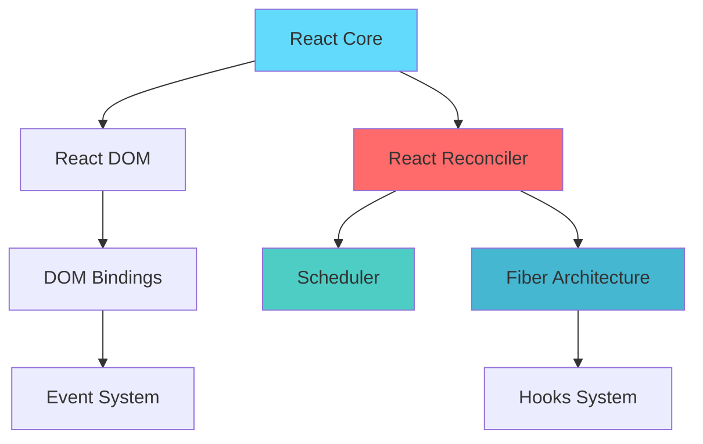
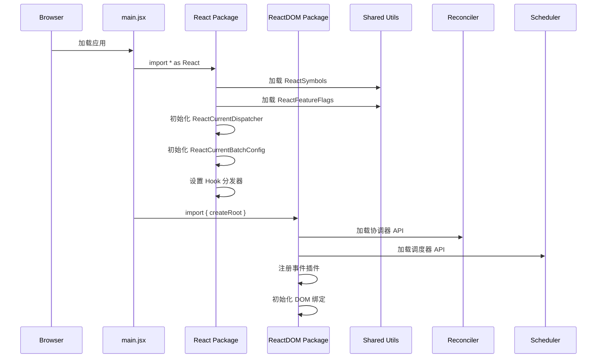
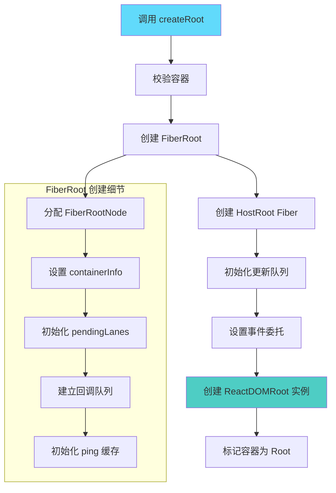
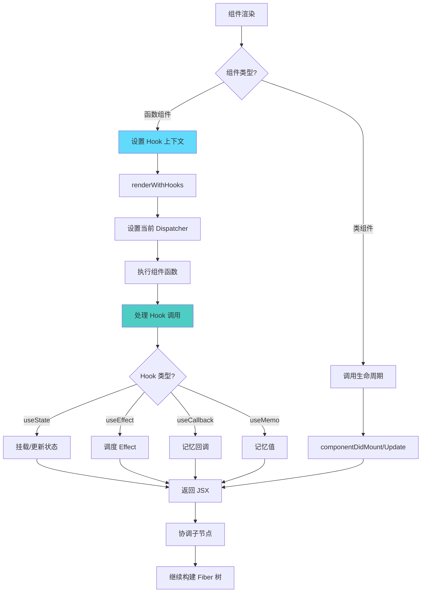
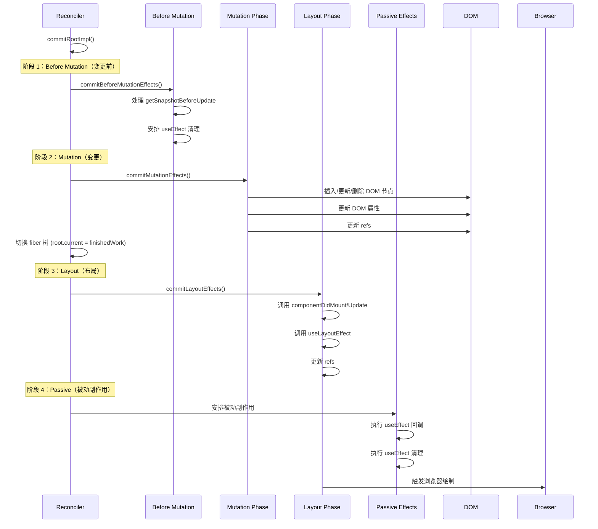
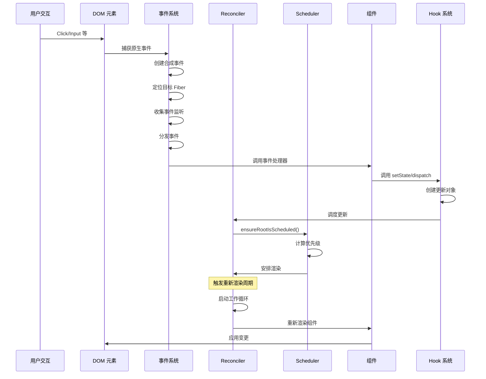
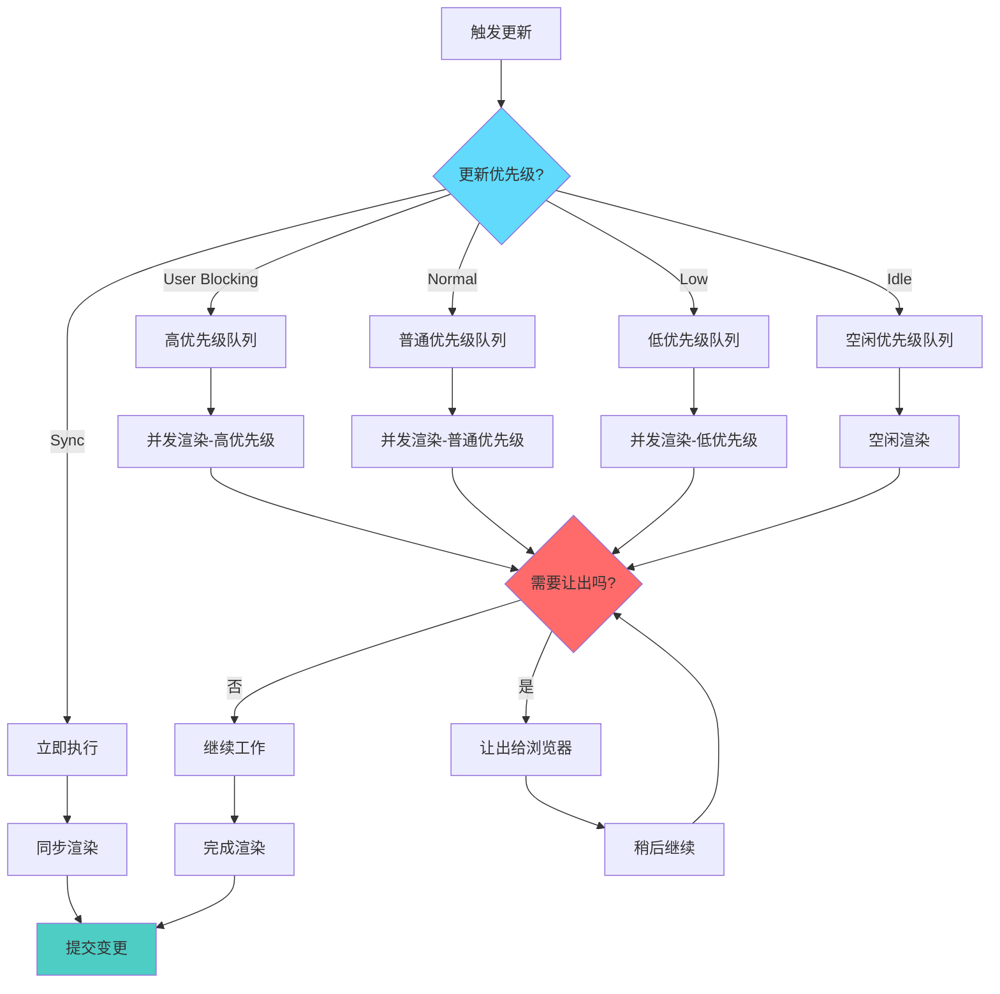
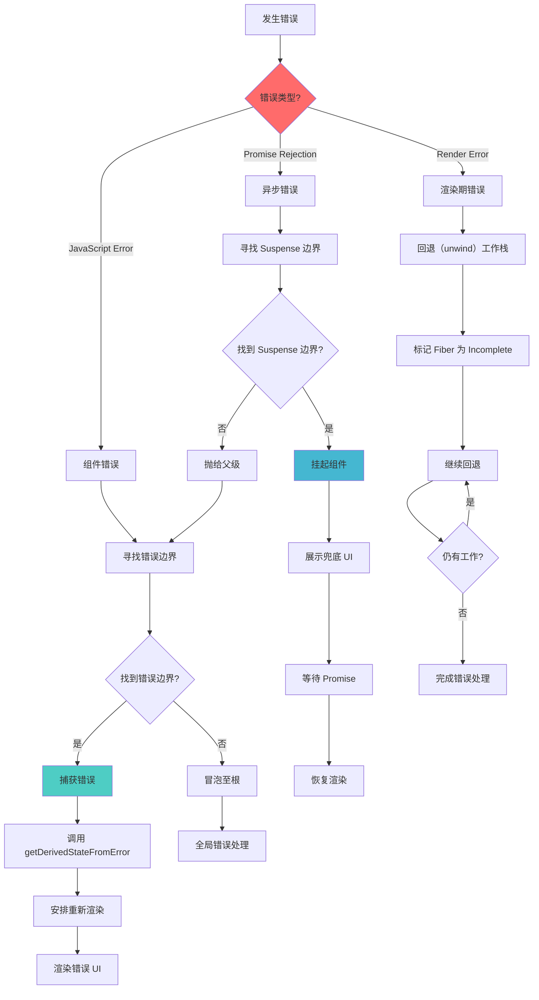
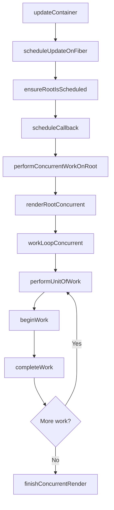
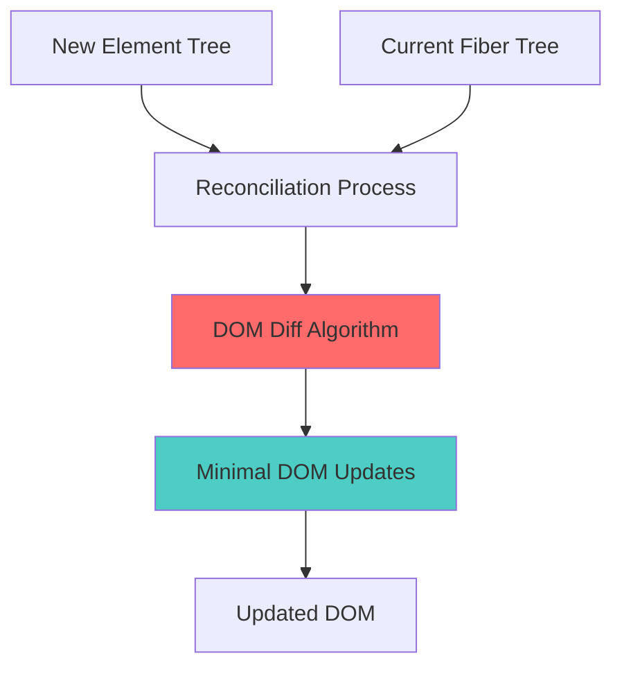

# React 18 源码实现与解析

> 从零开始、逐行实现 React 18 的核心功能，通过模块化设计完整演示其内部工作原理。

## 🌐 语言切换 | Language Switch

**中文** | **[English](./README.md)**

---

## 🚦 快速导航

| 章节 | 描述 | 关键词 |
| --- | --- | --- |
| [🚀 快速开始](#-快速开始) | 环境搭建与基本使用 | 安装、开发、示例 |
| [🏗️ 架构总览](#️-架构总览) | 系统整体设计 | 模块结构、设计模式 |
| [⚡ 核心实现](#-核心实现) | 关键实现流程 | 启动、渲染、协调 |
| [🛣️ React 车道优先级系统](#️-react-车道优先级系统) | React 18 并发调度 | 车道系统、优先级管理 |
| [🎣 Hooks 系统](#-hooks-系统) | 完整 Hooks 实现 | useState、useEffect、useReducer |
| [🔄 DOM Diff 算法](#-dom-diff-算法) | 协调与 Diff 过程 | 节点对比、列表更新 |
| [🔄 并发特性](#-并发特性) | React 18 并发能力 | Suspense、过渡、优先级 |
| [🎯 事件系统](#-事件系统) | 合成事件实现 | 委托、派发、处理 |
| [⏰ 调度器](#-调度器) | 任务调度与优先队列 | 时间分片、优先队列 |
| [🔧 进阶主题](#-进阶主题) | 深入实现细节 | 错误处理、DevTools、性能 |
| [📚 参考](#-参考) | API 参考与示例 | 代码样例、最佳实践 |

---

## 🚀 快速开始

### 前置知识

在深入本仓库的 React 18 实现前，建议你了解：

- **JavaScript ES6+**：现代 JS 特性与模式
- **数据结构**：[二进制运算](./markdown/&|.md)、[最小堆](./markdown/minHeap.md)
- **算法**：[深度优先遍历](./markdown/dfs.md)
- **Web APIs**：[MessageChannel API](./markdown/messageChannel.md)

### 快速安装与运行

```bash
# 克隆并安装依赖
git clone <repository-url>
cd mini_React
npm install

# 启动开发服务器
npm run dev
```

### 项目结构概览

```
mini_React/
├── 📁 src/                          # 源码实现
│   ├── 📁 react/                    # React 核心包
│   ├── 📁 react-dom/                # DOM 渲染器
│   ├── 📁 react-reconciler/         # 协调引擎
│   ├── 📁 scheduler/                # 任务调度器
│   └── 📁 shared/                   # 公共工具
├── 📁 markdown/                     # 详细文档
└── 📄 README.md                     # 英文版详解
```

---

## 🏗️ 架构总览

### 系统设计理念

本 React 18 实现遵循以下核心原则：

1. **🔄 模块化架构**：按包划分关注点，职责清晰
2. **⚡ 并发渲染**：非阻塞、可中断的渲染
3. **🎯 基于优先级的调度**：智能任务优先级管理
4. **🔗 基于 Fiber 的协调**：高效树遍历与更新
5. **🎣 Hook 驱动的状态管理**：函数组件状态与副作用

### 包结构关系



#### 核心包职责拆分

| 包名 | 职责 | 关键文件 |
| --- | --- | --- |
| **react/** | 对外 API 与 Hooks | `React.js`、`ReactHooks.js` |
| **react-dom/** | DOM 渲染 | `ReactDOMRoot.js` |
| **react-reconciler/** | 核心引擎 | `ReactFiberWorkLoop.js`、`ReactFiber.js` |
| **scheduler/** | 任务管理 | `Scheduler.js`、`SchedulerMinHeap.js` |
| **shared/** | 公共工具 | `ReactSymbols.js`、`ReactFeatureFlags.js` |

---

## ⚡ 核心实现

### 1. 应用启动流程

#### 1.1 入口文件解析

```javascript
// src/main.jsx - 应用入口
import * as React from "react";
import { createRoot } from "react-dom/client";

function App() {
  const [count, setCount] = React.useState(0);
  return <div onClick={() => setCount(count + 1)}>Count: {count}</div>;
}

const root = createRoot(document.getElementById("root"));
root.render(<App />);
```

#### 1.2 完整执行流程概览

React 应用的执行由多个相互关联的阶段组成，每个阶段都承担特定职责并包含详细的内部处理。

##### 1.2.1 阶段一：模块初始化与准备



**模块加载细节：**

```javascript
// 阶段 1.1：React 核心初始化
function initializeReactCore() {
  // 步骤 1：初始化全局分发器
  ReactCurrentDispatcher.current = null;
  ReactCurrentBatchConfig.transition = null;

  // 步骤 2：设置开发者工具集成
  if (__DEV__) {
    ReactDebugCurrentFrame.setExtraStackFrame = null;
  }

  // 步骤 3：初始化共享内部对象
  const ReactSharedInternals = {
    ReactCurrentDispatcher,
    ReactCurrentBatchConfig,
    ReactCurrentOwner,
    ReactDebugCurrentFrame,
  };

  return ReactSharedInternals;
}

// 阶段 1.2：事件系统初始化
function initializeEventSystem() {
  // 注册受支持的事件
  registerSimpleEvents();
  registerTwoPhaseEvent("onBeforeInput", ["beforeinput", "compositionend"]);
  registerTwoPhaseEvent("onCompositionEnd", ["compositionend"]);
  registerTwoPhaseEvent("onCompositionStart", ["compositionstart"]);
  registerTwoPhaseEvent("onCompositionUpdate", ["compositionupdate"]);

  // 初始化事件优先级
  setCurrentUpdatePriority(DefaultEventPriority);
}
```

### 实战示例

理解 React 如何为不同类型的更新分配车道，有助于优化应用并理解调度行为。

#### 1. 用户交互示例

**按钮点击（InputContinuousLane）**

```javascript
function Counter() {
  const [count, setCount] = useState(0);

  const handleClick = () => {
    // 此更新获得 InputContinuousLane 优先级
    setCount(count + 1);
  };

  return <button onClick={handleClick}>Count: {count}</button>;
}

// 车道分配流程：
// 1. 用户点击按钮
// 2. React 捕获 click 事件
// 3. 事件被赋予 InputContinuousLane（0b100）
// 4. setState 继承该优先级
// 5. 高优先级调度确保即时反馈
```

**文本输入（InputContinuousLane）**

```javascript
function SearchBox() {
  const [query, setQuery] = useState("");

  const handleInput = (e) => {
    // 为流畅输入提供高优先级
    setQuery(e.target.value);
  };

  return <input value={query} onChange={handleInput} />;
}

// 为什么用 InputContinuousLane？
// - 输入时需要即时可见反馈
// - 延迟会让体验变卡顿
// - 高优先级保证流畅打字
```

#### 2. 状态更新场景

**useEffect 更新（DefaultLane）**

```javascript
function DataFetcher() {
  const [data, setData] = useState(null);
  const [loading, setLoading] = useState(false);

  useEffect(() => {
    setLoading(true); // DefaultLane

    fetch("/api/data")
      .then((response) => response.json())
      .then((result) => {
        setData(result); // DefaultLane
        setLoading(false); // DefaultLane
      });
  }, []);

  return loading ? <div>Loading...</div> : <div>{data}</div>;
}

// 说明：
// - useEffect 回调以 DefaultLane 运行
// - 紧急性低于用户交互
// - 可被更高优先级打断
```

**异步状态更新（DefaultLane）**

```javascript
function AsyncCounter() {
  const [count, setCount] = useState(0);

  const incrementAsync = () => {
    // 初次点击：InputContinuousLane
    setTimeout(() => {
      // 定时器回调：DefaultLane
      setCount((prev) => prev + 1);
    }, 1000);
  };

  return <button onClick={incrementAsync}>Async Count: {count}</button>;
}

// 优先级变化：
// 1. 点击事件：InputContinuousLane（立即）
// 2. setTimeout 回调：DefaultLane（普通）
// 3. 同一交互的不同阶段，优先级不同
```

#### 3. 同步更新示例

**错误边界（SyncLane）**

```javascript
class ErrorBoundary extends React.Component {
  constructor(props) {
    super(props);
    this.state = { hasError: false };
  }

  static getDerivedStateFromError(error) {
    // 同步最高优先级
    return { hasError: true };
  }

  render() {
    if (this.state.hasError) {
      return <h1>Something went wrong.</h1>;
    }
    return this.props.children;
  }
}

// 原因：
// - 错误恢复至关重要
// - 不能被打断或延迟
// - 需立即执行以避免崩溃
```

**强制同步更新**

```javascript
function UrgentUpdate() {
  const [urgent, setUrgent] = useState(false);

  const handleUrgentClick = () => {
    // 使用 flushSync 强制同步
    flushSync(() => {
      setUrgent(true); // SyncLane
    });

    // 这句在同步更新提交后执行
    console.log("Urgent update completed");
  };

  return <button onClick={handleUrgentClick}>Urgent: {urgent}</button>;
}

// flushSync 强制 SyncLane：
// - 绕过并发渲染
// - 立即、同步执行
// - 谨慎使用，可能影响性能
```

#### 4. 后台工作示例

**空闲更新（IdleLane）**

```javascript
function BackgroundProcessor() {
  const [processed, setProcessed] = useState(0);
  const [data, setData] = useState([]);

  useEffect(() => {
    const processInBackground = () => {
      // 安排低优先级后台任务
      scheduler.postTask(
        () => {
          setProcessed((prev) => prev + 1); // IdleLane
        },
        { priority: "background" }
      );
    };

    const interval = setInterval(processInBackground, 5000);
    return () => clearInterval(interval);
  }, []);

  return <div>Processed: {processed} items</div>;
}

// IdleLane 特性：
// - 浏览器空闲时执行
// - 可被任何工作打断
// - 适合非关键任务
```

**数据预取（IdleLane）**

```javascript
function PrefetchingComponent() {
  const [currentData, setCurrentData] = useState(null);
  const [prefetchedData, setPrefetchedData] = useState(new Map());

  useEffect(() => {
    // 空闲时预取数据
    const prefetchNext = () => {
      scheduler.postTask(
        () => {
          fetch("/api/next-data")
            .then((response) => response.json())
            .then((data) => {
              // 低优先级，不会打断交互
              setPrefetchedData((prev) => new Map(prev).set("next", data));
            });
        },
        { priority: "background" }
      );
    };

    prefetchNext();
  }, [currentData]);

  return <div>Current: {currentData}</div>;
}
```

#### 5. 并发渲染场景

**混合优先级更新**

```javascript
function MixedPriorityApp() {
  const [userInput, setUserInput] = useState(""); // 高优先级
  const [searchResults, setSearchResults] = useState([]); // 普通
  const [analytics, setAnalytics] = useState({}); // 低优先级

  const handleSearch = (query) => {
    // 1. 立即 UI 反馈（InputContinuousLane）
    setUserInput(query);

    // 2. 搜索 API（DefaultLane）
    searchAPI(query).then((results) => {
      setSearchResults(results);
    });

    // 3. 埋点分析（IdleLane）
    scheduler.postTask(
      () => {
        setAnalytics((prev) => ({
          ...prev,
          lastSearch: query,
          searchCount: prev.searchCount + 1,
        }));
      },
      { priority: "background" }
    );
  };

  return (
    <div>
      <input value={userInput} onChange={(e) => handleSearch(e.target.value)} />
      <SearchResults results={searchResults} />
      <Analytics data={analytics} />
    </div>
  );
}

// 执行顺序：
// 1. InputContinuousLane：立刻更新输入框
// 2. DefaultLane：获取并展示搜索结果
// 3. IdleLane：空闲时更新埋点
```

**打断与恢复**

```javascript
function InterruptibleWork() {
  const [heavyData, setHeavyData] = useState([]);
  const [userAction, setUserAction] = useState("");

  const processHeavyData = () => {
    // 重计算（DefaultLane）
    processLargeDataset().then((result) => {
      setHeavyData(result); // 可被打断
    });
  };

  const handleUserAction = (action) => {
    // 高优先级用户操作（InputContinuousLane）
    setUserAction(action); // 将打断重计算
  };

  return (
    <div>
      <button onClick={processHeavyData}>Process Data</button>
      <button onClick={() => handleUserAction("clicked")}>User Action</button>
      <div>Status: {userAction}</div>
      <div>Data items: {heavyData.length}</div>
    </div>
  );
}

// 打断流程：
// 1. 开始默认优先级的数据处理
// 2. 用户点击触发高优先级交互
// 3. React 中断数据处理
// 4. 先完成用户交互更新
// 5. 随后恢复数据处理
```

### 车道过期与饥饿预防

React 通过一套过期时间系统，防止低优先级更新被高优先级长期压制，保障响应性与公平性。

#### 过期时间系统

**`computeExpirationTime(lane, currentTime)`** —— 计算某车道的过期时间

```javascript
function computeExpirationTime(lane, currentTime) {
  switch (lane) {
    case SyncLane:
    case InputContinuousLane:
      return currentTime + 250; // 250ms
    case DefaultLane:
      return currentTime + 5000; // 5s
    case IdleLane:
      return NoTimestamp; // 永不过期
    default:
      return NoTimestamp;
  }
}

// 超时：
// - SyncLane：250ms（应立即执行）
// - InputContinuousLane：250ms（交互需要快速反馈）
// - DefaultLane：5000ms（可等待）
// - IdleLane：不超时（可选）
```

#### 饥饿检测与预防

**`markStarvedLanesAsExpired(root, currentTime)`** —— 识别并提升被饿死的车道

```javascript
export function markStarvedLanesAsExpired(root, currentTime) {
  const pendingLanes = root.pendingLanes;
  const expirationTimes = root.expirationTimes;
  let lanes = pendingLanes;

  while (lanes > 0) {
    // 取最左侧置位索引
    const index = pickArbitraryLaneIndex(lanes);
    const lane = 1 << index;
    const expirationTime = expirationTimes[index];

    if (expirationTime === NoTimestamp) {
      // 首次见到该车道，设置过期时间
      expirationTimes[index] = computeExpirationTime(lane, currentTime);
    } else if (expirationTime <= currentTime) {
      // 已过期：标记为 expired，用于优先级提升
      root.expiredLanes |= lane;
    }

    // 移除此车道，继续
    lanes &= ~lane;
  }
}
```

**过期车道检测**

```javascript
export function includesExpiredLane(root, lanes) {
  return (lanes & root.expiredLanes) !== NoLanes;
}
```

**完成后的清理**

```javascript
export function markRootFinished(root, remainingLanes) {
  // 计算已完成的车道
  const noLongerPendingLanes = root.pendingLanes & ~remainingLanes;
  root.pendingLanes = remainingLanes;

  const expirationTimes = root.expirationTimes;
  let lanes = noLongerPendingLanes;

  while (lanes > 0) {
    const index = pickArbitraryLaneIndex(lanes);
    const lane = 1 << index;

    // 清理完成车道的过期时间
    expirationTimes[index] = NoTimestamp;
    lanes &= ~lane;
  }
}
```

#### 计算车道索引与过期映射

```javascript
function pickArbitraryLaneIndex(lanes) {
  // clz32：32 位表示的前导零数量
  return 31 - Math.clz32(lanes);
}

export function createLaneMap(initial) {
  const laneMap = [];
  for (let i = 0; i < TotalLanes; i++) {
    laneMap.push(initial);
  }
  return laneMap;
}
```

该过期系统在保证高优先级更新快速执行的同时，也确保低优先级更新最终能得到处理，实现响应与公平的平衡。

### 性能影响与收益

Lane 系统通过高效算法、紧凑数据结构与智能优先级管理，相比旧方案带来显著性能优势。

#### 按位运算效率

```javascript
// O(1) 的合并与检测
function mergeLanes(a, b) {
  return a | b;
}
function hasLane(lanes, targetLane) {
  return (lanes & targetLane) !== 0;
}

// 数组方案：O(n)
function mergeArrayPriorities(a, b) {
  return [...new Set([...a, ...b])];
}
function hasArrayPriority(priorities, target) {
  return priorities.includes(target);
}
```

#### 内存效率

```javascript
// 单个 32 位整数表示所有优先级
const allLanes = 0b1111111111111111111111111111111; // 4B
const specificLanes = SyncLane | DefaultLane; // 4B

// 对比：对象或数组表示会显著增大占用
```

#### 调度复杂度

```javascript
// O(1) 检测最高优先级
function getHighestPriorityLane(lanes) {
  return lanes & -lanes;
}

// 数组排序对比：O(n log n)
function getHighestPriorityArray(priorities) {
  return priorities.sort((a, b) => a.priority - b.priority)[0];
}
```

##### 1.2.2 阶段二：根节点创建与容器准备



**根创建关键实现：**

```javascript
// 阶段 2.1：容器校验与前置准备
export function createRoot(container, options) {
  // 步骤 1：校验容器元素
  if (!isValidContainer(container)) {
    throw new Error("createRoot(...): 目标容器不是一个 DOM 元素。");
  }

  // 步骤 2：处理可选项
  const { identifierPrefix, onRecoverableError, transitionCallbacks } =
    options || {};

  // 步骤 3：创建内部 Root 结构
  const root = createContainer(
    container,
    ConcurrentRoot,
    null,
    isStrictMode,
    concurrentUpdatesByDefaultOverride,
    identifierPrefix,
    onRecoverableError,
    transitionCallbacks
  );

  // 步骤 4：将容器标记为 React 根
  markContainerAsRoot(root.current, container);

  // 步骤 5：设置事件委托系统
  const rootContainerElement =
    container.nodeType === COMMENT_NODE ? container.parentNode : container;
  listenToAllSupportedEvents(rootContainerElement);

  // 步骤 6：返回 ReactDOMRoot 实例
  return new ReactDOMRoot(root);
}

// 阶段 2.2：创建 Fiber 根结构
function createFiberRoot(
  containerInfo,
  tag,
  hydrate,
  initialChildren,
  hydrationCallbacks
) {
  // 步骤 1：创建根节点
  const root = new FiberRootNode(
    containerInfo,
    tag,
    hydrate,
    hydrationCallbacks
  );

  // 步骤 2：创建 HostRoot Fiber
  const uninitializedFiber = createHostRootFiber(tag, isStrictMode);
  root.current = uninitializedFiber;
  uninitializedFiber.stateNode = root;

  // 步骤 3：初始化更新队列
  const initialState = {
    element: initialChildren,
    isDehydrated: hydrate,
    cache: null,
    transitions: null,
    pendingSuspenseBoundaries: null,
  };
  uninitializedFiber.memoizedState = initialState;

  const updateQueue = createUpdateQueue();
  uninitializedFiber.updateQueue = updateQueue;

  return root;
}
```

##### 1.2.3 阶段三：首次渲染流程


**渲染流程关键实现：**

```javascript
// 阶段 3.1：更新容器流程
function updateContainer(element, container, parentComponent, callback) {
  const current = container.current;
  const eventTime = requestEventTime();
  const lane = requestUpdateLane(current);

  // 步骤 1：创建更新对象
  const update = createUpdate(eventTime, lane);
  update.payload = { element };

  if (callback !== undefined && callback !== null) {
    update.callback = callback;
  }

  // 步骤 2：将更新入队
  const root = enqueueUpdate(current, update, lane);

  if (root !== null) {
    // 步骤 3：调度此次更新
    scheduleUpdateOnFiber(root, current, lane, eventTime);
    entangleTransitions(root, current, lane);
  }

  return lane;
}

// 阶段 3.2：工作循环执行
function workLoopConcurrent() {
  // 在调度器要求让出之前持续工作
  while (workInProgress !== null && !shouldYield()) {
    performUnitOfWork(workInProgress);
  }
}

function performUnitOfWork(unitOfWork) {
  const current = unitOfWork.alternate;

  // 步骤 1：开始工作阶段
  setCurrentDebugFiberInDEV(unitOfWork);
  let next;

  if (enableProfilerTimer && (unitOfWork.mode & ProfileMode) !== NoMode) {
    startProfilerTimer(unitOfWork);
    next = beginWork(current, unitOfWork, renderLanes);
    stopProfilerTimerIfRunningAndRecordDelta(unitOfWork, true);
  } else {
    next = beginWork(current, unitOfWork, renderLanes);
  }

  resetCurrentDebugFiberInDEV();
  unitOfWork.memoizedProps = unitOfWork.pendingProps;

  if (next === null) {
    // 步骤 2：完成工作阶段
    completeUnitOfWork(unitOfWork);
  } else {
    // 步骤 3：继续处理子节点
    workInProgress = next;
  }

  ReactCurrentOwner.current = null;
}
```

##### 1.2.4 阶段四：组件生命周期与 Hook 执行



**Hook 执行流程细节：**

```javascript
// 阶段 4.1：Hook 上下文设置
export function renderWithHooks(
  current,
  workInProgress,
  Component,
  props,
  secondArg,
  nextRenderLanes
) {
  renderLanes = nextRenderLanes;
  currentlyRenderingFiber = workInProgress;

  // 步骤 1：清理上一次 Hook 状态
  workInProgress.memoizedState = null;
  workInProgress.updateQueue = null;
  workInProgress.lanes = NoLanes;

  // 步骤 2：设置合适的 Dispatcher
  ReactCurrentDispatcher.current =
    current === null || current.memoizedState === null
      ? HooksDispatcherOnMount
      : HooksDispatcherOnUpdate;

  // 步骤 3：执行组件函数
  let children = Component(props, secondArg);

  // 步骤 4：处理渲染过程中的二次渲染
  if (didScheduleRenderPhaseUpdateDuringThisPass) {
    let numberOfReRenders = 0;
    do {
      didScheduleRenderPhaseUpdateDuringThisPass = false;
      localIdCounter = 0;

      if (numberOfReRenders >= RE_RENDER_LIMIT) {
        throw new Error("渲染次数过多...");
      }

      numberOfReRenders += 1;
      currentHook = null;
      workInProgressHook = null;

      workInProgress.updateQueue = null;

      ReactCurrentDispatcher.current = HooksDispatcherOnRerender;
      children = Component(props, secondArg);
    } while (didScheduleRenderPhaseUpdateDuringThisPass);
  }

  // 步骤 5：清理
  ReactCurrentDispatcher.current = ContextOnlyDispatcher;
  currentlyRenderingFiber = null;
  currentHook = null;
  workInProgressHook = null;
  renderLanes = NoLanes;

  return children;
}
```

##### 1.2.5 阶段五：提交（Commit）阶段执行



**提交阶段关键实现：**

```javascript
// 阶段 5.1：完整提交流程
function commitRootImpl(root, renderPriorityLevel) {
  // 步骤 1：提交前准备
  const finishedWork = root.finishedWork;
  const lanes = root.finishedLanes;

  if (finishedWork === null) {
    return null;
  }

  root.finishedWork = null;
  root.finishedLanes = NoLanes;

  // 步骤 2：变更前阶段（Before Mutation）
  const shouldFireAfterActiveInstanceBlur = commitBeforeMutationEffects(
    root,
    finishedWork
  );

  // 步骤 3：变更阶段（Mutation）
  commitMutationEffects(root, finishedWork, lanes);

  // 步骤 4：切换 Fiber 树
  root.current = finishedWork;

  // 步骤 5：布局阶段（Layout）
  commitLayoutEffects(finishedWork, root, lanes);

  // 步骤 6：安排被动副作用
  if (
    (finishedWork.subtreeFlags & PassiveMask) !== NoFlags ||
    (finishedWork.flags & PassiveMask) !== NoFlags
  ) {
    if (!rootDoesHavePassiveEffects) {
      rootDoesHavePassiveEffects = true;
      pendingPassiveEffectsRemainingLanes = remainingLanes;
      scheduleCallback(NormalSchedulerPriority, () => {
        flushPassiveEffects();
        return null;
      });
    }
  }

  // 步骤 7：清理并为下次渲染做准备
  remainingLanes = mergeLanes(remainingLanes, getRemainingLanes(root, lanes));
  ensureRootIsScheduled(root, now());

  return null;
}
```

##### 1.2.6 阶段六：事件处理与状态更新



**事件处理关键实现：**

```javascript
// 阶段 6.1：事件捕获与处理
function dispatchEventForPlugins(
  domEventName,
  eventSystemFlags,
  nativeEvent,
  targetInst,
  targetContainer
) {
  const nativeEventTarget = getEventTarget(nativeEvent);
  const dispatchQueue = [];

  // 步骤 1：从 Fiber 树提取事件
  extractEvents(
    dispatchQueue,
    domEventName,
    targetInst,
    nativeEvent,
    nativeEventTarget,
    eventSystemFlags,
    targetContainer
  );

  // 步骤 2：处理事件分发队列
  processDispatchQueue(dispatchQueue, eventSystemFlags);
}

// 阶段 6.2：状态更新调度
function dispatchSetState(fiber, queue, action) {
  const lane = requestUpdateLane(fiber);
  const eventTime = requestEventTime();

  // 步骤 1：创建更新对象
  const update = {
    lane,
    action,
    hasEagerState: false,
    eagerState: null,
    next: null,
  };

  // 步骤 2：抢先状态计算优化
  if (
    fiber.lanes === NoLanes &&
    (fiber.alternate === null || fiber.alternate.lanes === NoLanes)
  ) {
    const lastRenderedReducer = queue.lastRenderedReducer;
    if (lastRenderedReducer !== null) {
      try {
        const currentState = queue.lastRenderedState;
        const eagerState = lastRenderedReducer(currentState, action);
        update.hasEagerState = true;
        update.eagerState = eagerState;

        if (Object.is(eagerState, currentState)) {
          // 直接跳过——状态未变化
          return;
        }
      } catch (error) {
        // 忽略错误，渲染阶段再抛出
      }
    }
  }

  // 步骤 3：将更新入队并调度工作
  const root = enqueueConcurrentHookUpdate(fiber, queue, update, lane);
  if (root !== null) {
    scheduleUpdateOnFiber(root, fiber, lane, eventTime);
    entangleTransitionUpdate(root, queue, lane);
  }
}
```

##### 1.2.7 阶段七：并发特性与优先级管理



**优先级管理实现：**

```javascript
// 阶段 7.1：计算更新车道（优先级）
export function requestUpdateLane(fiber) {
  const mode = fiber.mode;
  if ((mode & ConcurrentMode) === NoMode) {
    return SyncLane;
  }

  // 处于 transition 上下文
  const isTransition = requestCurrentTransition() !== NoTransition;
  if (isTransition) {
    if (currentEventTransitionLane === NoLane) {
      currentEventTransitionLane = claimNextTransitionLane();
    }
    return currentEventTransitionLane;
  }

  // 根据当前更新优先级获取车道
  const updatePriority = getCurrentUpdatePriority();
  if (updatePriority !== NoEventPriority) {
    return lanePriorityToLanes(updatePriority);
  }

  // 从调度器优先级映射车道
  const schedulerPriority = getCurrentSchedulerPriorityLevel();
  const lane = schedulerPriorityToLane(schedulerPriority);
  return lane;
}

// 阶段 7.2：并发工作调度
function ensureRootIsScheduled(root, currentTime) {
  const existingCallbackNode = root.callbackNode;

  // 步骤 1：标记饥饿的车道为已过期
  markStarvedLanesAsExpired(root, currentTime);

  // 步骤 2：确定下一批要处理的车道
  const nextLanes = getNextLanes(
    root,
    root === workInProgressRoot ? workInProgressRootRenderLanes : NoLanes
  );

  if (nextLanes === NoLanes) {
    // 无工作
    if (existingCallbackNode !== null) {
      cancelCallback(existingCallbackNode);
    }
    root.callbackNode = null;
    root.callbackPriority = NoLane;
    return;
  }

  // 步骤 3：检查是否可复用已有回调
  const newCallbackPriority = getHighestPriorityLane(nextLanes);
  const existingCallbackPriority = root.callbackPriority;

  if (
    existingCallbackPriority === newCallbackPriority &&
    existingCallbackNode !== null
  ) {
    return; // 复用
  }

  // 步骤 4：取消旧回调并安排新回调
  if (existingCallbackNode != null) {
    cancelCallback(existingCallbackNode);
  }

  let newCallbackNode;
  if (newCallbackPriority === SyncLane) {
    // 同步工作
    if (root.tag === LegacyRoot) {
      scheduleLegacySyncCallback(performSyncWorkOnRoot.bind(null, root));
    } else {
      scheduleSyncCallback(performSyncWorkOnRoot.bind(null, root));
    }
    newCallbackNode = null;
  } else {
    // 并发工作
    let schedulerPriorityLevel;
    switch (lanesToEventPriority(nextLanes)) {
      case DiscreteEventPriority:
        schedulerPriorityLevel = ImmediateSchedulerPriority;
        break;
      case ContinuousEventPriority:
        schedulerPriorityLevel = UserBlockingSchedulerPriority;
        break;
      case DefaultEventPriority:
        schedulerPriorityLevel = NormalSchedulerPriority;
        break;
      case IdleEventPriority:
        schedulerPriorityLevel = IdleSchedulerPriority;
        break;
      default:
        schedulerPriorityLevel = NormalSchedulerPriority;
        break;
    }

    newCallbackNode = scheduleCallback(
      schedulerPriorityLevel,
      performConcurrentWorkOnRoot.bind(null, root)
    );
  }

  root.callbackPriority = newCallbackPriority;
  root.callbackNode = newCallbackNode;
}
```

##### 1.2.8 阶段八：错误处理与恢复



**错误处理实现：**

```javascript
// 阶段 8.1：捕获与处理异常
function throwException(
  root,
  returnFiber,
  sourceFiber,
  value,
  rootRenderLanes
) {
  // 标记源 Fiber 未完成
  sourceFiber.flags |= Incomplete;

  if (
    value !== null &&
    typeof value === "object" &&
    typeof value.then === "function"
  ) {
    // thenable（Promise）
    const wakeable = value;

    // 寻找最近的 Suspense 边界
    let workInProgress = returnFiber;
    do {
      if (
        workInProgress.tag === SuspenseComponent &&
        shouldCaptureSuspense(workInProgress)
      ) {
        // 将 wakeable 附加到 suspense 边界
        const wakeables = workInProgress.updateQueue;
        if (wakeables === null) {
          const updateQueue = new Set();
          updateQueue.add(wakeable);
          workInProgress.updateQueue = updateQueue;
        } else {
          wakeables.add(wakeable);
        }

        // 添加 ping 监听
        attachPingListener(root, wakeable, rootRenderLanes);

        workInProgress.flags |= ShouldCapture;
        workInProgress.lanes = rootRenderLanes;
        return;
      }
      workInProgress = workInProgress.return;
    } while (workInProgress !== null);

    // 未找到 Suspense 边界，当作错误处理
    value = new Error(
      "A component suspended while responding to synchronous input."
    );
  }

  // 常规错误处理
  let workInProgress = returnFiber;
  do {
    switch (workInProgress.tag) {
      case HostRoot: {
        const errorInfo = value;
        workInProgress.flags |= ShouldCapture;
        const lane = pickArbitraryLane(rootRenderLanes);
        workInProgress.lanes = mergeLanes(workInProgress.lanes, lane);

        const update = createRootErrorUpdate(workInProgress, errorInfo, lane);
        enqueueCapturedUpdate(workInProgress, update);
        return;
      }
      case ClassComponent: {
        const errorInfo = value;
        const ctor = workInProgress.type;
        const instance = workInProgress.stateNode;

        if (
          (workInProgress.flags & DidCapture) === NoFlags &&
          (typeof ctor.getDerivedStateFromError === "function" ||
            (instance !== null &&
              typeof instance.componentDidCatch === "function"))
        ) {
          workInProgress.flags |= ShouldCapture;
          const lane = pickArbitraryLane(rootRenderLanes);
          workInProgress.lanes = mergeLanes(workInProgress.lanes, lane);

          const update = createClassErrorUpdate(
            workInProgress,
            errorInfo,
            lane
          );
          enqueueCapturedUpdate(workInProgress, update);
          return;
        }
        break;
      }
    }
    workInProgress = workInProgress.return;
  } while (workInProgress !== null);
}
```

#### 1.3 详细实现步骤

**步骤 1：React 包加载**

```javascript
// src/react/src/React.js
import { useReducer, useState, useEffect } from "./ReactHooks";
import ReactSharedInternals from "./ReactSharedInternals";

export {
  useReducer,
  useState,
  useEffect,
  ReactSharedInternals as __SECRET_INTERNALS_DO_NOT_USE_OR_YOU_WILL_BE_FIRED,
};
```

**步骤 2：根创建流程（ReactDOMRoot）**

```javascript
// src/react-dom/src/client/ReactDOMRoot.js
export function createRoot(container) {
  // 1. 创建 Fiber 根结构
  const root = createContainer(container);

  // 2. 设置事件委托
  listenToAllSupportedEvents(container);

  // 3. 返回 ReactDOMRoot 实例
  return new ReactDOMRoot(root);
}

function ReactDOMRoot(internalRoot) {
  this._internalRoot = internalRoot;
}

ReactDOMRoot.prototype.render = function (children) {
  const root = this._internalRoot;
  root.containerInfo.innerHTML = "";
  updateContainer(children, root);
};
```

**步骤 3：Fiber 根结构创建**

```javascript
// src/react-reconciler/src/ReactFiberRoot.js
export function createFiberRoot(containerInfo) {
  // 创建 FiberRootNode
  const root = new FiberRootNode(containerInfo);

  // 创建 HostRoot Fiber
  const uninitializedFiber = createHostRootFiber();

  // 建立双向关联
  root.current = uninitializedFiber;
  uninitializedFiber.stateNode = root;

  // 初始化更新队列
  initialUpdateQueue(uninitializedFiber);

  return root;
}
```

### 2. 渲染流水线（Rendering Pipeline）

#### 2.1 渲染阶段（可中断）

渲染阶段负责构建新的 Fiber 树，并且可以被中断：



#### 2.2 工作循环实现

```javascript
// src/react-reconciler/src/ReactFiberWorkLoop.js
function workLoopConcurrent() {
  // 在调度器要求让出之前持续工作
  while (workInProgress !== null && !shouldYield()) {
    performUnitOfWork(workInProgress);
  }
}

function performUnitOfWork(unitOfWork) {
  const current = unitOfWork.alternate;

  // 开始工作阶段
  let next = beginWork(current, unitOfWork, renderLanes);

  unitOfWork.memoizedProps = unitOfWork.pendingProps;

  if (next === null) {
    // 无子节点，完成此单元
    completeUnitOfWork(unitOfWork);
  } else {
    // 继续处理子节点
    workInProgress = next;
  }
}
```

#### 2.3 提交阶段（同步）

提交阶段会将更改同步应用到 DOM：

```javascript
function commitRootImpl(root, renderPriorityLevel) {
  // 阶段 1：变更前副作用
  commitBeforeMutationEffects(root, finishedWork);

  // 阶段 2：变更副作用（DOM 变更）
  commitMutationEffects(root, finishedWork, lanes);

  // 切换 fiber 树
  root.current = finishedWork;

  // 阶段 3：布局副作用
  commitLayoutEffects(finishedWork, root, lanes);

  // 安排被动副作用（useEffect）
  if (rootDoesHavePassiveEffects) {
    scheduleCallback(NormalSchedulerPriority, flushPassiveEffects);
  }
}
```

### 3. Fiber 架构深入

#### 3.1 Fiber 节点结构

```javascript
// src/react-reconciler/src/ReactFiber.js
function FiberNode(tag, pendingProps, key, mode) {
  // 实例字段
  this.tag = tag; // Fiber 类型
  this.key = key; // 唯一标识
  this.elementType = null; // 元素类型
  this.type = null; // 函数组件/类组件引用
  this.stateNode = null; // DOM 节点或实例

  // Fiber 关系
  this.return = null; // 父 fiber
  this.child = null; // 第一个子节点
  this.sibling = null; // 下一个兄弟
  this.index = 0; // 在父中的位置

  // 属性与状态
  this.pendingProps = pendingProps; // 新的 props
  this.memoizedProps = null; // 已生效的 props
  this.updateQueue = null; // 更新队列
  this.memoizedState = null; // 已生效的 state

  // 副作用
  this.flags = NoFlags; // 当前节点副作用
  this.subtreeFlags = NoFlags; // 子树副作用
  this.deletions = null; // 待删除子节点

  // 调度
  this.lanes = NoLanes; // 当前节点优先级集合
  this.childLanes = NoLanes; // 子树优先级集合

  // 双缓冲
  this.alternate = null; // 交替 fiber
}
```

#### 3.2 Fiber 树遍历算法

```javascript
function completeUnitOfWork(unitOfWork) {
  let completedWork = unitOfWork;

  do {
    const current = completedWork.alternate;
    const returnFiber = completedWork.return;

    // 完成当前单元工作
    const next = completeWork(current, completedWork, renderLanes);

    if (next !== null) {
      // 挂起或错误的场景
      workInProgress = next;
      return;
    }

    // 汇总副作用
    if (returnFiber !== null && (returnFiber.flags & Incomplete) === NoFlags) {
      // 汇总子树副作用到父节点
      if (returnFiber.subtreeFlags === NoFlags) {
        returnFiber.subtreeFlags = completedWork.subtreeFlags;
      } else {
        returnFiber.subtreeFlags |= completedWork.subtreeFlags;
      }
      returnFiber.subtreeFlags |= completedWork.flags;
    }

    const siblingFiber = completedWork.sibling;
    if (siblingFiber !== null) {
      // 继续处理兄弟节点
      workInProgress = siblingFiber;
      return;
    }

    // 上移到父节点
    completedWork = returnFiber;
    workInProgress = completedWork;
  } while (completedWork !== null);

  // 抵达根
  if (workInProgressRootExitStatus === RootInProgress) {
    workInProgressRootExitStatus = RootCompleted;
  }
}
```

---

## 🛣️ React 车道优先级系统

### 概述与概念

React 的 Lane（车道）系统是一个精细的基于优先级的调度机制，通过用二进制位表示不同类型的工作，使并发渲染成为可能。它让 React 可以根据重要性与紧急程度，高效地管理、排序并中断更新。

#### 什么是 Lane？

Lane 是 React 用来为不同更新类型分类并赋予优先级的方式。每条车道用一个二进制数表示，每一位代表一个特定的优先级或工作类别。这种二进制表达可以用极高效的按位运算来合并、比较与管理并发更新。

```javascript
// 车道表示示例
const SyncLane = 0b0000000000000000000000000000001; // 最高优先级
const InputContinuousLane = 0b0000000000000000000000000000100; // 高优先级
const DefaultLane = 0b0000000000000000000000000010000; // 普通优先级
const IdleLane = 0b0100000000000000000000000000000; // 最低优先级
```

#### 关键原则

1. **数值越小优先级越高**：较小的二进制值先被处理
2. **按位运算**：通过按位或（`|`）等操作高效合并多个车道
3. **可中断渲染**：高优先级车道可中断低优先级工作
4. **细粒度控制**：不同车道代表具体的更新类别

#### 与并发特性的关系

车道系统是 React 18 并发特性的地基：

- **时间分片**：基于车道优先级暂停与继续工作
- **Suspense**：用车道管理加载与数据获取的优先级
- **Transitions**：以优先级管理实现顺滑 UI 过渡
- **自动批处理**：将相同优先级的更新合并处理

#### 相比过期时间调度的优势

- **更细的粒度**：对更新优先级控制更精准
- **更高效**：按位运算比时间比较更快
- **饥饿预防**：内建避免低优先级任务一直被饿死
- **并发安全**：专为并发渲染场景设计

### 车道类型与二进制表示

React 定义了多种车道类型，每种都有对应的二进制值与使用场景。

#### 完整车道类型表

| 车道类型 | 二进制 | 十进制 | 优先级 | 使用场景 |
| --- | --- | --- | --- | --- |
| `NoLanes` | `0b0000000000000000000000000000000` | 0 | N/A | 无工作 |
| `SyncLane` | `0b0000000000000000000000000000001` | 1 | 最高 | 同步更新、错误边界 |
| `InputContinuousHydrationLane` | `0b0000000000000000000000000000010` | 2 | 极高 | SSR 输入水合 |
| `InputContinuousLane` | `0b0000000000000000000000000000100` | 4 | 高 | 用户输入（点击、键盘） |
| `DefaultHydrationLane` | `0b0000000000000000000000000001000` | 8 | 中高 | SSR 默认水合 |
| `DefaultLane` | `0b0000000000000000000000000010000` | 16 | 中 | 普通状态更新、effects |
| `SelectiveHydrationLane` | `0b0001000000000000000000000000000` | 134217728 | 低 | 选择性水合 |
| `IdleHydrationLane` | `0b0010000000000000000000000000000` | 268435456 | 极低 | 空闲水合工作 |
| `IdleLane` | `0b0100000000000000000000000000000` | 536870912 | 最低 | 后台更新 |
| `OffscreenLane` | `0b1000000000000000000000000000000` | 1073741824 | 特殊 | 离屏组件工作 |

#### 车道分组

**同步车道**

- `SyncLane`：不可中断，用于关键更新，如错误边界

**用户交互车道**

- `InputContinuousLane`：为立即反馈的用户交互提供高优先级
- `InputContinuousHydrationLane`：交互的水合版本

**默认车道**

- `DefaultLane`：常规状态更新
- `DefaultHydrationLane`：默认水合工作

**后台车道**

- `IdleLane`：最低优先级的非紧急工作
- `IdleHydrationLane`：空闲水合
- `OffscreenLane`：当前不可见组件的工作

#### 二进制表示的优势

```javascript
// 示例：按位或合并多个车道
const combinedLanes = SyncLane | DefaultLane | IdleLane;
// 结果：0b0100000000000000000000000010001（多条车道同时激活）

// 示例：检查是否包含某条车道
const hasDefaultLane = (combinedLanes & DefaultLane) !== NoLanes;
// 结果：true

// 示例：寻找最高优先级车道（最右侧的 1）
const highestPriority = combinedLanes & -combinedLanes;
// 结果：0b0000000000000000000000000000001（SyncLane）
```

#### 车道掩码与分组

```javascript
// 非空闲车道掩码（排除后台工作）
const NonIdleLanes = 0b0001111111111111111111111111111;

// 检查是否包含非空闲工作
function includesNonIdleWork(lanes) {
  return (lanes & NonIdleLanes) !== NoLanes;
}

// 用于阻塞检测的同步+默认车道
const SyncDefaultLanes = InputContinuousLane | DefaultLane;
```

### 核心车道操作

React 提供了一组围绕按位运算实现的核心操作：

#### 1. 合并操作

**`mergeLanes(a, b)`** —— 按位或合并多条车道

```javascript
export function mergeLanes(a, b) {
  return a | b;
}

// 示例：合并用户输入与默认更新
const inputLane = 0b0000000000000000000000000000100; // 4
const defaultLane = 0b0000000000000000000000000010000; // 16
const combined = mergeLanes(inputLane, defaultLane);
// 结果：0b0000000000000000000000000010100 (20)

// 多重合并
const syncLane = 0b0000000000000000000000000000001; // 1
const allLanes = mergeLanes(mergeLanes(syncLane, inputLane), defaultLane);
// 结果：0b0000000000000000000000000010101 (21)
```

#### 2. 优先级检测

**`getHighestPriorityLane(lanes)`** —— 找到最右侧置位（最高优先级）

```javascript
export function getHighestPriorityLane(lanes) {
  return lanes & -lanes; // 隔离最右侧的 1
}

// 示例
const multipleLanes = 0b0000000000000000000000000010101; // Sync + Input + Default
const highest = getHighestPriorityLane(multipleLanes);
// 结果：0b0000000000000000000000000000001（SyncLane）

// 步骤：
// lanes:     0b0000000000000000000000000010101 (21)
// -lanes:    0b1111111111111111111111111101011 (-21 的二补数)
// lanes & -lanes: 0b0000000000000000000000000000001 (1)
```

#### 3. 子集判断

**`isSubsetOfLanes(set, subset)`** —— 判断 subset 是否完全包含于 set

```javascript
export function isSubsetOfLanes(set, subset) {
  return (set & subset) === subset;
}

// 示例
const currentLanes = 0b0000000000000000000000000010101; // Sync + Input + Default
const checkLanes = 0b0000000000000000000000000000101; // Sync + Input

const isIncluded = isSubsetOfLanes(currentLanes, checkLanes); // true

const missingLanes = 0b0000000000000000000000001000000; // 不同车道
const hasMissing = isSubsetOfLanes(currentLanes, missingLanes); // false
```

#### 4. 根更新标记

**`markRootUpdated(root, updateLane)`** —— 将新工作加入根的待处理车道

```javascript
export function markRootUpdated(root, updateLane) {
  // 按位或合并新车道
  root.pendingLanes |= updateLane;
}

// 示例：调度多次更新
const root = { pendingLanes: NoLanes }; // 初始无工作

// 用户点击（InputContinuousLane）
markRootUpdated(root, InputContinuousLane);
console.log(root.pendingLanes); // 4 (0b100)

// 状态更新（DefaultLane）
markRootUpdated(root, DefaultLane);
console.log(root.pendingLanes); // 20 (0b10100)

// 严重错误（SyncLane）
markRootUpdated(root, SyncLane);
console.log(root.pendingLanes); // 21 (0b10101)
```

#### 5. 车道分析

**`includesNonIdleWork(lanes)`** —— 是否包含非空闲（较高优先级）工作

```javascript
const NonIdleLanes = 0b0001111111111111111111111111111;

export function includesNonIdleWork(lanes) {
  return (lanes & NonIdleLanes) !== NoLanes;
}

// 示例
const idleWork = IdleLane; // 0b010...
const urgentWork = SyncLane | DefaultLane; // 0b000...10001

console.log(includesNonIdleWork(idleWork)); // false
console.log(includesNonIdleWork(urgentWork)); // true
```

#### 6. 高级工具

**`pickArbitraryLaneIndex(lanes)`** —— 获取最左侧置位的索引

```javascript
function pickArbitraryLaneIndex(lanes) {
  // clz32：32 位表示前导零个数
  return 31 - Math.clz32(lanes);
}

// 示例：用于过期跟踪
const lanes = 0b0000000000000000000000000010000; // DefaultLane
const index = pickArbitraryLaneIndex(lanes); // 4

// 详解：
// lanes: 0b0000000000000000000000000010000
// Math.clz32(lanes): 27
// 31 - 27 = 4
```

#### 7. 调度优先级选择

**`getNextLanes(root, wipLanes)`** —— 决定下一步要处理的车道集合

```javascript
export function getNextLanes(root, wipLanes) {
  const pendingLanes = root.pendingLanes;
  if (pendingLanes === NoLanes) {
    return NoLanes;
  }

  const nextLanes = getHighestPriorityLanes(pendingLanes);

  if (wipLanes !== NoLane && wipLanes !== nextLanes) {
    // 如果当前在做的工作优先级更高，则继续当前工作
    if (nextLanes > wipLanes) {
      // ... 其余实现详见源码
    }
  }
}
```
 
### 实战示例与性能优化

#### 缓存效率与 CPU 优化

```javascript
function processBatchedUpdates(updates) {
  let combinedLanes = NoLanes;
  for (const update of updates) {
    combinedLanes |= update.lane;
  }
  while (combinedLanes !== NoLanes) {
    const currentLane = getHighestPriorityLane(combinedLanes);
    processLane(currentLane);
    combinedLanes &= ~currentLane;
  }
}
```

#### 真实世界的性能测量

```javascript
function measureSchedulingPerformance() {
  const updates = Array.from({ length: 1000 }, (_, i) => ({
    id: i,
    lane: i % 2 === 0 ? DefaultLane : InputContinuousLane,
    payload: { value: i },
  }));

  console.time("Lane Scheduling");
  let laneBatch = NoLanes;
  updates.forEach((update) => {
    laneBatch |= update.lane;
  });
  while (laneBatch !== NoLanes) {
    const currentLane = getHighestPriorityLane(laneBatch);
    updates
      .filter((update) => (update.lane & currentLane) !== NoLanes)
      .forEach(processUpdate);
    laneBatch &= ~currentLane;
  }
  console.timeEnd("Lane Scheduling");

  console.time("Priority Queue Scheduling");
  const priorityQueue = updates
    .map((update) => ({ ...update, priority: getLanePriority(update.lane) }))
    .sort((a, b) => a.priority - b.priority);
  priorityQueue.forEach(processUpdate);
  console.timeEnd("Priority Queue Scheduling");
}
```

#### 减少内存分配与 GC 压力

```javascript
function laneBasedUpdates() {
  let pendingWork = NoLanes;
  pendingWork |= SyncLane;
  pendingWork |= DefaultLane;
  while (pendingWork !== NoLanes) {
    const current = getHighestPriorityLane(pendingWork);
    processWork(current);
    pendingWork &= ~current;
  }
}

function objectBasedUpdates() {
  let pendingWork = new Set();
  pendingWork.add({ priority: 1, type: "sync" });
  pendingWork.add({ priority: 16, type: "default" });
  const sorted = Array.from(pendingWork).sort((a, b) => a.priority - b.priority);
  sorted.forEach(processWork);
}
```

#### 可扩展性与浏览器调度集成

```javascript
function scalabilityTest(updateCount) {
  console.time(`Processing ${updateCount} updates`);
  let allWork = NoLanes;
  for (let i = 0; i < updateCount; i++) {
    const lane = i % 4 === 0 ? SyncLane : i % 4 === 1 ? InputContinuousLane : i % 4 === 2 ? DefaultLane : IdleLane;
    allWork |= lane;
  }
  while (allWork !== NoLanes) {
    const currentLane = getHighestPriorityLane(allWork);
    processLaneWork(currentLane);
    allWork &= ~currentLane;
  }
  console.timeEnd(`Processing ${updateCount} updates`);
}

function integrateWithBrowserScheduler(lanes) {
  const priority = lanesToSchedulerPriority(lanes);
  switch (getHighestPriorityLane(lanes)) {
    case SyncLane:
      return scheduler.postTask(work, { priority: "user-blocking" });
    case InputContinuousLane:
      return scheduler.postTask(work, { priority: "user-visible" });
    case DefaultLane:
      return scheduler.postTask(work, { priority: "background" });
    case IdleLane:
      return scheduler.postTask(work, { priority: "background" });
  }
}
```

---

## 🎣 Hooks 系统

### 1. Hooks 架构与 Dispatcher 模式

```javascript
const HooksDispatcherOnMount = {
  useReducer: mountReducer,
  useState: mountState,
  useEffect: mountEffect,
  useLayoutEffect: mountLayoutEffect,
  useRef: mountRef,
  useCallback: mountCallback,
  useMemo: mountMemo,
};

const HooksDispatcherOnUpdate = {
  useReducer: updateReducer,
  useState: updateState,
  useEffect: updateEffect,
  useLayoutEffect: updateLayoutEffect,
  useRef: updateRef,
  useCallback: updateCallback,
  useMemo: updateMemo,
};
```

### 2. renderWithHooks —— Hook 调度中枢

```javascript
export function renderWithHooks(
  current,
  workInProgress,
  Component,
  props,
  renderLanes
) {
  currentlyRenderingFiber = workInProgress;
  workInProgress.memoizedState = null;
  workInProgress.updateQueue = null;
  if (current !== null && current.memoizedState !== null) {
    ReactCurrentDispatcher.current = HooksDispatcherOnUpdate;
  } else {
    ReactCurrentDispatcher.current = HooksDispatcherOnMount;
  }
  const children = Component(props);
  currentlyRenderingFiber = null;
  workInProgressHook = null;
  currentHook = null;
  return children;
}
```

### 3. useState 深入

#### 3.1 挂载阶段实现

```javascript
function mountState(initialState) {
  const hook = mountWorkInProgressHook();
  if (typeof initialState === "function") {
    initialState = initialState();
  }
  hook.memoizedState = hook.baseState = initialState;
  const queue = {
    pending: null,
    interleaved: null,
    lanes: NoLanes,
    dispatch: null,
    lastRenderedReducer: baseStateReducer,
    lastRenderedState: initialState,
  };
  hook.queue = queue;
  const dispatch = (queue.dispatch = dispatchSetState.bind(
    null,
    currentlyRenderingFiber,
    queue
  ));
  return [hook.memoizedState, dispatch];
}

function mountWorkInProgressHook() {
  const hook = {
    memoizedState: null,
    baseState: null,
    baseQueue: null,
    queue: null,
    next: null,
  };
  if (workInProgressHook === null) {
    currentlyRenderingFiber.memoizedState = workInProgressHook = hook;
  } else {
    workInProgressHook = workInProgressHook.next = hook;
  }
  return workInProgressHook;
}
```

#### 3.2 更新阶段实现

```javascript
function updateState(initialState) {
  return updateReducer(baseStateReducer, initialState);
}

function updateReducer(reducer, initialArg, init) {
  const hook = updateWorkInProgressHook();
  const queue = hook.queue;
  queue.lastRenderedReducer = reducer;
  const current = currentHook;
  let baseQueue = current.baseQueue;
  const pendingQueue = queue.pending;
  if (pendingQueue !== null) {
    if (baseQueue !== null) {
      const baseFirst = baseQueue.next;
      const pendingFirst = pendingQueue.next;
      baseQueue.next = pendingFirst;
      pendingQueue.next = baseFirst;
    }
    current.baseQueue = baseQueue = pendingQueue;
    queue.pending = null;
  }
  if (baseQueue !== null) {
    const first = baseQueue.next;
    let newState = current.baseState;
    let newBaseState = null;
    let newBaseQueueFirst = null;
    let newBaseQueueLast = null;
    let update = first;
    // ... 其余实现略
  }
}
```

#### 3.3 状态更新分发（dispatch）

```javascript
function dispatchSetState(fiber, queue, action) {
  const lane = requestUpdateLane(fiber);

  const update = {
    lane,
    action,
    hasEagerState: false,
    eagerState: null,
    next: null,
  };

  // 抢先计算（eager）优化
  if (
    fiber.lanes === NoLanes &&
    (fiber.alternate === null || fiber.alternate.lanes === NoLanes)
  ) {
    const lastRenderedReducer = queue.lastRenderedReducer;
    if (lastRenderedReducer !== null) {
      try {
        const currentState = queue.lastRenderedState;
        const eagerState = lastRenderedReducer(currentState, action);

        update.hasEagerState = true;
        update.eagerState = eagerState;

        if (Object.is(eagerState, currentState)) {
          // 快路径：状态未变更，不触发重新渲染
          return;
        }
      } catch (error) {
        // 忽略，渲染阶段再处理
      }
    }
  }

  // 将更新入并发 Hook 队列并调度
  const root = enqueueConcurrentHookUpdate(fiber, queue, update, lane);
  if (root !== null) {
    const eventTime = requestEventTime();
    scheduleUpdateOnFiber(root, fiber, lane, eventTime);
  }
}
```

### 4. useEffect 实现

#### 4.1 Effect 结构与生命周期

```javascript
function mountEffect(create, deps) {
  return mountEffectImpl(
    PassiveEffect | PassiveStaticEffect,
    HookPassive,
    create,
    deps
  );
}

function mountEffectImpl(fiberFlags, hookFlags, create, deps) {
  const hook = mountWorkInProgressHook();
  const nextDeps = deps === undefined ? null : deps;

  currentlyRenderingFiber.flags |= fiberFlags;

  hook.memoizedState = pushEffect(
    HookHasEffect | hookFlags,
    create,
    undefined,
    nextDeps
  );
}

function pushEffect(tag, create, destroy, deps) {
  const effect = {
    tag,
    create,
    destroy,
    deps,
    next: null,
  };

  let componentUpdateQueue = currentlyRenderingFiber.updateQueue;
  if (componentUpdateQueue === null) {
    componentUpdateQueue = createFunctionComponentUpdateQueue();
    currentlyRenderingFiber.updateQueue = componentUpdateQueue;
    componentUpdateQueue.lastEffect = effect.next = effect;
  } else {
    const lastEffect = componentUpdateQueue.lastEffect;
    if (lastEffect === null) {
      componentUpdateQueue.lastEffect = effect.next = effect;
    } else {
      const firstEffect = lastEffect.next;
      lastEffect.next = effect;
      effect.next = firstEffect;
      componentUpdateQueue.lastEffect = effect;
    }
  }

  return effect;
}
```

#### 4.2 更新与依赖比对

```javascript
function updateEffect(create, deps) {
  return updateEffectImpl(PassiveEffect, HookPassive, create, deps);
}

function updateEffectImpl(fiberFlags, hookFlags, create, deps) {
  const hook = updateWorkInProgressHook();
  const nextDeps = deps === undefined ? null : deps;
  let destroy = undefined;

  if (currentHook !== null) {
    const prevEffect = currentHook.memoizedState;
    destroy = prevEffect.destroy;

    if (nextDeps !== null) {
      const prevDeps = prevEffect.deps;
      if (areHookInputsEqual(nextDeps, prevDeps)) {
        // 依赖未变，跳过 effect
        hook.memoizedState = pushEffect(hookFlags, create, destroy, nextDeps);
        return;
      }
    }
  }

  currentlyRenderingFiber.flags |= fiberFlags;

  hook.memoizedState = pushEffect(
    HookHasEffect | hookFlags,
    create,
    destroy,
    nextDeps
  );
}

function areHookInputsEqual(nextDeps, prevDeps) {
  if (prevDeps === null) {
    return false;
  }
  for (let i = 0; i < prevDeps.length && i < nextDeps.length; i++) {
    if (!Object.is(nextDeps[i], prevDeps[i])) {
      return false;
    }
  }
  return true;
}
```

### 5. 性能优化类 Hooks

#### 5.1 useCallback 实现

```javascript
function mountCallback(callback, deps) {
  const hook = mountWorkInProgressHook();
  const nextDeps = deps === undefined ? null : deps;
  hook.memoizedState = [callback, nextDeps];
  return callback;
}

function updateCallback(callback, deps) {
  const hook = updateWorkInProgressHook();
  const nextDeps = deps === undefined ? null : deps;
  const prevState = hook.memoizedState;

  if (prevState !== null) {
    if (nextDeps !== null) {
      const prevDeps = prevState[1];
      if (areHookInputsEqual(nextDeps, prevDeps)) {
        return prevState[0];
      }
    }
  }

  hook.memoizedState = [callback, nextDeps];
  return callback;
}
```

#### 5.2 useMemo 实现

```javascript
function mountMemo(nextCreate, deps) {
  const hook = mountWorkInProgressHook();
  const nextDeps = deps === undefined ? null : deps;
  const nextValue = nextCreate();
  hook.memoizedState = [nextValue, nextDeps];
  return nextValue;
}

function updateMemo(nextCreate, deps) {
  const hook = updateWorkInProgressHook();
  const nextDeps = deps === undefined ? null : deps;
  const prevState = hook.memoizedState;

  if (prevState !== null) {
    if (nextDeps !== null) {
      const prevDeps = prevState[1];
      if (areHookInputsEqual(nextDeps, prevDeps)) {
        return prevState[0];
      }
    }
  }

  const nextValue = nextCreate();
  hook.memoizedState = [nextValue, nextDeps];
  return nextValue;
}
```

---

## 🔄 DOM Diff 算法

### 1. 概览

DOM Diff 是协调过程的核心，通过比较当前 Fiber 树与新的元素树，尽可能少地变更 DOM，同时保持高性能。

#### 1.1 核心原则



- 同层比较；
- 类型变更通常替换整棵子树；
- 使用 key 高效识别移动；
- 基于启发式而非最优解。

#### 1.2 Diff 阶段与入口

引用 `reconcileChildFibers` 的多分支处理：单子节点、Fragment、数组子节点、文本节点与删除剩余子节点等。

### 2. 单节点协调

#### 2.1 相同类型更新

相同类型复用旧 Fiber/DOM，仅更新属性并继续协调子节点。

#### 2.2 不同类型替换

类型不同则删除旧子树，创建新 Fiber 并挂载，标记需要插入。

### 3. 多子节点（数组）协调

分阶段处理：公共前缀、公共后缀、剩余插入/删除、基于 key 的移动，最终得到结果子链表与放置位置。

### 4. 典型场景

- 简单属性/文本更新
- 元素类型变化（div→span）
- 带 key 的列表重排
- 列表插入与删除混合
- Fragment 处理

### 5. 性能优化

- 基于 key 的最少移动检测（`placeChild`）
- 子树无待处理工作时直接跳过（bailout）

### 6. 边界与错误处理

- `null/undefined/boolean` 子节点删除处理
- Portal 子树的专门协调逻辑

### 7. 复杂度分析与实践

- 时间复杂度：单节点 O(1)；数组场景在无 key 平均 O(n²)，带稳定 key 平均 O(n)
- 空间复杂度：大列表 key map 约 O(n)
- 最佳实践：稳定且唯一的 key；保持组件结构稳定；避免用索引作 key

---

## 🔄 并发特性（节选）

- 基于 Lane 的优先级系统：`mergeLanes/removeLanes/intersectLanes/getHighestPriorityLane/getNextLanes`
- Suspense 边界捕获 thenable 并挂起、ping 恢复
- Transitions：`startTransition/useTransition` 管理低优先级过渡更新

---

## 🎯 事件系统（节选）

- 根容器事件委托与注册：`listenToAllSupportedEvents/registerSimpleEvents`
- 事件派发流程：`dispatchEventForPlugins/extractEvents/processDispatchQueue`
- 合成事件：标准化属性、阻止默认、阻止冒泡

---

## ⏰ 调度器（Scheduler）（节选）

- 优先级与超时：Immediate/UserBlocking/Normal/Low/Idle
- 任务与计时最小堆；`scheduleCallback` 依据优先级与延迟生成任务

### 2. 任务调度实现

```javascript
function scheduleCallback(priorityLevel, callback, options) {
  const currentTime = getCurrentTime();

  let startTime;
  if (typeof options === "object" && options !== null) {
    const delay = options.delay;
    if (typeof delay === "number" && delay > 0) {
      startTime = currentTime + delay;
    } else {
      startTime = currentTime;
    }
  } else {
    startTime = currentTime;
  }

  let timeout;
  switch (priorityLevel) {
    case ImmediatePriority:
      timeout = IMMEDIATE_PRIORITY_TIMEOUT;
      break;
    case UserBlockingPriority:
      timeout = USER_BLOCKING_PRIORITY_TIMEOUT;
      break;
    case IdlePriority:
      timeout = IDLE_PRIORITY_TIMEOUT;
      break;
    case LowPriority:
      timeout = LOW_PRIORITY_TIMEOUT;
      break;
    case NormalPriority:
    default:
      timeout = NORMAL_PRIORITY_TIMEOUT;
      break;
  }

  const expirationTime = startTime + timeout;

  const newTask = {
    id: taskIdCounter++,
    callback,
    priorityLevel,
    startTime,
    expirationTime,
    sortIndex: -1,
  };

  if (startTime > currentTime) {
    newTask.sortIndex = startTime;
    push(timerQueue, newTask);

    if (peek(taskQueue) === null && newTask === peek(timerQueue)) {
      if (isHostTimeoutScheduled) {
        cancelHostTimeout();
      } else {
        isHostTimeoutScheduled = true;
      }
      requestHostTimeout(handleTimeout, startTime - currentTime);
    }
  } else {
    newTask.sortIndex = expirationTime;
    push(taskQueue, newTask);

    if (!isHostCallbackScheduled && !isPerformingWork) {
      isHostCallbackScheduled = true;
      requestHostCallback(flushWork);
    }
  }

  return newTask;
}
```

### 3. 最小堆实现

```javascript
export function push(heap, node) {
  const index = heap.length;
  heap.push(node);
  siftUp(heap, node, index);
}

export function peek(heap) {
  return heap.length === 0 ? null : heap[0];
}

export function pop(heap) {
  if (heap.length === 0) {
    return null;
  }
  const first = heap[0];
  const last = heap.pop();
  if (last !== first) {
    heap[0] = last;
    siftDown(heap, last, 0);
  }
  return first;
}

function siftUp(heap, node, i) {
  let index = i;
  while (index > 0) {
    const parentIndex = (index - 1) >>> 1;
    const parent = heap[parentIndex];
    if (compare(parent, node) > 0) {
      heap[parentIndex] = node;
      heap[index] = parent;
      index = parentIndex;
    } else {
      return;
    }
  }
}

function siftDown(heap, node, i) {
  let index = i;
  const length = heap.length;
  const halfLength = length >>> 1;
  while (index < halfLength) {
    const leftIndex = (index + 1) * 2 - 1;
    const left = heap[leftIndex];
    const rightIndex = leftIndex + 1;
    const right = heap[rightIndex];

    if (compare(left, node) < 0) {
      if (rightIndex < length && compare(right, left) < 0) {
        heap[index] = right;
        heap[rightIndex] = node;
        index = rightIndex;
      } else {
        heap[index] = left;
        heap[leftIndex] = node;
        index = leftIndex;
      }
    } else if (rightIndex < length && compare(right, node) < 0) {
      heap[index] = right;
      heap[rightIndex] = node;
      index = rightIndex;
    } else {
      return;
    }
  }
}

function compare(a, b) {
  const diff = a.sortIndex - b.sortIndex;
  return diff !== 0 ? diff : a.id - b.id;
}
```

### 4. 时间分片工作循环

```javascript
function workLoop(hasTimeRemaining, initialTime) {
  let currentTime = initialTime;
  advanceTimers(currentTime);
  currentTask = peek(taskQueue);

  while (
    currentTask !== null &&
    !(enableSchedulerDebugging && isSchedulerPaused)
  ) {
    if (
      currentTask.expirationTime > currentTime &&
      (!hasTimeRemaining || shouldYieldToHost())
    ) {
      break;
    }

    const callback = currentTask.callback;
    if (typeof callback === "function") {
      currentTask.callback = null;
      currentPriorityLevel = currentTask.priorityLevel;
      const didUserCallbackTimeout = currentTask.expirationTime <= currentTime;

      const continuationCallback = callback(didUserCallbackTimeout);
      currentTime = getCurrentTime();

      if (typeof continuationCallback === "function") {
        currentTask.callback = continuationCallback;
      } else {
        if (currentTask === peek(taskQueue)) {
          pop(taskQueue);
        }
      }
      advanceTimers(currentTime);
    } else {
      pop(taskQueue);
    }
    currentTask = peek(taskQueue);
  }

  if (currentTask !== null) {
    return true;
  } else {
    const firstTimer = peek(timerQueue);
    if (firstTimer !== null) {
      requestHostTimeout(handleTimeout, firstTimer.startTime - currentTime);
    }
    return false;
  }
}

function shouldYieldToHost() {
  const timeElapsed = getCurrentTime() - startTime;
  if (timeElapsed < frameInterval) {
    return false;
  }

  if (enableIsInputPending) {
    if (needsPaint) {
      return true;
    }
    if (timeElapsed < continuousInputInterval) {
      if (isInputPending !== null) {
        return isInputPending();
      }
    } else if (timeElapsed < maxInterval) {
      if (isInputPending !== null) {
        return isInputPending(continuousOptions);
      }
    } else {
      return true;
    }
  }

  return true;
}
```

---

## 🔧 进阶主题

### 1. 错误边界与错误处理

#### 1.1 错误边界实现

```javascript
function finishClassComponent(
  current,
  workInProgress,
  Component,
  shouldUpdate,
  hasContext,
  renderLanes
) {
  markRef(current, workInProgress);

  const didCaptureError = (workInProgress.flags & DidCapture) !== NoFlags;

  if (!shouldUpdate && !didCaptureError) {
    if (hasContext) {
      invalidateContextProvider(workInProgress, Component, false);
    }
    return bailoutOnAlreadyFinishedWork(current, workInProgress, renderLanes);
  }

  const instance = workInProgress.stateNode;
  ReactCurrentOwner.current = workInProgress;

  let nextChildren;
  if (
    didCaptureError &&
    typeof Component.getDerivedStateFromError !== "function"
  ) {
    nextChildren = null;
  } else {
    nextChildren = instance.render();
  }

  workInProgress.flags |= PerformedWork;
  if (current !== null && didCaptureError) {
    forceUnmountCurrentAndReconcile(
      current,
      workInProgress,
      nextChildren,
      renderLanes
    );
  } else {
    reconcileChildren(current, workInProgress, nextChildren, renderLanes);
  }

  workInProgress.memoizedState = instance.state;

  if (hasContext) {
    invalidateContextProvider(workInProgress, Component, true);
  }

  return workInProgress.child;
}
```

#### 1.2 错误捕获与恢复

```javascript
function throwException(
  root,
  returnFiber,
  sourceFiber,
  value,
  rootRenderLanes
) {
  sourceFiber.flags |= Incomplete;

  if (
    value !== null &&
    typeof value === "object" &&
    typeof value.then === "function"
  ) {
    const wakeable = value;

    let workInProgress = returnFiber;
    do {
      if (workInProgress.tag === SuspenseComponent) {
        const wakeables = workInProgress.updateQueue;
        if (wakeables === null) {
          const updateQueue = new Set();
          updateQueue.add(wakeable);
          workInProgress.updateQueue = updateQueue;
        } else {
          wakeables.add(wakeable);
        }

        workInProgress.flags |= ShouldCapture;
        workInProgress.lanes = rootRenderLanes;
        return;
      }
      workInProgress = workInProgress.return;
    } while (workInProgress !== null);
  } else {
    let workInProgress = returnFiber;
    do {
      switch (workInProgress.tag) {
        case HostRoot: {
          const errorInfo = value;
          workInProgress.flags |= ShouldCapture;
          const lane = pickArbitraryLane(rootRenderLanes);
          workInProgress.lanes = mergeLanes(workInProgress.lanes, lane);
          const update = createRootErrorUpdate(workInProgress, errorInfo, lane);
          enqueueCapturedUpdate(workInProgress, update);
          return;
        }
        case ClassComponent:
          const errorInfo = value;
          const ctor = workInProgress.type;
          const instance = workInProgress.stateNode;

          if (
            (workInProgress.flags & DidCapture) === NoFlags &&
            (typeof ctor.getDerivedStateFromError === "function" ||
              (instance !== null &&
                typeof instance.componentDidCatch === "function"))
          ) {
            workInProgress.flags |= ShouldCapture;
            const lane = pickArbitraryLane(rootRenderLanes);
            workInProgress.lanes = mergeLanes(workInProgress.lanes, lane);
            const update = createClassErrorUpdate(
              workInProgress,
              errorInfo,
              lane
            );
            enqueueCapturedUpdate(workInProgress, update);
            return;
          }
          break;
      }
      workInProgress = workInProgress.return;
    } while (workInProgress !== null);
  }
}
```

### 2. DevTools 集成

```javascript
function injectInternals(internals) {
  if (typeof __REACT_DEVTOOLS_GLOBAL_HOOK__ === "undefined") {
    return false;
  }

  const hook = __REACT_DEVTOOLS_GLOBAL_HOOK__;
  if (hook.isDisabled) {
    return true;
  }

  if (!hook.supportsFiber) {
    return false;
  }

  try {
    const rendererID = hook.inject(internals);
    injectedHook = hook;
    injectedProfilingHooks = hook.getProfilingHooks
      ? hook.getProfilingHooks()
      : null;
    return true;
  } catch (err) {
    return false;
  }
}

function onCommitRoot(root, eventPriority) {
  if (injectedHook && typeof injectedHook.onCommitFiberRoot === "function") {
    try {
      const didError = (root.current.flags & DidCapture) === DidCapture;
      if (enableProfilerTimer) {
        let schedulerPriority;
        switch (eventPriority) {
          case DiscreteEventPriority:
            schedulerPriority = ImmediateSchedulerPriority;
            break;
          case ContinuousEventPriority:
            schedulerPriority = UserBlockingSchedulerPriority;
            break;
          case DefaultEventPriority:
            schedulerPriority = NormalSchedulerPriority;
            break;
          case IdleEventPriority:
            schedulerPriority = IdleSchedulerPriority;
            break;
          default:
            schedulerPriority = NormalSchedulerPriority;
            break;
        }
        injectedHook.onCommitFiberRoot(
          rendererID,
          root,
          schedulerPriority,
          didError
        );
      } else {
        injectedHook.onCommitFiberRoot(rendererID, root, undefined, didError);
      }
    } catch (err) {
      // 提交阶段不安全抛出，捕获所有错误
    }
  }
}
```

### 3. 性能优化

#### 3.1 Fiber 对象池管理

```javascript
const fiberPool = [];
const POOL_SIZE = 10;

function createFiber(tag, pendingProps, key, mode) {
  let fiber = fiberPool.pop();
  if (fiber !== undefined) {
    // 复用池中 fiber
    fiber.tag = tag;
    fiber.key = key;
    fiber.elementType = null;
    fiber.type = null;
    fiber.stateNode = null;
    fiber.return = null;
    fiber.child = null;
    fiber.sibling = null;
    fiber.index = 0;
    fiber.ref = null;
    fiber.pendingProps = pendingProps;
    fiber.memoizedProps = null;
    fiber.updateQueue = null;
    fiber.memoizedState = null;
    fiber.dependencies = null;
    fiber.mode = mode;
    fiber.flags = NoFlags;
    fiber.subtreeFlags = NoFlags;
    fiber.deletions = null;
    fiber.lanes = NoLanes;
    fiber.childLanes = NoLanes;
    fiber.alternate = null;
    return fiber;
  }

  return new FiberNode(tag, pendingProps, key, mode);
}

function releaseFiber(fiber) {
  if (fiberPool.length < POOL_SIZE) {
    resetFiberProperties(fiber);
    fiberPool.push(fiber);
  }
}
```

#### 3.2 批处理优化

```javascript
// React 18 自动批处理
function batchedUpdates(fn, a, b) {
  const prevExecutionContext = executionContext;
  executionContext |= BatchedContext;
  try {
    return fn(a, b);
  } finally {
    executionContext = prevExecutionContext;
    if (executionContext === NoContext) {
      resetRenderTimer();
      flushSyncCallbacks();
    }
  }
}

// 手动批处理控制
function flushSync(fn) {
  const prevExecutionContext = executionContext;
  const prevTransition = ReactCurrentBatchConfig.transition;

  try {
    ReactCurrentBatchConfig.transition = null;
    executionContext |= BatchedContext;

    if (fn) {
      return fn();
    }
  } finally {
    executionContext = prevExecutionContext;
    ReactCurrentBatchConfig.transition = prevTransition;

    if (executionContext === NoContext) {
      resetRenderTimer();
      flushSyncCallbacks();
    }
  }
}
```

---

## 📚 参考

### API 参考

#### 核心 React API

| API | 描述 | 使用示例 |
| --- | --- | --- |
| `useState` | 状态管理 Hook | `const [state, setState] = useState(initialValue)` |
| `useEffect` | 副作用 Hook | `useEffect(() => { /* effect */ }, [deps])` |
| `useReducer` | 复杂状态管理 | `const [state, dispatch] = useReducer(reducer, initialState)` |
| `useCallback` | 记忆化回调 | `const memoizedCallback = useCallback(fn, [deps])` |
| `useMemo` | 记忆化值 | `const memoizedValue = useMemo(() => computeExpensiveValue(a, b), [a, b])` |
| `useRef` | 可变引用对象 | `const ref = useRef(initialValue)` |

#### React DOM API

| API | 描述 | 使用示例 |
| --- | --- | --- |
| `createRoot` | 创建根容器 | `const root = createRoot(container)` |
| `root.render` | 渲染元素到根 | `root.render(<App />)` |
| `flushSync` | 强制同步更新 | `flushSync(() => { setState(newState) })` |

### 实现示例

#### 1. 自定义 Hook 示例

```javascript
function useCounter(initialValue = 0) {
  const [count, setCount] = useState(initialValue);

  const increment = useCallback(() => {
    setCount((c) => c + 1);
  }, []);

  const decrement = useCallback(() => {
    setCount((c) => c - 1);
  }, []);

  const reset = useCallback(() => {
    setCount(initialValue);
  }, [initialValue]);

  return { count, increment, decrement, reset };
}

function Counter() {
  const { count, increment, decrement, reset } = useCounter(0);

  return (
    <div>
      <p>Count: {count}</p>
      <button onClick={increment}>+</button>
      <button onClick={decrement}>-</button>
      <button onClick={reset}>Reset</button>
    </div>
  );
}
```

#### 2. Suspense 示例

```javascript
const LazyComponent = React.lazy(() => import("./LazyComponent"));

function App() {
  return (
    <div>
      <Suspense fallback={<div>Loading...</div>}>
        <LazyComponent />
      </Suspense>
    </div>
  );
}
```

#### 3. Transition 示例

```javascript
function SearchResults() {
  const [query, setQuery] = useState("");
  const [results, setResults] = useState([]);
  const [isPending, startTransition] = useTransition();

  const handleSearch = (newQuery) => {
    setQuery(newQuery);

    startTransition(() => {
      setResults(searchData(newQuery));
    });
  };

  return (
    <div>
      <input
        value={query}
        onChange={(e) => handleSearch(e.target.value)}
        placeholder="Search..."
      />
      {isPending && <div>Searching...</div>}
      <ResultsList results={results} />
    </div>
  );
}
```

### 性能最佳实践

#### 1. 优化策略

- **使用 React.memo 进行组件记忆化**
- **实现 useCallback 获得稳定函数引用**
- **应用 useMemo 处理昂贵计算**
- **利用 Suspense 进行代码分割**
- **使用 Transitions 处理非紧急更新**

#### 2. 常见陷阱避免

- **避免在渲染中创建对象**
- **不要使用数组索引作为 key**
- **最小化 useEffect 依赖**
- **防止不必要的重新渲染**
- **正确处理错误边界**

### 开发工作流

#### 1. 设置开发环境

```bash
# 安装依赖
npm install

# 启动开发服务器
npm run dev

# 运行测试
npm test

# 构建生产版本
npm run build
```

#### 2. 调试技巧

```javascript
// 启用 React DevTools
if (typeof window !== "undefined" && window.__REACT_DEVTOOLS_GLOBAL_HOOK__) {
  window.__REACT_DEVTOOLS_GLOBAL_HOOK__.onCommitFiberRoot = (id, root) => {
    console.log("Fiber root committed:", root);
  };
}

// 性能分析
function ProfiledApp() {
  return (
    <Profiler id="App" onRender={onRenderCallback}>
      <App />
    </Profiler>
  );
}

function onRenderCallback(
  id,
  phase,
  actualDuration,
  baseDuration,
  startTime,
  commitTime
) {
  console.log("Render performance:", {
    id,
    phase,
    actualDuration,
    baseDuration,
    startTime,
    commitTime,
  });
}
```

### 架构决策

#### 1. 为什么选择 Fiber 架构？

- **可中断渲染**：允许 React 暂停和恢复工作
- **基于优先级的调度**：高优先级更新可中断低优先级
- **更好的错误处理**：改进的错误边界和恢复
- **并发特性**：支持 Suspense、Transitions 等并发功能

#### 2. 为什么选择基于 Lane 的优先级系统？

- **细粒度控制**：二进制车道提供精确的优先级管理
- **高效合并**：按位运算实现快速车道操作
- **可扩展设计**：易于添加新的优先级级别
- **并发安全**：线程安全的优先级比较

#### 3. 为什么选择事件委托？

- **性能**：每种事件类型只需一个事件监听器
- **内存效率**：减少事件处理器的内存使用
- **动态内容**：处理动态添加/删除的元素
- **一致行为**：跨浏览器事件标准化

### 贡献指南

#### 1. 代码风格

- 遵循现有代码约定
- 使用有意义的变量和函数名
- 为复杂逻辑添加全面注释
- 保持一致的缩进和格式

#### 2. 测试要求

- 为新功能编写单元测试
- 确保集成测试通过
- 为关键路径添加性能基准
- 测试错误处理场景

#### 3. 文档标准

- 更新 API 文档以反映变更
- 为新功能添加代码示例
- 维护架构决策记录
- 保持 README.md 最新

### 未来增强

#### 1. 计划功能

- **服务器组件**：React Server Components 实现
- **流式 SSR**：改进的服务器端渲染与流式传输
- **并发渲染**：增强的并发功能
- **性能优化**：额外的性能改进

#### 2. 研究领域

- **WebAssembly 集成**：探索 WASM 用于性能关键路径
- **Worker 线程支持**：将工作卸载到 Web Workers
- **高级调度**：更复杂的调度算法
- **内存管理**：改进的内存使用模式

---

## 🎯 总结

本 React 18 实现展示了现代 React 背后的复杂工程：

### 关键成就

✅ **完整的 Fiber 架构** - 可中断、基于优先级的渲染  
✅ **完整的 Hooks 系统** - 所有主要 Hooks 及正确的生命周期管理  
✅ **并发特性** - Suspense、Transitions 和优先级调度  
✅ **事件系统** - 合成事件与委托及跨浏览器兼容性  
✅ **高级调度器** - 带优先级队列和让出的时间分片  
✅ **错误处理** - 全面的错误边界和恢复机制  
✅ **性能优化** - 内存管理、批处理和记忆化  
✅ **DevTools 集成** - 完整的调试和分析功能

### 技术亮点

- **🔄 模块化架构**：跨包的清晰关注点分离
- **⚡ 并发渲染**：非阻塞、可中断的渲染流水线
- **🎯 优先级系统**：复杂的基于 Lane 的优先级管理
- **🎣 Hook 系统**：React Hook 架构的完整实现
- **📊 性能**：针对内存使用和渲染性能优化
- **🛠 开发者体验**：全面的调试和开发工具

### 学习成果

通过研究此实现，开发者将深入了解：

- 现代 JavaScript 框架架构
- 并发编程模式
- 性能优化技术
- 事件系统设计
- 状态管理策略
- 错误处理最佳实践

此实现既作为教育资源，也作为理解 React 内部机制的基础，提供构建高性能 React 应用和贡献 React 生态所需的知识。

---

## 📄 许可证

本项目采用 MIT 许可证 - 详见 [LICENSE](LICENSE) 文件。

### 致谢

此实现受官方 React 代码库启发并遵循其模式。我们感谢 React 团队的出色工作和设计决策，使这一教育性实现成为可能。

**React 团队贡献者**：Dan Abramov、Andrew Clark、Sebastian Markbåge 以及整个 React 核心团队在 React 架构和实现方面的创新工作。

---

_为 React 社区用心构建 ❤️_
